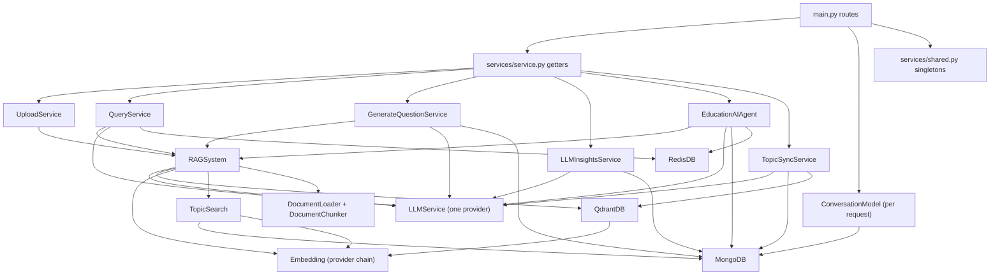
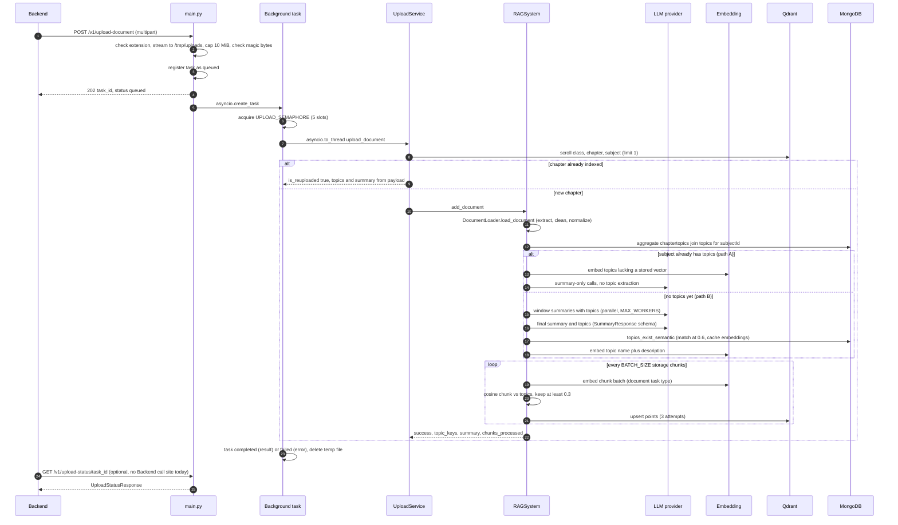
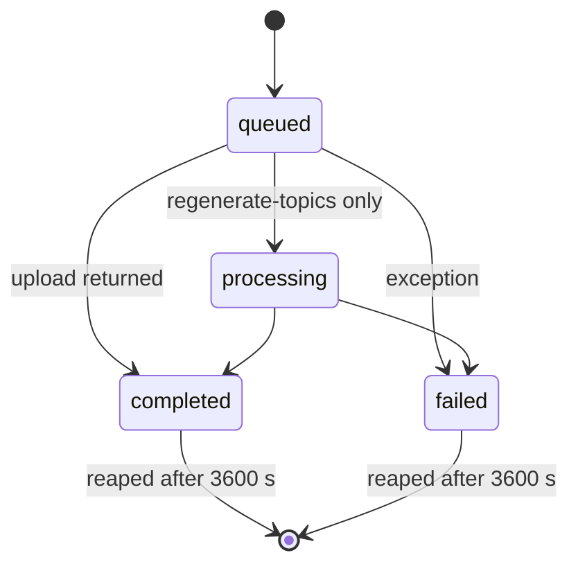
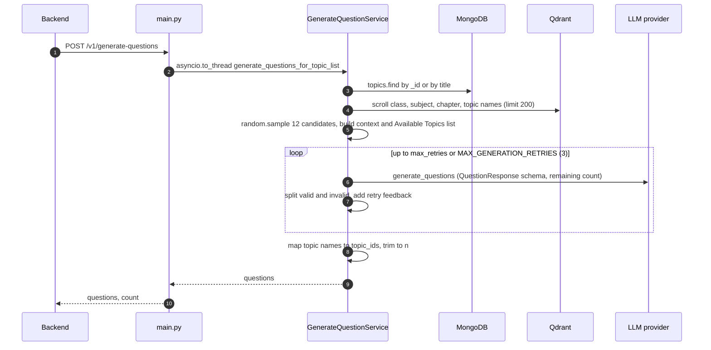
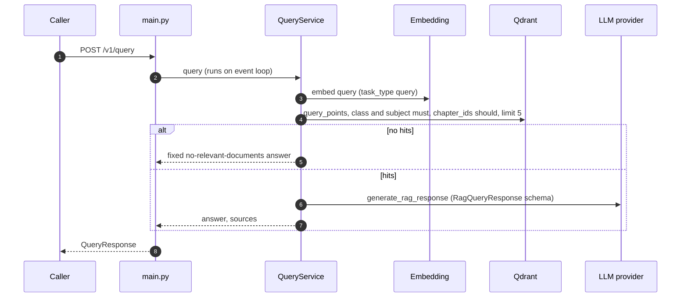
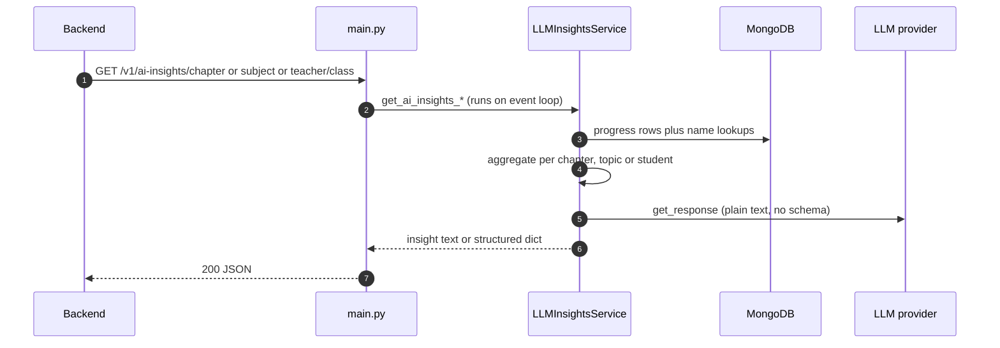
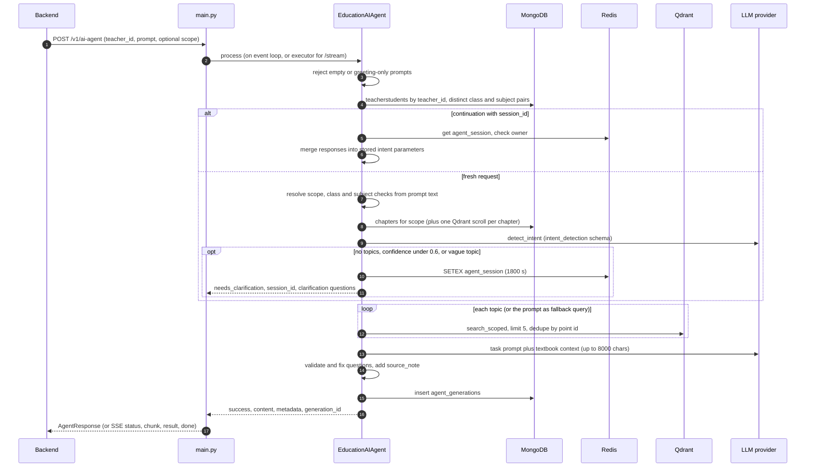
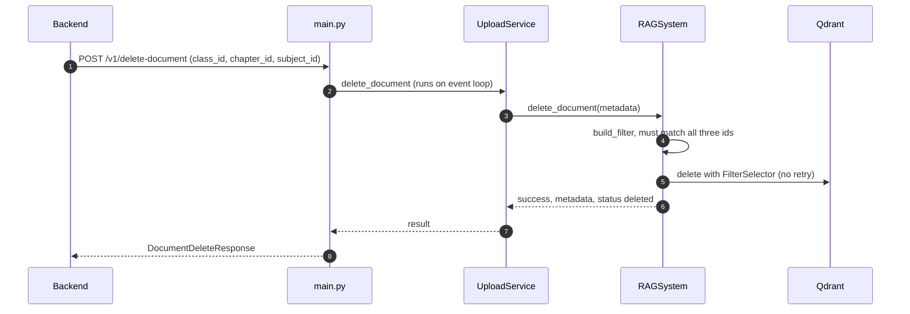
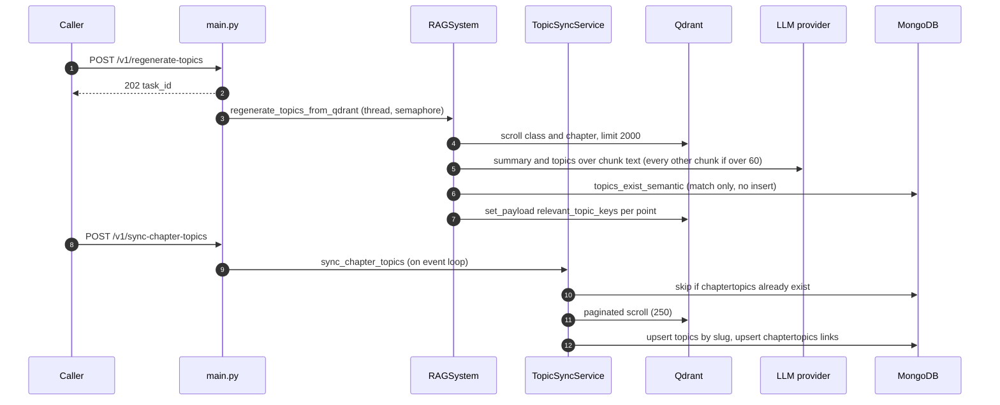
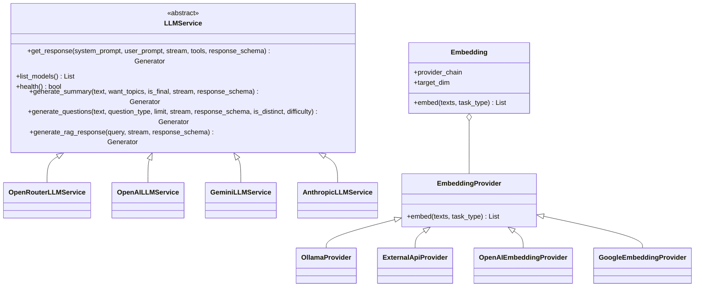

# AI Service — Low-Level Design

> **Verified against:** `ai-service` @ `e6043c7` (main), 2026-09-26. See also: [System HLD](../reference/hld.md), [Architecture](./architecture.md).

This document describes how the AI Service is built, class by class and flow by flow. Every non-obvious claim cites a repo-relative code location. Items marked "(not verified)" could not be confirmed from code alone.

## 1. Scope and responsibilities

The AI Service is a single FastAPI application (`main.py`) that owns everything LLM-, embedding- and vector-related for AskAide AI. Only the Backend calls it; the Frontend never does.

| Responsibility | Entry point | Main component |
|---|---|---|
| Chapter document ingestion (extract, clean, summarize, extract topics, chunk, embed, store) | `POST /v1/upload-document` | `UploadService` → `RAGSystem.add_document` |
| Chapter index status, batch status, deletion | `/v1/search-document`, `/v1/search-documents/batch`, `/v1/delete-document` | `UploadService` |
| Grounded question generation (MCQ, fill-in-the-blank) | `POST /v1/generate-questions` | `GenerateQuestionService` |
| RAG question answering over indexed chapters | `POST /v1/query` | `QueryService` |
| LLM learning insights from student progress data | `GET /v1/ai-insights/*` | `LLMInsightsService` |
| Teacher content agent (quiz, paper, assignment, notes, worksheet) with clarification sessions, access scoping and history | `/v1/ai-agent*` | `EducationAIAgent` |
| Chat conversation persistence | `/v1/conversations*` | `models/conversation.py:ConversationModel` |
| Topic maintenance (regenerate topics from stored chunks, sync Qdrant topics into MongoDB) | `/v1/regenerate-topics`, `/v1/sync-chapter-topics` | `RAGSystem.regenerate_topics_from_qdrant`, `TopicSyncService` |

Out of scope (owned by the Backend): end-user authentication and JWTs, chapter/class/subject CRUD, PDF storage, question persistence, quiz lifecycle. The service **trusts** the `teacher_id` / `user_id` values the Backend passes (see §9.2).

**Callers observed in the Backend** (grep of `Backend/src` for `/v1/...`): `upload-document`, `delete-document`, `search-document`, `generate-questions`, the three `ai-insights` routes, `ai-agent`, `ai-agent/stream`, `ai-agent/classes`, `ai-agent/tasks`, `ai-agent/health`, `ai-agent/generation/{id}` and `conversations`. No Backend call site was found for `upload-status`, `search-documents/batch`, `regenerate-topics`, `sync-chapter-topics`, `query`, `ai-agent/modify`, `ai-agent/history`, `ai-agent/chapters` or the legacy `teacher/*` routes.

## 2. Tech stack and runtime

| Layer | Technology | Version source |
|---|---|---|
| Language | Python 3.11 | CI `.github/workflows/code-review.yml` (`python-version: "3.11"`), ruff `target-version = "py311"` in `pyproject.toml` |
| Web framework | FastAPI | `requirements.txt` pins `fastapi==0.141.1` (the only pinned dependency) |
| ASGI server | uvicorn | unpinned |
| Validation / settings | pydantic v2, pydantic-settings, python-dotenv | unpinned |
| Vector DB client | qdrant-client (HTTP by default, gRPC optional) | unpinned |
| Document DB client | pymongo (sync) | unpinned |
| Cache / sessions | redis (redis-py, sync) | unpinned |
| LLM SDKs | openai, anthropic, google-generativeai; OpenRouter via `requests` | unpinned |
| HTTP | requests (LLM + embeddings), httpx (self keep-alive) | unpinned |
| Retry | tenacity (Qdrant only) | unpinned |
| Document parsing | pypdfium2, python-docx; `pypdf` imported as fallback | `pypdf` is **not** in `requirements.txt` (`document/document_loader.py:_extract_pdf_pages`) |
| Numerics | numpy | unpinned |
| Logging | structlog, python-logging-loki | unpinned |
| Uploads | python-multipart | unpinned |

Declared but not imported anywhere: `rapidfuzz`, `sse-starlette`. `pyproject.toml` contains only ruff configuration (rules `E,F,W,I,B,UP`, `E501` ignored); there is no packaging metadata.

**Process model**

- One uvicorn process serving `main:app`. No `Procfile`, `Dockerfile`, `render.yaml` or `--workers` flag exists in the repo; documented commands are `uvicorn main:app --reload --port 8000` (`README.md`, `setup_and_run.sh`, `.opencode.json`). `main.py` has no `__main__` block, so `python main.py` does not start a server.
- Code comments state the deployment target is a 512 MB Render instance (`main.py` upload semaphore comment, `config.py`, `CLAUDE.md`). Several in-memory structures assume exactly one worker (see §12).
- Handlers are `async def`, but most services are synchronous (pymongo, redis-py, requests). Where the blocking work runs:

| Handler(s) | Blocking work runs on |
|---|---|
| `/v1/generate-questions` | `asyncio.to_thread` (default executor) |
| `/v1/upload-document`, `/v1/regenerate-topics` | `asyncio.create_task` → `UPLOAD_SEMAPHORE` (5) → `asyncio.to_thread` |
| `/v1/ai-agent/stream` | `EducationAIAgent.process` via `loop.run_in_executor(None, ...)`; the follow-up streaming LLM call is iterated synchronously inside the async generator |
| `/v1/search-documents/batch` | a new `ThreadPoolExecutor()` per request |
| Qdrant keep-alive | `asyncio.to_thread(qdrant.client.count, ...)` |
| All other routes (`query`, `delete-document`, `search-document`, `sync-chapter-topics`, insights, `ai-agent`, `ai-agent/modify`, history, classes, chapters, conversations, `teacher/*`) | **directly on the event-loop thread** — a slow LLM or DB call blocks every other request for its duration |

Inside ingestion, summarization fans out on a bounded thread pool (`utils/thread_pool.py:ThreadPoolManager.imap`, `MAX_WORKERS`); the pool is created per call, not held for the process lifetime.

## 3. Package structure

```text
ai-service/
├── main.py                  FastAPI app, middleware, lifespan, every route, in-memory task store
├── config.py                pydantic-settings Settings + load_dotenv
├── logger.py                stdlib logger factory, structlog config, Loki shipping
├── db/                      qdrant_db.py, mongo_db.py, redis_db.py
├── document/                document_loader.py (PDF/DOCX/TXT extraction + cleaning)
├── llm/                     llm_open_router.py, llm_open_ai.py, llm_gemini.py, llm_anthropic.py
├── models/                  conversation.py (conversations + messages persistence)
├── services/
│   ├── shared.py            lazy singleton registry for heavy objects
│   ├── service.py           lazy getters for feature services
│   ├── llm_service.py       abstract LLMService + provider factory
│   ├── active_llm.py        SwitchableLLM (live, swappable client) + saved-choice persistence
│   ├── llm_admin.py         admin LLM status / test / activate / reset / model listing
│   ├── rag.py               RAGSystem (ingestion, search, topic regeneration)
│   ├── upload_service.py, query_service.py, generate_question_service.py
│   ├── llm_insights.py, education_ai_agent.py, topic_sync_service.py
│   └── ai/                  advanced modules, not wired to HTTP
├── utils/                   embedding, chunker, prompts, schemas, topic search, metrics, ...
├── tests/                   pytest suite (unit/ + service tests)
├── eval/                    offline RAGAS eval, HTTP benchmark, embedding A/B
├── sync_missing_topics.py   one-off maintenance script (TopicSyncService)
└── test_async_upload.py     manual upload smoke script (not collected by pytest tests/)
```

| Package / module | Responsibility |
|---|---|
| `main.py` | App factory, `v1_router`, auth dependency, rate-limit and correlation middleware, lifespan tasks, upload task registry, SSE streaming, inline agent request/response models |
| `config.py` | `Settings` (Qdrant, Mongo, Redis, provider keys, batch sizes, logging); `get_settings()` is `lru_cache`d; exports `.env` into `os.environ` with `override=False` |
| `logger.py` | Coloured stdout loggers (`get_logger`), structlog JSON logger (`get_struct_logger`), `setup_loki_logging()` |
| `db/` | Thin clients: `QdrantDB` (retrying wrapper), `MongoDB` (connect + ping, URI redaction), `RedisDB` (optional, degrades when unreachable) |
| `document/` | `DocumentLoader`: per-page PDF extraction, repeated header/footer removal, text normalization |
| `llm/` | One `LLMService` subclass per provider |
| `models/` | `ConversationModel` over `conversations` / `messages` |
| `services/` | Feature services and the singleton registry |
| `services/ai/` | `AIOrchestrator`, `AdaptiveQuestionGenerator`, `ConceptDependencyGraph`, `MultiHopRAG`, `QueryExpander`, `SemanticChunker`, `SocraticQuestionGenerator` — importable, no route in `main.py` |
| `utils/` | `embedding.py`, `chunker.py`, `thread_pool.py`, `topic_search.py`, `topic_embedder.py`, `mongo_util.py`, `prompt.py`, `response_format.py`, `schema.py`, `common.py`, `metrics.py`, `openapi_tags.py`; unused at runtime: `cache.py`, `validators.py`, `question_utils.py`, `tool.py` (only in a provider `__main__` demo) |

## 4. Component design

### 4.1 Dependency graph and lifecycle

Heavy objects are process-wide lazy singletons in `services/shared.py`, built under one `threading.RLock` with double-checked locking. The RLock is required because composite getters call other getters while holding it. Feature services are lazy singletons in `services/service.py` (plain `if not X` checks, no lock). `main.py` imports getters from `services/service.py`.



| Singleton getter (`services/shared.py`) | Builds | Depends on |
|---|---|---|
| `get_embedding()` | `utils.embedding.Embedding()` | env only |
| `get_mongo()` | `db.mongo_db.MongoDB(MONGO_URI, MONGO_DB_NAME)` | — |
| `get_qdrant()` | `db.qdrant_db.QdrantDB(embedding=...)` | `get_embedding` |
| `get_topic_search()` | `utils.topic_search.TopicSearch(mongo, embedding)` | `get_mongo`, `get_embedding` |
| `get_llm_service()` | `services.active_llm.create_live_llm(mongo)` → one `SwitchableLLM` | saved choice in Mongo `llm_settings`, else `LLM_PROVIDER` |
| `get_rag_system()` | `services.rag.RAGSystem(db, embedding, topic_search, llm_service)` | all of the above |
| `get_redis()` | `db.redis_db.RedisDB(host, port, channel, username, password)` | — |

Feature services (`services/service.py`): `get_upload_service`, `get_generate_question_service`, `get_query_service`, `get_llm_insights_service`, `get_education_ai_agent` (alias `get_teacher_quiz_service`), `get_topic_sync_service`. No object is closed on shutdown.

### 4.2 HTTP layer — `main.py`

- `app = FastAPI(..., dependencies=[Security(verify_api_key)])` applies auth to every route; `v1_router = APIRouter(prefix="/v1")` holds all business routes and is included last.
- Middleware (both `@app.middleware("http")`): `correlation_logging_middleware` is registered first and `rate_limit_middleware` second. Starlette makes the last-registered middleware outermost, so rate limiting runs first and 429 responses bypass the correlation logger.
- Upload task registry: `_upload_tasks: Dict[str, Dict]` guarded by `threading.Lock` (`_task_get`, `_task_set`, `_task_delete`), because background threads write and the event loop reads.
- Inline models: `AgentRequest`, `AgentResponse`, `ModifyRequest` (all other models live in `utils/schema.py`).
- Admin LLM routes (`/v1/admin/llm/*`, tag `TAG_V1_ADMIN`) are thin wrappers over `services/llm_admin.py`; test/activate run in a worker thread capped by `LLM_TEST_TIMEOUT` (§8.1).

### 4.3 RAGSystem — `services/rag.py`

Owns ingestion, retrieval and topic regeneration against one Qdrant collection. Constructed once by `get_rag_system()`; its constructor calls `QdrantDB.create_collection` (creates the collection if missing).

| Method | Behaviour |
|---|---|
| `add_document(file_path: str, metadata: Dict[str, Any]) -> Dict` | Full ingestion pipeline (§7.1). Streams storage chunks in `BATCH_SIZE` batches, never materializing the full chunk list |
| `generate_summary_and_topics(raw_text: str)` | Returns `(final_summary, topic_keys)`; direct call under 4000 chars, otherwise windowed parallel summaries plus recursive reduction |
| `regenerate_topics_from_qdrant(class_id: str, chapter_id: str, subject_id: str) -> Dict` | Rebuilds topics from stored chunk text and rewrites `relevant_topic_keys` payloads (§7.7) |
| `delete_document(metadata: Dict[str, Any]) -> Dict` | Filter-delete of all chunks matching the metadata |
| `search(query: str, limit: int = 5, filters: Optional[Dict] = None, is_nested_filter: bool = False) -> List[Dict]` | Vector search with a dict-built filter |
| `search_scoped(query: str, scopes: List[Dict], chapter_ids: Optional[List[str]] = None, limit: int = 5) -> List[Dict]` | Vector search restricted to an OR of (class AND subject) pairs; returns `[]` when no valid scope (fail closed) |
| `search_by_filter(limit: int = 5, filters: Optional[Dict] = None, is_nested_filter: bool = False)` | Filter-only scroll |
| `create_payload_index(fields: List[str]) -> None` | Keyword payload index per field |
| `build_filter(filter_dict)` / `build_filter_nested(filter_dict, nested_key=None)` | String value → `must` match; list value → `should` block; optional `NestedCondition` for the nested key |

Collaborators: `QdrantDB`, `Embedding`, `TopicSearch`, `LLMService`, `DocumentLoader`, `DocumentChunker`, `TopicEmbedder`, `utils/mongo_util.get_topics_from_subject_mongo`.

### 4.4 QdrantDB — `db/qdrant_db.py`

| Method | Retry | Notes |
|---|---|---|
| `create_collection(collection_name, distance=Distance.COSINE)` | yes | `VectorParams(size=vector_size, distance=COSINE)` if the collection does not exist |
| `create_payload_index(collection_name, field_name, field_schema=KEYWORD)` | no | errors are logged, not raised |
| `batch_upsert(collection_name, points)` | yes | `client.upsert` |
| `search_by_text(collection_name, query_text, limit=5, filter_conditions=None)` | yes | embeds with `task_type="query"`, then `client.query_points` |
| `search_by_filter(collection_name, filter_conditions, limit=10)` | yes | single-page `client.scroll`, no vectors returned |
| `delete_by_filter(collection_name, filter_conditions)` | no | `FilterSelector` delete |
| `add_text(...)`, `close()` | no | `add_text` is not used by services |

The client comes from `get_qdrant_client(host, port, prefer_grpc, api_key)`, `lru_cache(maxsize=1)`. The URL is `https://HOST:PORT` unless `QDRANT_HOST` already carries a scheme; client timeout is 30 s. Retry policy: tenacity, 3 attempts, `wait_exponential(multiplier=1, max=10)`, only on `UnexpectedResponse`, `ResponseHandlingException`, `ConnectionError`.

### 4.5 Embedding — `utils/embedding.py`

`Embedding.embed(texts: List[str], task_type: str = "document") -> List[List[float]]` tries each provider listed in `EMBEDDING_PROVIDERS`, in order, returning the first non-`None` result. Every vector is truncated or zero-padded to `QDRANT_VECTOR_SIZE` (`_normalize_dim`). It raises `RuntimeError("All embedding providers failed ...")` when the chain is exhausted and increments `fallback_count` on each provider failure (not exported to metrics). Provider details are in §8.2.

### 4.6 DocumentLoader and DocumentChunker

`document/document_loader.py:DocumentLoader.load_document(file_path) -> str` (static) dispatches on extension:

- **PDF**: per-page text via pypdfium2 (native memory, pages closed eagerly), falling back to `pypdf` on PDFium errors. `_detect_boilerplate` flags short lines (at most 8 words) whose digit-normalized template repeats on at least `max(3, 30%)` of pages, and only when there are at least 3 pages. `_clean_pages` also drops `Reprint YYYY-YY` watermarks and bare page numbers.
- **DOCX**: paragraphs joined via python-docx. **TXT**: UTF-8 read.
- `_normalize_text`: de-hyphenates line-wrapped words, repairs degree symbols (`100oC` → `100°C`), collapses newlines and whitespace.

`utils/chunker.py:DocumentChunker(target_words=300, overlap_words=50)` splits on sentence terminators (`(?<=[.!?])\s+`) and packs whole sentences up to `target_words`. Overlap is carried as trailing whole sentences totalling at most `overlap_words`. A single sentence longer than the target becomes its own oversized chunk. `iter_chunks` is a generator; `split_chunks` materializes it.

### 4.7 TopicSearch and TopicEmbedder

- `utils/topic_search.py:TopicSearch.topics_exist_semantic(subject_id, input_topics, similarity_threshold=0.8) -> List[Dict]` (callers pass 0.6). It loads the subject's existing topics (`chaptertopics` joined with `topics`) and tries an exact case-insensitive title match first. For the rest it uses cosine similarity against existing topic embeddings, computing any missing ones and caching them with `bulk_write` into `topics.embedding`. Matched inputs get `is_exists=True`, the canonical `name` / `description`, and `id` (the `topicId`). It **does not insert** new topics.
- `utils/topic_embedder.py:TopicEmbedder.get_relevant_topics_batch(text_embeddings, topic_keys_embeddings, threshold=0.3) -> List[List[int]]`: a numpy cosine matrix; per chunk, returns topic indices with similarity of at least `threshold`, sorted descending.

### 4.8 UploadService — `services/upload_service.py`

The constructor creates keyword payload indexes on `class_id`, `chapter_id`, `subject_id`.

| Method | Behaviour |
|---|---|
| `is_already_exists(class_id, chapter_id, subject_id)` | `RAGSystem.search_by_filter(limit=1)` on the three ids |
| `search_document(class_id, chapter_id, subject_id)` | Returns `found`, `metadata` and the first chunk's full payload as `data` |
| `upload_document(file_path, class_id, chapter_id, subject_id)` | If a chunk exists, returns `is_reuploaded: true` with that payload's topics and summary **without re-ingesting**; otherwise `RAGSystem.add_document` |
| `delete_document(class_id, chapter_id, subject_id)` | `RAGSystem.delete_document` |

### 4.9 QueryService — `services/query_service.py`

`query(query, class_id, subject_id, chapter_ids, stream=False)` calls `RAGSystem.search(limit=5)` with filter `class_id` AND `subject_id` AND `chapter_id` IN `chapter_ids`. It builds a context block per hit (text, summary, ids, `source_file`) and calls `LLMService.generate_rag_response` with the `RagQueryResponse` schema. With `stream=True` it publishes each LLM event to Redis (`RedisDB.publish`) and returns nothing; `main.py` never passes `stream`, so the HTTP path is always non-streaming. The constructor creates the same three payload indexes.

### 4.10 GenerateQuestionService — `services/generate_question_service.py`

| Method | Behaviour |
|---|---|
| `generate_questions_for_topic_list(class_id, subject_id, chapter_id, input_topics, n=10, question_type="mcq", is_distinct=False, difficulty=None, max_retries=None) -> List[Dict]` | Topic lookup, candidate retrieval, LLM generation with validation retries, topic-id tagging (§7.2) |
| `search_topics_rag(class_id, subject_id, chapter_id, topics=None, limit=CANDIDATE_SAMPLE)` | Filter scroll (pool `QG_CANDIDATE_POOL`), then `random.sample` down to `limit` |
| `_generate_with_retry(context, question_type, n, is_distinct, difficulty, max_retries)` | Up to `max_retries` (if an int of at least 1) or `MAX_GENERATION_RETRIES` attempts; asks only for the missing count each round and appends retry feedback |
| `_split_valid_invalid(questions, question_type)` (static) | MCQ/mixed: at least 4 options and an in-range `correct_option_index`. `fillblanks`/`subjective`: text contains `___` and a non-empty `answer`. Explanations shorter than 10 chars are replaced with `The correct answer is ...` |

The constructor adds a keyword index on `relevant_topic_keys[].name` alongside the three id indexes. Module constants are read from env at import time: `QG_CANDIDATE_POOL`, `QG_CANDIDATE_SAMPLE`, `MAX_GENERATION_RETRIES`.

### 4.11 LLMInsightsService — `services/llm_insights.py`

| Method | Reads | Returns |
|---|---|---|
| `get_ai_insights_subject(subject_id, user_id) -> str` | `subjects`, `studenttopicprogresses`, `chapters`, `topics` | 40–50 word chapter-level paragraph |
| `get_ai_insights_chapter(chapter_id, user_id) -> str` | `chapters`, `chaptertopics`, `studenttopicprogresses`, `topics` | ~50 word paragraph covering attempted and unattempted topics |
| `get_ai_insights_teacher_class(teacher_id, subject_id) -> dict` | `teacherstudents`, `studenttopicprogresses`, `chapters`, `topics`, `subjects` | `insight`, `weak_topics`, `students_needing_help`, `total_students`, `unstarted_chapters` |

Uses `LLMService.get_response` directly (no schema) and concatenates dict events. Errors come back as strings (subject/chapter) or `{"error": ...}` (teacher class) rather than exceptions.

### 4.12 EducationAIAgent — `services/education_ai_agent.py`

The teacher-facing agent. `TASK_TYPES` = `quiz`, `paper`, `assignment`, `notes`, `worksheet`.

| Method | Behaviour |
|---|---|
| `process(teacher_id, teacher_prompt, responses=None, session_id=None, class_id=None, subject_id=None, chapter_id=None) -> Dict` | Main entry point: gating, scope resolution, intent detection, clarification or generation, history save (§7.5) |
| `modify_generation(teacher_id, generation_id, modifications) -> Dict` | Loads a saved generation, checks ownership, merges and sanitizes parameters, re-runs the task over **all** accessible scopes, saves a new generation |
| `get_teacher_accessible_classes(teacher_id) -> List[Dict]` | Distinct `(class_id, subject_id, school_id)` from `teacherstudents` where `teacher_id` = ObjectId; ids returned as strings |
| `get_teacher_classes(teacher_id)` | The above, enriched with `classes.name` / `subjects.name` |
| `get_chapters_with_topics(scopes)` | Active chapters per scope (sorted by `order`), `has_rag_content` via one Qdrant scroll per chapter, topics via a `chaptertopics` → `topics` aggregation |
| `detect_intent(prompt, accessible_classes)` | Keyword pre-classification plus one LLM call with an `intent_detection` JSON schema |
| `execute_task(task_type, topics, parameters, scopes, teacher_id, chapter_ids=None, prompt="")` | Dispatches to `_create_quiz` / `_create_paper` / `_create_assignment` / `_create_notes` / `_create_worksheet`; adds `metadata.source_note` |
| `find_best_chapter_match(prompt, scopes)` | Word-overlap score on chapter names (words longer than 3 chars, match at 0.5 or above), then `Chapter N` → `order`, otherwise suggestions |
| `get_generations_history(teacher_id, limit=20, offset=0)`, `get_generation_by_id(generation_id)` | Reads `agent_generations` |

Session store: Redis key `agent_session:` + UUID with a 1800 s TTL when `RedisDB._available`, otherwise the process-local dict `AGENT_SESSIONS`. Generations are persisted to `agent_generations` with a single immediate retry on insert failure.

### 4.13 TopicSyncService — `services/topic_sync_service.py`

`sync_chapter_topics(chapter_id, class_id, subject_id, class_name) -> Dict`:

1. Skips if the chapter already has `chaptertopics` rows.
2. Otherwise scrolls all chapter points (pages of 250) and aggregates unique `relevant_topic_keys` names, case-insensitively.
3. If no names are found, falls back to LLM topic extraction from a stored `summary`.
4. Upserts `topics` by slug `slug(topic)-slug(class_name)` (mirrors the Backend slug rules), then upserts `chaptertopics` links with `order`.

### 4.14 ConversationModel and DB clients

- `models/conversation.py:ConversationModel(mongo)`: `create_conversation`, `list_conversations(user_id, limit=50)` (sorted by `updated_at` desc), `get_messages(conversation_id, limit=100)` (sorted by `created_at` asc), `add_message` (also bumps `updated_at`), `delete_conversation` (deletes the conversation filtered by owner, then all its messages). Instantiated per request.
- `db/mongo_db.py:MongoDB(uri=None, db_name=None)`: `MongoClient(uri)` with driver defaults, then `server_info()` in the constructor (raises on failure). Falls back to `Settings` when args are `None`. Passwords are redacted in logs (`_redact_uri`).
- `db/redis_db.py:RedisDB(host, port, channel=None, username=None, password=None)`: `decode_responses=True`, ping in the constructor. On failure it sets `_available=False` and `client=None` instead of raising. `set(key, value, expiry=None)` uses `SETEX` when `expiry` is given; values are JSON-encoded. `set`/`get` do not check `_available` themselves.

### 4.15 Implemented but unwired

| Module | Status |
|---|---|
| `services/ai/*` | No route; `get_ai_orchestrator()` would build its own `RAGSystem()`, bypassing `services/shared.py` |
| `utils/cache.py` (`CachedEmbedding`, `cached_query`) | Not imported; `cached_query` is a pass-through |
| `utils/validators.py`, `utils/question_utils.py` | Not imported (the latter needs scikit-learn, which is not a dependency) |
| `utils/metrics.py:track_request_metrics`, `HealthChecker.register_check` | Never called |

## 5. Data design

### 5.1 Qdrant

| Property | Value |
|---|---|
| Collections | One, named by `QDRANT_COLLECTION_NAME` (`config.py` default `ai-service`); created at `RAGSystem` construction if missing |
| Vector | Single unnamed dense vector, size `QDRANT_VECTOR_SIZE`, distance `COSINE` (`db/qdrant_db.py:create_collection`) |
| Point id | `uuid4` string |
| Payload indexes | `KEYWORD` on `class_id`, `chapter_id`, `subject_id`, `relevant_topic_keys[].name` (requested by the service constructors on first construction in each process; failures only logged) |

**Chunk payload** (`services/rag.py:add_document._flush_batch`):

| Field | Type | Meaning |
|---|---|---|
| `class_id`, `chapter_id`, `subject_id` | string | Stringified Mongo ObjectIds from the upload form |
| `index` | int | Global chunk position in the document |
| `text` | string | Storage chunk text (~`QDRANT_CHUNK_SIZE` words) |
| `relevant_topic_keys` | array of objects with `name`, `description` | Chapter topics with cosine of at least 0.3 to this chunk, most similar first |
| `summary` | string | Chapter-level final summary (identical on every chunk of the chapter) |
| `source_file` | string | Basename of the temp file, i.e. `UUIDHEX_originalname` |
| `created_at` | float | Epoch seconds |
| `words_count`, `sentence_count` | int | Whitespace words, count of `.` characters |

**Access patterns**

| Use | Filter | Operation / limit |
|---|---|---|
| Existence, RAG status, batch status | `must` class_id, chapter_id, subject_id | scroll, limit 1 |
| Delete chapter | same | `delete` with `FilterSelector` |
| `/v1/query` | `must` class_id, subject_id + `should` chapter_id in list | `query_points`, limit 5 |
| Question candidates | `must` class, subject, chapter + `should` `relevant_topic_keys[].name` in topic titles | scroll, limit `QG_CANDIDATE_POOL` |
| Agent scoped search | `must` [ `should` of (class_id AND subject_id) per scope ] + optional `should` chapter_id | `query_points`, limit 5 per topic query |
| Agent "chapter has PDF" | `must` chapter_id | scroll, limit 1 |
| Regenerate topics | `must` class_id, chapter_id | scroll, limit 2000, single page |
| Topic sync | `must` chapter_id, class_id, subject_id | paginated scroll, 250 per page |
| Keep-alive | none | `count(exact=False)` |

No score threshold is applied to vector search results.

### 5.2 MongoDB

Database from `MONGO_DB_NAME`. The service creates **no indexes**. Id convention: Mongo stores ObjectIds; Qdrant payloads and API parameters use their string form.

| Collection | Access | Fields used | Used by |
|---|---|---|---|
| `topics` | R/W | `_id`, `title`, `description`, `embedding` (cached vector, written), `slug`, `status` (set on insert) | `TopicSearch`, `utils/mongo_util.get_topics_mongo`, `TopicSyncService`, insights, agent |
| `chaptertopics` | R/W | `chapterId`, `topicId`, `subjectId`, `classId`, `order` | `RAGSystem._get_existing_topics`, `TopicSearch` (name from `MONGO_TOPIC_COLLECTION`), `TopicSyncService` (upsert), insights and agent (hard-coded name) |
| `chapters` | R | `_id`, `name`, `order`, `classId`, `subjectId`, `isActive` | agent, insights |
| `classes` | R | `_id`, `name` | agent |
| `subjects` | R | `_id`, `name`, `classId` | agent, insights |
| `teacherstudents` | R | `teacher_id`, `student_id`, `class_id`, `_subject_id`, `school_id` | agent access control, teacher class insights |
| `studenttopicprogresses` | R | `userId`, `subjectId`, `chapterId`, `topicId`, `totalAttempts`, `easyAttempts`, `mediumAttempts`, `hardAttempts`, `easyCorrect`, `mediumCorrect`, `hardCorrect`, `avgTimeSpent`, `masteryScore`, `masteryState` | insights |
| `agent_generations` | R/W | `generation_id` (uuid4), `teacher_id` (string), `prompt`, `task_type`, `parameters`, `content`, `metadata`, `created_at` (epoch) | agent history and modify |
| `conversations` | R/W | `_id`, `user_id` (ObjectId), `title`, `created_at`, `updated_at` | `ConversationModel` |
| `messages` | R/W | `_id`, `conversation_id` (ObjectId), `role`, `content`, `created_at` | `ConversationModel` |
| `llm_settings` | R/W | `_id` (`active:<scope>`), `scope`, `provider`, `model`, `updated_by`, `updated_at`, `previous` | `services/active_llm.py` (read once at startup; written on activate, deleted on reset) |
| `llm_settings_history` | R/W | `scope`, `action`, `from`, `to`, `requested_by`, `at` | `services/active_llm.py` (appended on every switch; recent entries shown by admin status) |

### 5.3 Redis

| Key / channel | Type | TTL | Writer | Notes |
|---|---|---|---|---|
| `agent_session:` + session UUID | string (JSON) | 1800 s | `EducationAIAgent._session_set` | Holds `teacher_id`, `original_prompt`, `intent`, `scopes`, `chapter_ids`, `status`, `created_at`; deleted on completion |
| Channel named by `REDIS_CHANNEL` | pub/sub | — | `QueryService.query(stream=True)` | Not reachable from any HTTP route |
| `embed:` MD5, `query:`, `search:` | — | 3600 s / 300 s | `utils/cache.py` | Defined, never used |

`REDIS_DB` is read into `Settings` but never passed to the client, so DB 0 is always used.

### 5.4 In-process state and on-disk data

| State | Location | Lifetime |
|---|---|---|
| Upload/regeneration task status | `main.py:_upload_tasks` | Until reaped (3600 s after completion) or process restart |
| Rate-limit timestamps per client key | `main.py:_rate_limiter` | Process lifetime; a key is pruned only when that key sends again |
| Agent sessions (Redis-down fallback) | `education_ai_agent.py:AGENT_SESSIONS` | Process lifetime, no TTL |
| Metrics / health registry | `utils/metrics.py` globals | Process lifetime (empty in practice) |
| Uploaded files | `/tmp/uploads/UUIDHEX_filename` | Deleted in the background task's `finally` |

## 6. API design

Auth column: **key** = requires `x-api-key` (or `Authorization: Bearer`) equal to `AI_SERVICE_API_KEY`; **none** = exempt (`main.py:AUTH_SKIP_PATHS`). All error bodies use FastAPI's `detail` shape (§9.3). Model names refer to `utils/schema.py` unless marked `main.py`.

| Method | Path | Auth | Purpose | Request | Response | Main errors |
|---|---|---|---|---|---|---|
| GET | `/ping` | none | Liveness | — | `status: alive` | — |
| GET | `/` | key | Root info | — | static JSON | 401 |
| GET | `/health` | none | Health summary | — | `status`, `version`, `timestamp`, `checks` | — (no checks registered → always `healthy`) |
| GET | `/health/live` | none | Liveness probe | — | `status: alive` | — |
| GET | `/health/ready` | none | Readiness probe | — | `status` (`ready`/`not_ready`), `checks` | — |
| GET | `/metrics` | key | In-process metrics | — | `uptime_seconds`, `timestamp`, `counters`, `histograms`, `gauges` | 401 |
| POST | `/v1/upload-document` | key | Async chapter ingestion | multipart `file` + form `class_id`, `chapter_id`, `subject_id` (`DocumentUploadRequest`) | 202 `UploadStatusResponse` (`status: queued`) | 400 extension / magic bytes, 413 over 10 MiB, 422 ids, 500 save failure |
| GET | `/v1/upload-status/{task_id}` | key | Poll task | path `task_id` | `UploadStatusResponse` with `result: DocumentUploadResponse` when completed | 200 `status: not_found` for unknown ids; 500 when a completed result lacks upload fields (§12) |
| POST | `/v1/delete-document` | key | Delete chapter vectors | `DocumentUploadRequest` | `DocumentDeleteResponse` | 422, 500 |
| POST | `/v1/search-document` | key | Chapter indexed? | `DocumentUploadRequest` | `DocumentSearchResponse` (`found`, `metadata`, `data` = first chunk payload) | 422, 500 |
| POST | `/v1/search-documents/batch` | key | Parallel status for many chapters | `BatchDocumentSearchRequest` | `BatchDocumentSearchResponse` (`results[chapter_id, found]`, `total`, `found_count`) | 422, unhandled Qdrant errors → 500 |
| POST | `/v1/regenerate-topics` | key | Async topic regeneration from stored chunks | `DocumentUploadRequest` | 202 `UploadStatusResponse` | 422 |
| POST | `/v1/sync-chapter-topics` | key | Qdrant → Mongo topic sync | `SyncChapterTopicsRequest` (+ `class_name`) | `SyncChapterTopicsResponse` | 422, 500 |
| POST | `/v1/query` | key | RAG answer | `QueryRequest` (`query`, `class_id`, `subject_id`, `chapter_ids`, `stream` required but ignored) | `QueryResponse` (`answer`, `sources[]`) | 400 empty query, 422, 500 `Query failed` |
| POST | `/v1/generate-questions` | key | Question generation | `GenerateQuestionsRequest` | `GenerateQuestionsResponse` (`questions: QuestionItem[]`, `count`) | 422 ids, 500 |
| GET | `/v1/ai-insights/subject` | key | Student subject insight | query `subject_id`, `user_id` | `insight: str` | 422; service errors come back as text inside `insight` with 200; 500 |
| GET | `/v1/ai-insights/chapter` | key | Student chapter insight | query `chapter_id`, `user_id` | `insight: str` | 422; 500 (detail includes exception text) |
| GET | `/v1/ai-insights/teacher/class` | key | Class-level insight | query `teacher_id`, `subject_id` | `insight`, `weak_topics[]`, `students_needing_help`, `total_students`, `unstarted_chapters[]` | 400 invalid id or no students, 500 |
| POST | `/v1/ai-agent` | key | Teacher agent turn | `AgentRequest` (main.py) | `AgentResponse` (main.py) | 500; business failures are 200 with `success: false`, `error` |
| POST | `/v1/ai-agent/stream` | key | Agent turn as SSE | `AgentRequest` | `text/event-stream` (§6.2) | errors sent as an SSE `error` event |
| POST | `/v1/ai-agent/modify` | key | Re-run a generation with new params | `ModifyRequest` (main.py) | `AgentResponse` | 500; not-found / not-owner as `success: false` |
| GET | `/v1/ai-agent/history` | key | Teacher generation history | query `teacher_id`, `limit`=20, `offset`=0 | `success`, `generations[]` | 500 |
| GET | `/v1/ai-agent/generation/{generation_id}` | key | One generation | path id | `success`, `generation` | 404, 500 |
| GET | `/v1/ai-agent/classes` | key | Teacher classes/subjects | query `teacher_id` | `success`, `classes[class_id, class_name, subject_id, subject_name]` | 500 |
| GET | `/v1/ai-agent/chapters` | key | Chapters with topics and PDF status | query `teacher_id`, optional `subject_id` | `success`, `chapters[]` | 500 |
| GET | `/v1/ai-agent/tasks` | key | Static task catalogue | — | `success`, `tasks[id, name, description, icon]` | — |
| GET | `/v1/ai-agent/health` | key | Static agent health | — | `status`, `agent` | 401 |
| POST | `/v1/conversations` | key | Create conversation | query `user_id`, `title`="New Chat" | `success`, `conversation` | 500 |
| GET | `/v1/conversations` | key | List conversations | query `user_id`, `limit`=50 | `success`, `conversations[]` | 500 |
| GET | `/v1/conversations/{conversation_id}/messages` | key | List messages (max 100) | path id, query `user_id` (not used for filtering) | `success`, `messages[]` | 500 |
| POST | `/v1/conversations/{conversation_id}/messages` | key | Append message | query `user_id`, `role`, `content` | `success`, `message` | 500 |
| DELETE | `/v1/conversations/{conversation_id}` | key | Delete conversation and messages | query `user_id` | `success` | 500 |
| POST | `/v1/teacher/create-quiz` | key | Legacy quiz (wraps agent) | `TeacherQuizRequest` | `TeacherQuizResponse` | 500 |
| GET | `/v1/teacher/classes` | key | Legacy classes | query `teacher_id` | `success`, `classes[]` | 500 |
| GET | `/v1/admin/llm/status` | key | Live provider/model, source (`database`/`env`), env default, recent switches, per-provider key-configured flags (never the key) | — | `LlmStatus` | — |
| POST | `/v1/admin/llm/test` | key | Plain / JSON / MCQ-schema checks on a model; never changes anything | `{ provider?, model? }` (empty = live model) | `LlmTestResult` | 400 unknown provider / key not set, 504 past `LLM_TEST_TIMEOUT` |
| POST | `/v1/admin/llm/active` | key | Re-run the 3 checks; only if all pass, save the choice then swap the live client | `{ provider, model, requested_by? }` | `LlmSwitchResult` (`activated: false` = nothing changed) | 409 switch already running, 503 can't save, 504 |
| POST | `/v1/admin/llm/reset` | key | Delete the saved choice and swap back to the env default | `{ requested_by? }` | `LlmSwitchResult` | 409, 503 |
| GET | `/v1/admin/llm/models` | key | Live model listing per provider, cached 10 min; curated fallback | query `provider?`, `free_only?` (OpenRouter) | `LlmModelList` | 502 only if OpenRouter's public catalogue is down |

FastAPI built-ins `/docs`, `/redoc`, `/openapi.json` are auth-exempt.

### 6.1 Key models

| Model | Fields (type, default) | Validation |
|---|---|---|
| `GenerateQuestionsRequest` | `class_id`, `subject_id`, `chapter_id`, `topics: List[str]`, `n: int = 10`, `type: str = "mcq"`, `is_distinct: bool = False`, `difficulty: Optional[str]`, `max_retries: Optional[int]` | ids must match 24-hex; `n` range validator is defective (§12) |
| `QuestionItem` (response) | `question_text`, `answer`, `difficulty`, `type`, `explanation`, `topic_ids: List[str]`, `options: Optional[List[str]]`, `correct_option_index: Optional[int]` | — |
| `DocumentUploadRequest` / `BatchSearchItem` | `class_id`, `chapter_id`, `subject_id` | 24-hex ObjectId |
| `DocumentUploadResponse` | `success`, `metadata: DocumentUploadRequest`, `topics_extracted`, `topic_keys: List[Dict]`, `summary`, `summary_length`, `is_reuploaded` | — |
| `UploadStatusResponse` | `task_id`, `status` (`queued`, `processing`, `completed`, `failed`, `not_found`), `result`, `error` | — |
| `QueryRequest` | `query`, `class_id`, `subject_id`, `chapter_ids: List[str]`, `stream: bool` | class/subject ids 24-hex; chapter ids unvalidated |
| `SyncChapterTopicsRequest` | `chapter_id`, `class_id`, `subject_id`, `class_name` | ids 24-hex |
| `AgentRequest` (main.py) | `teacher_id`, `prompt`, `responses: Optional[Dict]`, `session_id`, `class_id`, `subject_id`, `chapter_id` | none beyond types |
| `AgentResponse` (main.py) | `success`, `needs_clarification`, `session_id`, `generation_id`, `ai_message`, `task_detected`, `topics_identified`, `clarification`, `content`, `metadata`, `error` | no `task_type` field |
| `ModifyRequest` (main.py) | `teacher_id`, `generation_id`, optional `num_questions`, `difficulty`, `question_type`, `sections`, `duration_minutes` | clamped in the agent |

LLM structured-output schemas live in `utils/response_format.py`: `SummaryResponse` (`summary`, `topics[name, relevance, description]`, `importance_score`), `QuestionResponse` (all `QuestionItem` properties marked required, plus `topics: List[str]`, `extra: forbid`), `RagQueryResponse` (`answer`, `sources[chapter_ids, subject_id, class_id, source_files]`). They are wrapped as `ResponseSchema(type="json_schema", json_schema=JsonSchema(name, strict=True, schema))`.

### 6.2 SSE contract — `/v1/ai-agent/stream`

Each frame is `data: JSON` followed by a blank line; headers `Cache-Control: no-cache`, `Connection: keep-alive`, `X-Accel-Buffering: no` (`main.py:ai_agent_stream`).

| `type` | Payload | Emitted |
|---|---|---|
| `status` | `message` | Progress: understanding, preparing, generating TASK, writing |
| `chunk` | `content` | LLM token deltas (clarification rewrite or summary of the generated content), or the error text on business failure |
| `result` | `data` = raw `process()` dict (includes `task_type`; `generation_id` attached) | Once |
| `done` | — | End of stream |
| `error` | `message` | On exception |

## 7. Key flows

### 7.1 Document upload and ingestion



| Parameter | Code default | Source |
|---|---|---|
| Max upload size / read chunk | 10 MiB / 64 KiB | `main.py:_validate_upload_file` |
| Allowed types | `.txt`, `.pdf` (`%PDF` magic), `.docx` (`PK` magic) | same |
| Concurrent pipelines | 5 | `main.py:UPLOAD_SEMAPHORE` |
| Direct (unchunked) summarization | text under 4000 chars | `services/rag.py:generate_summary_and_topics` |
| Summary window | `QDRANT_SUMMARY_CHUNK_SIZE` 1000 words, overlap `QDRANT_SUMMARY_CHUNK_OVERLAP` 50 words | `config.py` |
| Summary parallelism | `MAX_WORKERS` 4, at most 4 in flight | `utils/thread_pool.py:imap` |
| Recursive reduction cap | combined summaries over 12000 chars are re-summarized | `rag.py:MAX_CONTEXT_CHARS` |
| Topic de-duplication | exact title, else cosine at least 0.6 | `rag.py` → `TopicSearch.topics_exist_semantic` |
| Storage chunk | `QDRANT_CHUNK_SIZE` 512 words, overlap `QDRANT_CHUNK_OVERLAP` 50 words | `config.py` |
| Embed + upsert batch | `BATCH_SIZE` 16 | `config.py` |
| Chunk → topic tagging | cosine at least 0.3 | `utils/topic_embedder.py` |
| Qdrant upsert retry | 3 attempts, exponential backoff, max 10 s | `db/qdrant_db.py` |
| Task retention | reaped 3600 s after completion, sweep every 300 s | `main.py:_cleanup_old_tasks` |

Task lifecycle (`main.py`):



An unknown or reaped id (including every id after a restart) returns `status: not_found` with HTTP 200.

### 7.2 Question generation



| Parameter | Code default | Source |
|---|---|---|
| Candidate pool / sample | `QG_CANDIDATE_POOL` 200 / `QG_CANDIDATE_SAMPLE` 12 | `generate_question_service.py` |
| LLM attempts | `max_retries` from request if at least 1, else `MAX_GENERATION_RETRIES` 3 | `_generate_with_retry` |
| Context | per candidate `Text` + `Relevant Topics`, then the first candidate's summary, then the Available Topics names | `build_llm_context` |
| Topic refs | accepted as ObjectIds or titles | `utils/mongo_util.py:get_topics_mongo` |

Questions whose topic names don't resolve get `topic_ids: []` and a warning is logged. Empty candidate sets return `[]`.

### 7.3 RAG query



Top-k is 5 with no score threshold. The context contains each chunk's text, the chapter summary, ids and `source_file`. The system prompt instructs the model to answer only from context (`utils/prompt.py:get_rag_system_prompt`). No Backend call site exists; the eval harness exercises the same path (`eval/ragas_eval.py`).

### 7.4 AI insights



| Variant | Aggregation rules (`services/llm_insights.py`) |
|---|---|
| Subject | All progress rows for (`subjectId`, `userId`), grouped chapter → topic; prompt asks for a 40–50 word chapter-level analysis |
| Chapter | Expected topics from `chaptertopics`; attempted vs unattempted; prompt asks for ~50 words |
| Teacher class | Students from `teacherstudents` (`teacher_id`, `_subject_id`). A topic is weak when at least 40% of attempting students are `WEAK`/`LEARNING`. A student needs help when average mastery is under 0.35. A chapter is unstarted when fewer than 50% of students have progress on it. The prompt includes the top 6 weak topics and 5 unstarted chapters; the response returns up to 10 weak topics and 5 chapters |

### 7.5 AI agent (teacher content)



Gating order inside `process` (`services/education_ai_agent.py`):

1. Actionability (skipped on continuation).
2. Teacher must have at least one `teacherstudents` pair.
3. Session lookup and owner check, or on a fresh request:
   1. explicit `class_id` / `subject_id` must match an accessible pair (otherwise denied, never widened);
   2. a class number in the prompt must be assigned;
   3. a subject keyword in the prompt must map to an assigned subject (narrows scope) or the request is denied;
   4. "list chapters" intent returns the chapter list without generation;
   5. chapter name / number resolution, with suggestions when unmatched.

| Parameter | Value | Source |
|---|---|---|
| Session TTL | 1800 s | `SESSION_TTL_SECONDS` |
| Retrieval | `search_scoped` top-5 per topic, deduped | `_search_rag_content` |
| Context size | each chunk capped at 1000 chars, full context capped at 8000 chars | `_build_context`, `_generate_with_llm` |
| Parameter clamps | questions 1–50 (default 10), sections 1–10 (3), duration 10–240 min (60), difficulty easy/medium/hard | `_sanitize_*` |
| Question post-processing | drop empty; dedupe when `difflib` ratio is above 0.85; pad MCQ options to 4; clamp index; default difficulty `medium` | `_validate_and_fix_questions` |
| Clarification | chapter choice (first 15 chapters), topics (required), count, difficulty, duration + sections (paper), question type (quiz/assignment/worksheet) | `generate_clarification_questions` |
| LLM calls per turn | clarification: 1. Generation: 2 (intent + content). Continuation: 1. `/stream` adds 1 streaming summary call | `process`, `main.py:ai_agent_stream` |

### 7.6 Document deletion



Only Qdrant vectors are removed. `topics` / `chaptertopics` are left to the Backend. On a Qdrant error `RAGSystem` returns `success: false` without `metadata`, which fails `DocumentDeleteResponse` validation and surfaces as HTTP 500.

### 7.7 Topic regeneration and sync



## 8. LLM and embedding provider layer

### 8.1 Abstraction



- `services/llm_service.py:LLMService` is an ABC. Subclasses implement `get_response`, `list_models` and `health`. The helpers `generate_summary`, `generate_questions` and `generate_rag_response` pick a system prompt from `PromptService` and re-yield `get_response` events.
- Every method is a **generator** yielding dicts `response` + `finish_reason`. Non-streaming calls yield once; streaming calls yield per delta.
- `get_llm_service_class()` reads `LLM_PROVIDER` (default `openrouter`; accepts `openai`, `gemini`, `anthropic`, alias `claude`) and raises `ValueError` for anything else. There is **no cross-provider LLM fallback**.
- **Live switching.** `services/shared.py:get_llm_service` returns one `services/active_llm.py:SwitchableLLM` that forwards every call to the active provider client. Every service holds that wrapper, so `SwitchableLLM.swap()` (called by `llm_admin.activate` / `reset_to_env`) switches the whole app instantly with no restart; `get_response` reads the client once, so in-flight calls finish on the old client. At startup `create_live_llm` reads the saved choice once from Mongo `llm_settings` (doc `_id = "active:<scope>"`); with none (or an unusable one, e.g. its key was removed) it uses `LLM_PROVIDER` + that provider's model env var. API keys stay in env only — a provider is usable only if its key env var is set.
- **Scope.** `LLM_SETTINGS_SCOPE`, else `RENDER_SERVICE_ID`, else `local-<ENVIRONMENT>`, so local dev and a deployment sharing one database never pick up each other's choice.
- **Switch safety.** `activate` holds a process lock (a second switch gets 409), re-runs the plain / JSON / MCQ-schema checks on a throwaway client, and only if all pass saves the choice (503 if it can't) then swaps. Tests and activations are capped by `LLM_TEST_TIMEOUT` (default 90 s).

### 8.2 Provider matrix

LLM providers (model and parameter values are code defaults; deployments may override):

| `LLM_PROVIDER` | Module / client | Model env (code default) | Temperature / max tokens env (default) | Timeout | Structured output handling |
|---|---|---|---|---|---|
| `openrouter` | `llm/llm_open_router.py`, `requests.post` to `OPENROUTER_URL` | `OPEN_ROUTER_MODEL` (`openai/gpt-3.5-turbo`) | `OPEN_ROUTER_TEMPERATURE` (0.7) / `OPEN_ROUTER_MAX_TOKENS` (omitted if unset) | 120 s | `response_format` = `ResponseSchema.model_dump()`; content JSON-parsed with `utils/common.py:safe_str_to_json` |
| `openai` | `llm/llm_open_ai.py`, OpenAI SDK | `OPENAI_MODEL` (`gpt-3.5-turbo`) | `OPENAI_TEMPERATURE` (0.7) / `OPENAI_MAX_TOKENS` (500) | SDK default | passes `response_schema.model_json_schema()` (class-level schema); returns raw text |
| `gemini` | `llm/llm_gemini.py`, google-generativeai | `GEMINI_MODEL` (`gemini-2.0-flash-exp`) | `GEMINI_TEMPERATURE` (0.7) / `GEMINI_MAX_TOKENS` (2048) | SDK default | only sets `response_mime_type=application/json`; system and user prompts concatenated; returns raw text |
| `anthropic` | `llm/llm_anthropic.py`, Anthropic SDK | `ANTHROPIC_MODEL` (`claude-sonnet-4-20250514`) | `ANTHROPIC_TEMPERATURE` (0.7) / `ANTHROPIC_MAX_TOKENS` (4096) | SDK default | forced tool call built from `json_schema.description`, a field `JsonSchema` does not define (§12) |

Embedding providers (`utils/embedding.py`):

| Name | Transport | Model env | Batching | Timeout | `task_type` |
|---|---|---|---|---|---|
| `ollama` | `POST OLLAMA_BASE_URL/api/embed`; on failure per-text `/api/embeddings` on 10 threads | `OLLAMA_EMBEDDING_MODEL` | whole list per request; each text truncated to 350 words | connect 10 s, read 180 s | ignored |
| `external` | `POST EMBEDDING_API_URL`, body `inputs` | — | 32 texts per request | 60 s | ignored |
| `openai` | OpenAI SDK `embeddings.create` (new client per call) | `OPENAI_EMBEDDING_MODEL` | whole list | SDK default | ignored |
| `google` | Generative Language API `models/MODEL:embedContent`, key as query param | `GOOGLE_EMBEDDING_MODEL` | one HTTP call per text, sequential | 30 s | `RETRIEVAL_QUERY` for queries, `RETRIEVAL_DOCUMENT` otherwise |

Query embedding uses `task_type="query"` (`db/qdrant_db.py:search_by_text`); everything else uses the `document` default. Changing provider or dimension without re-ingesting searches a mismatched vector space (`eval/README.md`).

### 8.3 Retries, timeouts, fallbacks

| Concern | Mechanism |
|---|---|
| LLM transport retry | None. Providers catch every exception and **yield a bare string** (`"I encountered an error while generating the response."`) instead of raising |
| LLM content retry | Question generation only: validation-driven re-asks (§7.2) |
| Summary fallback | `LLMService.generate_summary` yields the first 200 words of the input if `get_response` raises (in practice providers swallow errors first) |
| Embedding fallback | Ordered provider chain; `RuntimeError` when all fail |
| Qdrant | tenacity on create/upsert/search/scroll (§4.4); 30 s client timeout |
| Agent RAG failures | `_search_rag_content` returns `[]` on embedding/Qdrant errors; content is then generated ungrounded and `source_note` says so |

How callers treat the bare-string error event:

| Caller | Behaviour |
|---|---|
| `EducationAIAgent._extract_llm_response`, `LLMInsightsService` | Type-check the event, so they degrade to defaults or an empty string |
| `RAGSystem.process_chunk` | Catches the resulting `AttributeError` and yields an empty summary |
| `QueryService.query`, `GenerateQuestionService._llm_generate_questions_raw`, the final-summary calls in `RAGSystem.generate_summary_and_topics` and `_generate_single_summary` | Call `.get()` on the event and fail with `AttributeError` (HTTP 500, or a failed upload task) |

### 8.4 Token and cost controls

No tokenizer is used at runtime (`utils/question_utils.count_tokens` is unused). Input size is bounded by character or word caps instead: 1000-word summary windows with a 12000-char recursive reduction; regeneration samples every other chunk above 60 chunks; agent context is capped at 1000 chars per chunk and 8000 in total; QG context is 12 sampled chunks; Ollama input is truncated to 350 words. Output is bounded by the provider max-tokens env vars in §8.2. There is no per-request budget, quota or cost accounting.

### 8.5 Prompt construction

| Location | Prompts |
|---|---|
| `utils/prompt.py:PromptService` | RAG system prompt; chunk / final summary, with and without topics; question generation (type, limit, distinct, difficulty, MCQ and fill-blank rules); agent quiz / paper / assignment / notes / worksheet templates |
| `services/education_ai_agent.py:detect_intent` | Inline intent-analysis context and JSON schema |
| `services/education_ai_agent.py:_generate_with_llm` | Agent task prompt + textbook context sent as the **user** message under the final-summary system prompt (via `generate_summary(is_final=True)`) |
| `services/llm_insights.py` | Inline system and user prompts per insight type |
| `main.py:ai_agent_stream` | Inline prompts for the streamed clarification and summary text |

## 9. Cross-cutting concerns

### 9.1 Configuration

`config.py` calls `load_dotenv(<repo>/.env, override=False)` so real environment variables win, then exposes `Settings` via `get_settings()`. Many modules read `os.getenv` directly instead of `Settings`, so both paths matter.

| Variable | Read via | Meaning |
|---|---|---|
| `AI_SERVICE_API_KEY` | Settings | Shared key expected in `x-api-key`; required in every deployed environment |
| `DEBUG`, `LOG_LEVEL`, `ENVIRONMENT` | Settings | Debug forces DEBUG level and console rendering; log level; environment label on shipped logs |
| `LOKI_URL`, `LOKI_USERNAME`, `LOKI_PASSWORD` | Settings | Grafana Loki shipping (no-op when URL unset) |
| `SELF_API_URL` | os.getenv | Base URL the self keep-alive pings |
| `QDRANT_KEEPALIVE_SECONDS` | os.getenv | Interval of the Qdrant keep-alive `count` |
| `BATCH_SIZE`, `MAX_WORKERS` | Settings | Ingestion embed/upsert batch size; summarization thread fan-out |
| `LLM_PROVIDER` | os.getenv | **Default** provider; overridden by a choice saved from /admin → AI System (§8.1) |
| `LLM_SETTINGS_SCOPE` | os.getenv | Optional scope for the saved LLM choice (else `RENDER_SERVICE_ID`, else `local-<ENVIRONMENT>`) |
| `LLM_TEST_TIMEOUT` | os.getenv | Cap in seconds for admin LLM test / activate checks (default 90) |
| `OPENROUTER_API_KEY`, `OPENROUTER_URL`, `OPEN_ROUTER_MODEL`, `OPEN_ROUTER_TEMPERATURE`, `OPEN_ROUTER_MAX_TOKENS`, `GITHUB_REPO_URL` | os.getenv | OpenRouter key, chat-completions URL, model, sampling, max tokens, `HTTP-Referer` header |
| `OPENAI_API_KEY`, `OPENAI_MODEL`, `OPENAI_TEMPERATURE`, `OPENAI_MAX_TOKENS` | os.getenv | OpenAI LLM (key also reused for OpenAI embeddings) |
| `GEMINI_API_KEY`, `GEMINI_MODEL`, `GEMINI_TEMPERATURE`, `GEMINI_MAX_TOKENS` | os.getenv | Gemini LLM (key also reused for Google embeddings) |
| `ANTHROPIC_API_KEY`, `ANTHROPIC_MODEL`, `ANTHROPIC_TEMPERATURE`, `ANTHROPIC_MAX_TOKENS` | os.getenv | Anthropic LLM |
| `EMBEDDING_PROVIDERS` | os.getenv | Comma-separated embedding fallback chain |
| `OLLAMA_BASE_URL`, `OLLAMA_EMBEDDING_MODEL` | os.getenv | Ollama embedding endpoint and model |
| `EMBEDDING_API_URL` | os.getenv | External embedding endpoint |
| `OPENAI_EMBEDDING_MODEL`, `GOOGLE_EMBEDDING_MODEL` | os.getenv | Embedding model ids |
| `QDRANT_HOST`, `QDRANT_PORT`, `QDRANT_API_KEY`, `QDRANT_PREFER_GRPC` | Settings | Qdrant connection |
| `QDRANT_COLLECTION_NAME` | Settings / os.getenv | Collection name |
| `QDRANT_VECTOR_SIZE` | Settings and os.getenv | Collection dimension; embedding pad/truncate target |
| `QDRANT_CHUNK_SIZE`, `QDRANT_CHUNK_OVERLAP` | Settings | Storage chunk size / overlap in words |
| `QDRANT_SUMMARY_CHUNK_SIZE`, `QDRANT_SUMMARY_CHUNK_OVERLAP` | Settings | Summary window size / overlap in words |
| `MONGO_URI`, `MONGO_DB_NAME` | os.getenv, Settings fallback | MongoDB connection and database |
| `MONGO_TOPIC_COLLECTION` | os.getenv | Chapter-topic link collection (effectively required, §12) |
| `REDIS_HOST`, `REDIS_PORT`, `REDIS_USER`, `REDIS_PASSWORD`, `REDIS_CHANNEL` | os.getenv | Redis connection and pub/sub channel |
| `REDIS_DB` | Settings | Declared, not passed to the client |
| `QG_CANDIDATE_POOL`, `QG_CANDIDATE_SAMPLE`, `MAX_GENERATION_RETRIES` | os.getenv (import time) | Question-generation retrieval pool, sample size, attempt count |

### 9.2 Authentication and authorization

- `main.py:verify_api_key` is a global `Security` dependency built on `APIKeyHeader(name="x-api-key", auto_error=False)`, so Swagger shows an Authorize button. It accepts `x-api-key` or `Authorization: Bearer KEY` and compares with `secrets.compare_digest`; a mismatch returns 401 `Invalid or missing API key`.
- `AI_SERVICE_API_KEY` must be set in every deployed environment; leaving it unset is only intended for local development.
- Health probes (`/ping`, `/health`, `/health/live`, `/health/ready`) are exempt from the key. `/` and `/metrics` are **not** exempt, even though the OpenAPI tag description says health routes need no key.
- There is no end-user identity. The Backend is the only trusted caller and owns end-user authentication and authorization. Teacher content scope is data-driven: `teacherstudents` pairs are enforced inside Qdrant queries by `RAGSystem.search_scoped`, which fails closed.

### 9.3 Error handling

| Situation | HTTP | Body |
|---|---|---|
| Handler-raised `HTTPException` | 400/401/404/413/429/500/503 | `detail` string |
| Pydantic request validation (e.g. non-ObjectId ids) | 422 | FastAPI `detail` list (`loc`, `msg`, `type`) |
| Rate limit | 429 | `detail`: `Rate limit exceeded. Try again later.` |
| Business failure in agent/modify | 200 | `success: false`, `error`, `needs_clarification` |
| Insight service error (subject/chapter) | 200 | error text inside `insight` |
| Streaming failure | 200 stream | SSE `error` event |
| Unhandled exception | 500 | Starlette default |

Most handlers wrap work in `try/except Exception` and re-raise a generic 500. As a side effect, `HTTPException(503)` raised inside those blocks is converted into 500 (e.g. `main.py:generate_questions`).

### 9.4 Logging, metrics, health

- **Request logs**: `correlation_logging_middleware` binds `x-correlation-id` (from the Backend, or generated as `ai_` + 12 hex) into structlog contextvars and emits `request_completed` / `request_failed` with path, method, status and `duration_ms`. Health paths are skipped. The id is echoed in the response header.
- **App logs**: `logger.get_logger` attaches a coloured stdout handler per module. structlog renders JSON, or console output when `DEBUG`.
- **Loki**: `setup_loki_logging()` attaches a `LokiQueueHandler` (background thread) to the root logger with low-cardinality tags `service` and `env`. It is idempotent and a no-op without `LOKI_URL`. Mongo URIs are password-redacted before logging (`db/mongo_db.py:_redact_uri`).
- **Metrics**: `/metrics` serializes `utils/metrics.py:MetricsCollector`, but nothing records into it, so only `uptime_seconds` and `timestamp` carry data.
- **Health**: `/health` and `/health/ready` run `HealthChecker.run_checks()` with zero registered checks, so they always report healthy. They do not probe Mongo, Qdrant, Redis or the LLM. `/v1/ai-agent/health` is static.

### 9.5 Concurrency, rate limiting, caching, memory

- **Rate limiting** (`main.py:_check_rate_limit`): in-memory sliding window of 200 requests per 60 s per key. The key is the first `x-forwarded-for` entry, else the socket peer. Health paths are exempt. The limiter is per process and not shared.
- **Upload back-pressure**: `asyncio.Semaphore(5)` around ingestion and regeneration; excess tasks wait inside `asyncio.create_task`.
- **Thread safety**: heavy singletons are built under an RLock. Feature-service getters are unlocked but are called from the event-loop thread. The task registry uses a `threading.Lock`; metrics counters have their own locks.
- **Caching**: Qdrant client via `lru_cache`; `Settings` via `lru_cache`; topic embeddings cached in `topics.embedding` in Mongo. There is no response or embedding cache (`utils/cache.py` is unused).
- **Memory (512 MB target)**: lazy heavy singletons; streaming chunk generators instead of materialized lists; `del` plus `gc.collect()` after each stage in `RAGSystem`; pypdfium2 instead of pypdf (comment in `document/document_loader.py` cites ~75x heap blow-up with pypdf); bounded `imap` so chunk inputs do not accumulate; uploads streamed to disk in 64 KiB pieces; the upload semaphore.

## 10. Background and startup tasks

`main.py:lifespan`:

| Step | When | Behaviour | Failure mode |
|---|---|---|---|
| `setup_loki_logging()` | startup | Attach Loki handler if configured | warning, non-fatal |
| `get_mongo()` + `get_llm_service()` | startup | Warm the cheap singletons (Mongo connect + ping, live LLM: saved choice read once, else env default) | warning, non-fatal; a missing provider key re-raises on first use |
| `_cleanup_old_tasks` | every 300 s | Remove tasks completed more than 3600 s ago | exceptions caught per sweep so the loop survives |
| `keep_alive` | every 120 s | `httpx` GET `SELF_API_URL/ping` to avoid free-tier sleep | warning per failure; pings `None/ping` if unset |
| `keep_alive_qdrant` | every `QDRANT_KEEPALIVE_SECONDS` (1800 s when blank, invalid or at most 0) | `get_qdrant()` then `count(collection, exact=False)` in a thread, to keep the Qdrant cluster from idling | warning per failure; interval parsed defensively |
| shutdown | on stop | Cancel the three tasks; clients are not closed | — |

**Lazy initialization chain.** The first request that needs RAG runs `get_*_service()` → `get_rag_system()` → `get_qdrant()` (→ `get_embedding()`), `get_topic_search()` (→ `get_mongo()`) and `get_llm_service()`. `RAGSystem.__init__` ensures the collection exists, and the service constructor creates payload indexes. `get_redis()` connects (and degrades if unreachable) for the query service and the agent. Note that `keep_alive_qdrant` also forces `get_qdrant()` / `get_embedding()` on its first tick, so those are initialized within one keep-alive interval even with no traffic.

## 11. Testing

| Path | Type | What it covers |
|---|---|---|
| `tests/conftest.py` | fixtures | Session-scoped test env vars (collection, vector size 384, providers); mock Qdrant, embedding and LLM fixtures |
| `tests/unit/test_chunker.py` | unit | `DocumentChunker` boundaries, overlap, sentence handling |
| `tests/unit/test_config.py` | unit | `Settings` defaults, env overrides, `get_settings` caching |
| `tests/unit/test_document_cleaning.py` | unit | Boilerplate/watermark removal, de-hyphenation, degree repair |
| `tests/unit/test_rag_filter.py` | unit | A re-implementation of the filter-building logic (does not call `RAGSystem._build_filter`) |
| `tests/test_teacher_agent.py` | service | Agent access control with `MagicMock` deps: id validation, scope resolution, gating, expired sessions, `search_scoped` OR-of-ANDs and fail-closed |
| `tests/test_api_endpoints.py` | smoke | Calls old unversioned `/ai-insights/...` paths with no assertions |
| `tests/test_progress.py` | manual script | No `test_` functions; needs live Mongo + OpenRouter |
| `test_async_upload.py` (repo root) | manual script | Upload/poll against a local server using unversioned paths; outside `tests/` |

Run locally with `pytest tests/ -v`, lint with `ruff check .`, and type-check with `mypy . --ignore-missing-imports`. CI (`.github/workflows/code-review.yml`, on PRs and pushes to `main`, Python 3.11) runs ruff, then mypy (non-blocking via `|| true`), then pytest.

**Evaluation harness** (`eval/`, offline; deps in `eval/requirements-eval.txt`, deliberately excluded from `requirements.txt`):

| Tool | Measures | Notes |
|---|---|---|
| `python -m eval.ragas_eval --dataset ... --out ...` | RAGAS faithfulness, answer relevancy, context precision/recall | Calls `RAGSystem.search` + `QueryService.query` in-process; judge configured by `RAGAS_JUDGE_PROVIDER` / `RAGAS_JUDGE_MODEL` / `RAGAS_EMBED_PROVIDER` / `RAGAS_EMBED_MODEL` |
| `python -m eval.benchmark --endpoint ... --payloads ... -n N -c C` | p50–p99 latency, throughput, TTFT for SSE, error rate | Default `--endpoint /query` predates the `/v1` prefix, and no `x-api-key` header is sent |
| `python -m eval.embedding_experiment --dataset ...` | Retrieval A/B on the live collection | Used to justify `RETRIEVAL_QUERY` for Gemini query embeddings (`eval/README.md`) |

## 12. Design constraints and known limitations

Technical facts from the code at `e6043c7`:

**Deployment and runtime**

1. **Single-process assumption.** Task status (`_upload_tasks`), rate-limit windows, the Redis-down session fallback, metrics and the live LLM choice are process-local (another instance would only pick up a switch on restart). A restart loses all task state (`not_found`), and multiple uvicorn workers would break status polling and rate limits.
2. **Event-loop blocking.** Most routes call synchronous services directly (§2), so one long LLM call in `/v1/ai-agent`, `/v1/query` or an insights route stalls all concurrent requests. Streaming token loops are also synchronous inside the async generator.
3. **Rate limiter.** In-memory and per process, keyed on client IP. Server-to-server traffic from the Backend therefore shares one bucket unless the Backend forwards client IPs (not verified).
4. **Auth.** `/` and `/metrics` require the key despite being "health" routes.
5. **Health and metrics are hollow.** No health checks are registered and no metrics are recorded (§9.4).
6. **Keep-alive side effects.** `keep_alive` logs a warning every 120 s when `SELF_API_URL` is unset. The Qdrant keep-alive initializes Qdrant/Embedding singletons at its first tick.

**Data access and ownership**

7. **Trusted identities.** `teacher_id` / `user_id` are taken from the Backend as the trusted caller; the service does not re-verify end-user identity.
8. **Re-upload is a no-op.** An already-indexed chapter returns `is_reuploaded: true` with old topics and summary; re-ingestion requires `delete-document` first.
9. **Regeneration.** Reads at most 2000 chunks in one scroll page. It never inserts new Mongo topics, because `topics_exist_semantic` only matches existing ones — despite the route docstring saying topics are saved to MongoDB.
10. **N+1 lookups.** `EducationAIAgent.get_chapters_for_scope` issues one Qdrant scroll and up to two Mongo lookups per chapter, and runs up to twice per agent request (chapter match + clarification options).

**Validation and response shapes**

11. **`n` validator defect.** `GenerateQuestionsRequest._validate_n` returns a tuple instead of raising, so an out-of-range `n` is not rejected with 422. The tuple reaches the service and fails later. Reproduced with pydantic 2.12.
12. **Unpollable results.** `GET /v1/upload-status/{id}` builds `DocumentUploadResponse` from the stored result. A completed `regenerate-topics` task (result keys `chunks_processed`, `topics_extracted`, `collection`) and an upload whose loader returned `success: false` ("No text loaded") both fail validation, so polling them returns HTTP 500.
13. **Agent response shape.** `AgentResponse` has no `task_type` field, so `/v1/ai-agent` drops it (the SSE `result` event keeps it). Legacy `/v1/teacher/create-quiz` always returns `questions: []` because the agent nests questions under `content.questions`.
14. **Clarified chapter is ignored.** On session continuation, a chapter picked from the clarification options is resolved and then overwritten by `session.get("chapter_ids")` (`services/education_ai_agent.py:process`), so it does not narrow retrieval.

**LLM and embedding layer**

15. **Provider structured-output inconsistency.** Only the OpenRouter provider parses JSON for callers. `QueryService`, `GenerateQuestionService` and parts of `RAGSystem` assume dict responses. The Anthropic provider reads `response_schema.json_schema.description`, which `utils/response_format.py:JsonSchema` does not define, so structured calls error inside the provider (read from code; not runtime-tested).
16. **No LLM retries or fallback.** Explicit timeout only on OpenRouter (120 s). Error events are bare strings (§8.3).
17. **Config sharp edges.**
    - `MONGO_TOPIC_COLLECTION` unset makes `TopicSearch.__init__` call `get_collection(None)`, which raises `TypeError` on pymongo 4.x, so RAG initialization fails.
    - When `QDRANT_VECTOR_SIZE` is unset, `Settings` (384, used for the collection) and `Embedding` (768, used for padding) disagree.
    - `REDIS_DB` is ignored.

**Storage, dependencies and dead code**

18. **Payload overhead.** The full chapter summary is duplicated on every chunk, and `source_file` carries the temp-file UUID prefix.
19. **Indexes.** Payload indexes are (re)requested by four service constructors, without retry. No MongoDB indexes are managed by the service.
20. **Dependency drift.** `pypdf` is used but undeclared; `rapidfuzz` and `sse-starlette` are declared but unused; only FastAPI is pinned.
21. **Dead or stale code.**
    - `services/ai/*`, `utils/cache.py` and `utils/validators.py` are unwired.
    - `QueryRequest.stream` is required but ignored.
    - The `/` handler lists non-existent endpoints.
    - Upload docstrings in `main.py` and `services/rag.py` describe "4000 chars / 512 chars with 100 overlap", while the code uses word-based windows of 1000/50 and 512/50.

## 13. Related docs

- [System HLD](../reference/hld.md)
- [AI Service Architecture](./architecture.md) and [Overview](./overview.md) — older summaries; where they disagree with this LLD, the code at the verified commit wins
- [Cross-Service Integration Guide](../reference/integration.md)
- [API Reference](../reference/api-reference.md)
- [RAG Evaluation & Benchmarking](./development/eval-readme.md)
- [Testing Strategy](./development/testing-strategy.md)
- [Shared Contracts — API Definitions](../shared-contracts/api-definitions.md)
