# Backend — Low-Level Design

> **Verified against:** `Backend` @ `bf8e7df` (main), 2026-09-26. See also: [System HLD](../reference/hld.md), [Architecture](./architecture.md), [Database Schema](./reference/database-schema.md).

All paths in this document are relative to the Backend repository root. Numbers (timeouts, limits, defaults) are taken from the code at the commit above.

## 1. Scope and responsibilities

The Backend is the only server the browser talks to. The Frontend never calls the AI Service directly.

| Responsibility | What the Backend does | Main location |
|---|---|---|
| Identity | Email/password and Google ID-token login, JWT access/refresh tokens, OTP email verification, password reset | `src/modules/auth/` |
| Authorization | Role guards (`SuperAdmin`, `Principal`, `Teacher`, `Parent`, `Student`, `NormalUser`) and per-resource ownership checks | `src/shared/middleware/auth.js`, `src/shared/utils/access.js` |
| System of record | MongoDB (Mongoose) for curriculum, question bank, practice sessions, answers, mastery, quizzes, schools, relationships, feedback, campaigns | `src/modules/*/models/`, `src/shared/models/` |
| AI orchestration | Calls `AI_ENDPOINT` + `/v1/...` with `x-api-key` for PDF ingestion, question generation, learning insights, the teacher AI assistant and SuperAdmin live LLM switching | `content.service.js`, `questions.service.js`, `topicProgress.controller.js`, `ai-assistant.service.js`, `llmSystem.service.js` |
| Question supply | Keeps a per-chapter question bank topped up (on-demand generation, prefetch, yield-based "content complete" detection) | `src/modules/questions/services/questions.service.js` |
| Learning analytics | Topic mastery scoring, streaks, badges, dashboards for students, teachers, parents, principals and SuperAdmin | `src/modules/progress/`, `teacher/`, `parent/`, `principal/`, `supporting/` |
| Document rendering | Headless Chromium (`puppeteer-core` + `@sparticuz/chromium`) for question-paper PDFs, session share-card PNGs, AI-assistant PDF export | `questionPaper.service.js`, `shareCard.service.js`, `ai-assistant.service.js` |
| Email | Transactional (OTP, reset, password change) and broadcast campaigns over the SendGrid HTTPS API | `src/shared/utils/mailSender.js`, `src/modules/campaign/` |
| Background work | In-process cron jobs, fire-and-forget generation tasks, campaign sends | `index.js`, `src/shared/jobs/`, `src/modules/supporting/jobs/` |

Out of scope for the Backend: embeddings, vector search, LLM calls and conversation storage for the AI assistant (AI Service); UI and client-side orchestration (Frontend). Uploaded chapter PDFs are **not stored** by the Backend: they are held in memory and forwarded to the AI Service.

## 2. Tech stack and runtime

| Concern | Package (declared range in `package.json`) | Notes |
|---|---|---|
| Language / modules | Node.js, ESM (`"type": "module"`) | No `engines` field. Code uses global `fetch`, `FormData`, `Blob`, `AbortSignal.timeout`, `Readable.fromWeb`, so Node 18+ is required in practice |
| HTTP framework | `express` ^4.21.2 | Default body-size limits (no `limit` passed to `express.json()`) |
| Database | `mongoose` ^8.13.2 | MongoDB only. `prisma` ^6.4.1 is a devDependency but unused (no schema) |
| Auth | `jsonwebtoken` ^9.0.2, `bcrypt` ^5.1.1, `google-auth-library` ^10.9.0 | bcrypt cost factor 10 |
| Validation | `joi` ^18.0.2 | Via `validate(schema)` middleware |
| Security middleware | `helmet` ^8.1.0, `cors` ^2.8.5, `express-rate-limit` ^7.5.1 | Rate-limit store is the default in-memory store |
| Uploads | `multer` ^2.0.2 | `memoryStorage`, PDF only, 50 MB |
| Compression | `compression` ^1.8.1 | Level 6, threshold 10 KB |
| Scheduling | `node-cron` ^4.2.0 | In-process |
| Logging | `winston` ^3.19.0, `winston-daily-rotate-file` ^5.0.0, `winston-loki` ^6.1.4 | Loki transport optional |
| Email | `@sendgrid/mail` ^8.1.6 | HTTPS API (no SMTP) |
| Google APIs | `googleapis` ^150.0.1 | Sheets append for the feedback mirror |
| PDF / images | `puppeteer-core` ^24.41.0, `@sparticuz/chromium` ^133.0.0 | No bundled browser; `postinstall` only echoes a note |
| API docs | `swagger-jsdoc` ^6.2.8, `swagger-ui-express` ^5.0.1 | Served at `/api-docs` in every environment |
| Misc | `node-fetch` ^3.3.2 (keep-alive job only), `express-list-endpoints` ^7.1.1, `dotenv` ^16.5.0 | `otp-generator` and `jsdom` are declared but not imported |
| Tooling | `jest` ^30.2.0, `eslint` ^9.39.2 (flat config), `nodemon` ^3.0.3 | |

**Process model**

- One Node process, one event loop: `npm start` runs `node index.js`, `npm run dev` runs `nodemon index.js`. There is no `cluster`, `worker_threads` or PM2 configuration in the repo.
- Headless Chromium is launched as a child process for each PDF/PNG render and closed afterwards (no browser pool).
- Background work (cron, question generation, campaign sends, post-session progress updates) runs in the same process as request handling.
- `app.set('trust proxy', 1)` (`index.js`) so `req.ip` is the client IP behind one reverse proxy.
- Startup (`index.js`): `app.listen(PORT)`, then inside the listen callback `DBConnection()` (`config/db.config.js`: `maxPoolSize: 50`, `minPoolSize: 10`, `readPreference: 'secondaryPreferred'`, rethrows on failure), then pre-warm the study-configuration cache and a fire-and-forget `GET ${AI_ENDPOINT}/ping` (30 s timeout) to wake the AI Service.
- Shutdown (`index.js`): on `SIGTERM`/`SIGINT`, flush buffered API logs (`flushApiLogs`), `server.close()`, and force `process.exit(0)` after 10 s.
- Deployment hints in code comments: Render (proxy IP handling, SIGTERM on deploy, free-tier sleep, blocked SMTP ports) and Grafana Cloud Loki for logs. No Procfile, Dockerfile or `render.yaml` exists in the repo.

## 3. Code structure

```text
Backend/
├── index.js                    # app bootstrap: global middleware, /ping /health /api-docs, startup, shutdown
├── config/
│   ├── server.config.js        # PORT, ATLAS_DB_URL (from DATABASE_URL), NODE_ENV
│   ├── db.config.js            # mongoose.connect (pool 10-50, secondaryPreferred)
│   └── swagger.config.js       # OpenAPI 3.0 spec built from JSDoc in route files
├── routes/
│   ├── index.js                # /api  -> /v1
│   └── v1/index.js             # mounts all module routers (40 base paths)
├── src/
│   ├── modules/<name>/         # 17 feature modules
│   │   ├── routes/             # express.Router + middleware chain + Swagger JSDoc
│   │   ├── controllers/        # thin HTTP handlers (asyncHandler)
│   │   ├── services/           # business logic, singleton class instances
│   │   ├── models/             # Mongoose schemas owned by the module
│   │   ├── validators/         # Joi schemas (not every module)
│   │   ├── tests/              # Jest service tests (not every module)
│   │   └── index.js            # barrel re-exporting routers/services
│   └── shared/
│       ├── middleware/         # auth.js, errorHandler.js, validate.js, apiLogger.middleware.js
│       ├── models/             # User, Profile, OTP
│       ├── utils/              # logger, mailSender, requestContext, apiLogBuffer, access, cache, ...
│       ├── jobs/               # keepAlive.js
│       └── templates/email/    # OTP, password reset, password update, campaign
├── edu-platform-tester/        # standalone TypeScript/Playwright test agent, own package.json, not loaded by the server
└── eslint.config.js
```

| Folder | Responsibility |
|---|---|
| `index.js` | Global middleware order, health endpoints, Swagger UI, 404 and error handlers, startup warm-ups, graceful shutdown. Side-effect imports start both cron jobs |
| `config/` | Env loading (`dotenv`), Mongo connection, Swagger spec |
| `routes/v1/index.js` | Single place where every module router is mounted under `/api/v1` |
| `src/modules/*` | Feature modules (see section 5) |
| `src/shared/middleware/` | `auth`, `optionalAuth`, role guards, `validate`, `apiLogger`, `AppError`, `asyncHandler`, `errorHandler`, `notFoundHandler` |
| `src/shared/utils/` | `logger.js` (Winston), `mailSender.js` (SendGrid), `requestContext.js` (AsyncLocalStorage, `correlationHeaders`, `fetchWithTimeout`, `proxyAiService`), `apiLogBuffer.js`, `access.js` (`canAccessUser`), `responseHandler.js` (`sendSuccess`, `sendError`), `unsubscribeToken.js`, `googleSheets.js`, `whatsapp.js` (mock), `cache.js` (Redis, see 6.5), `validation.js` |
| `src/shared/models/` | Cross-cutting `User`, `Profile`, `OTP` |

**Module pattern** (`routes → controllers → services → models`):

1. The route file declares the chain, for example `router.post('/create-with-pdf', auth, isTeacher, upload.single('pdf'), chapterController.createChapterWithPdf)` (`src/modules/content/routes/chapter.routes.js`).
2. The controller is wrapped in `asyncHandler` so rejected promises reach `errorHandler`, extracts params, calls one service method and responds with `sendSuccess(res, message, data, statusCode, pagination)`.
3. The service is a class exported as a singleton. It throws a module-specific error class (for example `QuestionsError`) carrying `statusCode` and `code`, which `errorHandler` turns into JSON.
4. Models are plain Mongoose schemas. Services import models across module boundaries directly (there is no repository layer).

Deviations worth knowing: `quiz.controller.js` uses manual `try/catch` instead of `asyncHandler`; `topicProgress.controller.js` contains business logic (`calculateChapterProgress`, `getSubjectProgressData`) that the teacher, parent and principal dashboard services import; a few places use dynamic `import()` to avoid circular imports (`topicProgress.controller.js` → `progress.service.js`, `questionPaper.service.js` → its models).

## 4. Request pipeline

Global middleware is registered in `index.js` in this order; route-level middleware is declared per route file.

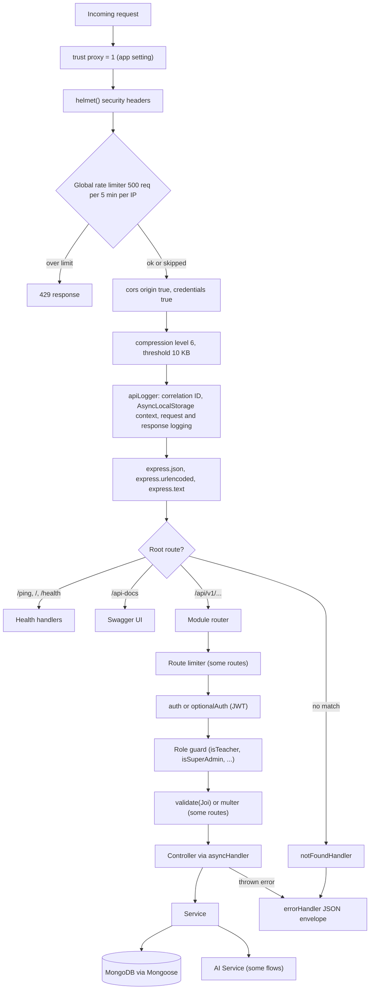

| # | Stage | File | Behaviour |
|---|---|---|---|
| 1 | Proxy trust | `index.js` | `trust proxy` = 1 so rate limiting keys on the real client IP |
| 2 | Security headers | `index.js` | `helmet()` with defaults |
| 3 | Global rate limit | `index.js` | 5-minute window, 500 requests per IP, `draft-8` `RateLimit` header, no legacy headers. Skipped for paths starting with `/api-docs`, for `/ping`, and for loopback IPs |
| 4 | CORS | `index.js` | `origin: true` (reflects the request origin), `credentials: true` |
| 5 | Compression | `index.js` | Responses above 10 KB, level 6 |
| 6 | API logger | `src/shared/middleware/apiLogger.middleware.js` | Reuses `x-correlation-id` or generates `req_<timestamp>_<hex>`, echoes it as a response header, seeds AsyncLocalStorage, logs start and finish, queues `ApiLog` documents (see 10.4). Excluded paths: `/api/v1/logs`, `/ping`, `/api-docs`, `/health`, `/robots.txt`, `/favicon.ico`, `/sitemap.xml`, `/.well-known` |
| 7 | Body parsing | `index.js` | JSON, URL-encoded (`extended: true`), text |
| 8 | Root routes | `index.js` | `GET /ping` liveness, `GET /` platform probe, `GET /health` (Mongo `readyState`, 503 when not connected), `/api-docs` Swagger UI |
| 9 | Module router | `routes/v1/index.js` | See section 7 |
| 10 | Route limiter | module route files | Auth, feedback, inline-feedback and admin LLM routes only (see 10.5) |
| 11 | Authentication | `src/shared/middleware/auth.js` | `auth` rejects with 401; `optionalAuth` attaches `req.user` when a valid token exists and never rejects |
| 12 | Role guard | `src/shared/middleware/auth.js` | Checks `req.user.accountType`; every guard except `isSuperAdmin` also admits `SuperAdmin`. Some routers apply `router.use(auth, guard)` for all routes; a few routes use inline SuperAdmin checks |
| 13 | Validation | `src/shared/middleware/validate.js` | Joi on `body`, `params`, `query` with `abortEarly: false`, `allowUnknown: true`, `stripUnknown: false`. 46 of 198 route definitions use it; the rest validate inside controllers or services |
| 14 | Controller / service | module folders | `asyncHandler` forwards rejections to `errorHandler` |
| 15 | 404 and errors | `src/shared/middleware/errorHandler.js` | `notFoundHandler` raises `AppError(404, 'NOT_FOUND')`; `errorHandler` logs and responds (see 10.3) |

## 5. Module design

Seventeen modules live under `src/modules/`. Base paths are relative to `/api/v1`.

### 5.1 auth

| Aspect | Detail |
|---|---|
| Responsibility | Signup, login, Google login, token refresh and logout, OTP send/verify, change password, reset password |
| Base path | `/authenticate` |
| Key functions | `auth.service.js`: `signup`, `login`, `loginWithGoogle`, `generateAccessToken`, `generateRefreshToken`, `storeRefreshToken`, `rotateTokens`, `revokeRefreshToken`, `revokeAllUserTokens`, `changePassword`, `generateResetToken`, `resetPassword`, `sendOTP`, `verifyOTP` |
| Models owned | `RefreshToken`, `OTP` (module copy; `src/shared/models/otp.model.js` registers the same model name guarded by `mongoose.models.OTP`) |
| Collaborators | `User`, `Profile` (shared), `referral.service.js` (redeem on signup), `mailSender`, email templates |
| Notes | Joi validators in `validators/auth.validator.js`; route limiters on login, Google, signup and reset (10.5) |

### 5.2 user

| Aspect | Detail |
|---|---|
| Responsibility | Own profile (details, update, display picture, delete account), public profile, school-managed student accounts |
| Base paths | `/profile`, `/student` |
| Key functions | `user.service.js`: `updateProfile`, `deleteAccount`, `getUserDetails`, `updateDisplayPicture`, `createStudent`, `createStudentsBulk`, `getPublicProfile`, `getAllStudents`, `updateStudent`, `deleteStudent` |
| Models owned | None (uses shared `User`, `Profile`) |
| Collaborators | `TeacherStudent` |
| Notes | Display picture accepts a URL/object from the client; the Cloudinary upload call is commented out in `profile.controller.js` |

### 5.3 content

| Aspect | Detail |
|---|---|
| Responsibility | Class, subject, chapter, topic hierarchy; chapter PDF ingestion via the AI Service; chapter deletion; RAG status check; study hierarchy for the practice picker |
| Base paths | `/classes`, `/subjects`, `/chapters`, `/topic`, `/study` |
| Key functions | `content.service.js`: `getAllStudyData` (aggregation, in-memory cached), `getStudyConfiguration`, `getChaptersByClassAndSubject` (computes `isStartable`), `createChapterWithPdf`, `_processChapterWithAI`, `_processTopicsFromAI`, `deleteChapters`, `checkRagStatus`, `createTopic`, `createTopicMapping` |
| Models owned | `Class`, `Subject`, `Chapter`, `Topic`, `ChapterTopics` |
| Collaborators | AI Service (`/v1/upload-document`, `/v1/delete-document`, `/v1/search-document`), `questions.service.js` (`prewarmChapter`) |
| Notes | A chapter is **startable** when it has at least one `ChapterTopics` row and `ragIndexed === true` |

### 5.4 questions

| Aspect | Detail |
|---|---|
| Responsibility | Question bank CRUD and reads, session batches with background AI generation, public "try now" batch, SEO chapter preview by slugs, admin-triggered generation, per-chapter counts |
| Base path | `/questions` |
| Key functions | `questions.service.js`: `getQuestionsBatch`, `_handleNoQuestions`, `_maybePrefetch`, `prewarmChapter`, `generateForChapter`, `_claimGenerationJob`, `_startBackgroundGeneration`, `_generateQuestionsBackground`, `_persistBatch`, `_dedupeNewQuestions`, `_callAIService`, `getPublicQuestionsBatch`, `getPublicChapterPreview`, `countByChapters` |
| Models owned | `Question`, `QuestionGenerationJob` |
| Collaborators | Content models, `UserAnswer` (answered-question exclusion), AI Service `/v1/generate-questions` |
| Notes | See flow 8.3 for the job state machine and tuning variables |

### 5.5 progress

| Aspect | Detail |
|---|---|
| Responsibility | Practice sessions, answer batches, topic mastery, dashboard aggregate, streaks and freezes, daily challenge, session reactions and NPS, badges, share cards, AI learning insights proxy |
| Base paths | `/sessions`, `/user-answers`, `/topic-progress`, `/progress`, `/streaks`, `/daily-challenge`, `/session-feedback`, `/badges` |
| Key functions | `progress.service.js`: `createSession`, `endSession`, `submitAnswerBatch`, `calculateAndUpdateProgress`, `updateTopicProgress`, `calculateMasteryScore`, `getProgress`, `getLastIncompleteSession`, `getMasterySummary`. `topicProgress.controller.js`: `calculateChapterProgress`, `getSubjectProgressData`, AI insight handlers. `streak.service.js`: `recordPractice`, `useStreakFreeze`, `getStreakData`. `badge.service.js`: 15 badge definitions, `checkAndAwardBadges`, `getUserBadges`. `dailyChallenge.service.js`, `sessionFeedback.service.js`, `shareCard.service.js` (Chromium PNG) |
| Models owned | `Session`, `UserAnswer`, `StudentTopicProgress`, `Streak`, `DailyChallenge`, `SessionFeedback` |
| Collaborators | `Question`, `ChapterTopics`, `Chapter`, `User`, `Profile` (badges stored in `Profile.achievements`), `Achievement`, AI Service `/v1/ai-insights/*` |
| Notes | Topic-progress routes take the user from the JWT (`req.user.id`), not from a URL parameter |

### 5.6 question-paper

| Aspect | Detail |
|---|---|
| Responsibility | Teacher exam-paper generation from the existing question bank (difficulty mix), history, preview, PDF render, delete; public lead-magnet generator |
| Base path | `/question-paper` |
| Key functions | `questionPaper.service.js`: `generatePaper`, `generatePublicPaper` (max 10 questions, stores a `Lead`, calls the WhatsApp mock), `renderPDF` (Chromium), `getPaperPreview`, `getPaperHistory`, `deletePaper` |
| Models owned | `QuestionPaper`, `Lead` |
| Collaborators | `Question`, content models, `src/shared/utils/whatsapp.js` (mock that logs and sleeps 1.5 s) |
| Notes | Does not call the AI Service |

### 5.7 teacher

| Aspect | Detail |
|---|---|
| Responsibility | Teacher accounts (created by principals), teacher-student-subject assignments, teacher analytics dashboards |
| Base paths | `/teacher`, `/teacher-students`, `/teacher-dashboard` |
| Key functions | `teacher.service.js`: `createTeacher`, `getAllTeachers`, `updateTeacher`, `deleteTeacher`, `createTeacherStudentBulk` (also `$addToSet`s the class onto each student's `User.class`), `getTeacherStudents`. `teacherDashboard.service.js`: `getMyAssignments`, `getSubjectDashboard`, `getStudentsList`, `getChapterAnalytics`, `getStudentProgress`, `getWeakTopics`, `getActivityFeed` |
| Models owned | `TeacherStudent` |
| Collaborators | `User`, content models, `StudentTopicProgress`, `Session`, `getSubjectProgressData` |

### 5.8 quiz

| Aspect | Detail |
|---|---|
| Responsibility | Teacher-authored quizzes (draft, publish, close, clone, soft delete), question management, analytics; student availability, attempts, server-side grading, history |
| Base path | `/quiz` |
| Key functions | `quiz.service.js`: `createQuiz` (requires a matching `TeacherStudent` row), `updateQuiz`, `deleteQuiz`, `publishQuiz`, `closeQuiz`, `cloneQuiz`, `addQuestionsToQuiz`, `removeQuestionFromQuiz`, `reorderQuestions`, `getStudentAvailableQuizzes`, `submitAnswer`, `submitQuiz`, `getAttemptResult`, `getAttempt`, `getInProgressAttempt`, `shouldShowAnswers`, `getStudentQuizHistory`, `getQuizAnalytics`, `searchQuestionsForQuiz` |
| Models owned | `Quiz`, `QuizQuestion`, `QuizAttempt`, `QuizAnswer` |
| Collaborators | `TeacherStudent`, `Question`, content models |
| Notes | Routes use `auth` only; ownership (`createdBy`) and attempt ownership are enforced in the service. See 13 for the missing `startQuizAttempt` |

### 5.9 school

- **Responsibility:** school and section CRUD. **Base paths:** `/school`, `/sections`. **Models owned:** `School` (unique `schoolCode`), `Section`. **Collaborators:** `Class`.
- **Key functions** (`school.service.js`): `createSchool`, `updateSchool`, `getAllSchools`, `getSchoolById`, `createSection`, `bulkCreateSections`, `getSectionsBySchool`, `getSectionsBySchoolAndClass`, `updateSection`, `deleteSection`.

### 5.10 principal

| Aspect | Detail |
|---|---|
| Responsibility | School-scoped dashboards for principals; principal account CRUD for SuperAdmin |
| Base paths | `/principal` (dashboards, `isPrincipal`), `/principals` (accounts, `isSuperAdmin`) |
| Key functions | `principalDashboard.service.js`: `resolveSchool` (from the principal's `User.schoolId`, 400 `NO_SCHOOL` if unset), `getOverview`, `getClassPerformance`, `getSubjectPerformance`, `getTeachers`, `getStudentsList`, `getStudentDetail`. `principalAccount.service.js`: `createPrincipal`, `getAllPrincipals`, `updatePrincipal`, `deletePrincipal` |
| Models owned | None |
| Collaborators | `TeacherStudent`, `User`, `School`, `Section`, `StudentTopicProgress`, `Session`, `Streak`, `getSubjectProgressData` |

### 5.11 parent

| Aspect | Detail |
|---|---|
| Responsibility | Parent-child links (created by teachers/principals, unlinked by parents), parent dashboards |
| Base paths | `/parent-students`, `/parent-dashboard` |
| Key functions | `parent.service.js`: `createParentStudentBulk` (optionally creates parent accounts), `getParentStudents`, `unlinkParentStudent`, `verifyParentChildLink`. `parentDashboard.service.js`: `_validateParentChildLink`, `getMyChildren`, `getChildOverview`, `getChildSubjectProgress`, `getChildWeakTopics`, `getChildActivity` |
| Models owned | `ParentStudent` |
| Collaborators | `User`, `Session`, `StudentTopicProgress`, `progress.service.js`, `getSubjectProgressData` |

### 5.12 supporting (including SuperAdmin admin metrics and AI System)

| Aspect | Detail |
|---|---|
| Responsibility | Leaderboards, public stats, API log inspection, public feedback inbox with admin triage, SuperAdmin overview dashboards and user approval toggle, SuperAdmin live LLM control (AI System tab), daily achievement scheduler |
| Base paths | `/leaderboard`, `/feedback`, `/logs`, `/stats`, `/admin/metrics`, `/admin/system/llm` |
| Key functions | `supporting.service.js`: `getGlobalLeaderboard` and `getSubjectLeaderboard` (top 10 by distinct correct questions), `submitFeedback` (honeypot, DB write, Sheets mirror), `listFeedback`, `updateFeedback`, `getLogs`, `getLogStats`, `deleteAllLogs`, `getPublicStats`. `adminMetrics.service.js`: `getOverview`, `getUserMetrics`, `getNewUsers`, `getUserDetail`, `updateUserApproval`, `getContentMetrics`, `getQuestionJobMetrics`, `getEngagementMetrics`, `getFeedbackInsights`. `llmSystem.service.js`: `getStatus`, `listModels`, `testModel`, `activateModel`, `resetToEnvDefault` (proxies to the AI Service `/v1/admin/llm/*`, see 9) |
| Models owned | `ApiLog`, `Feedback`, `Achievement` |
| Collaborators | Almost every other module's models (read-only aggregations), `googleSheets.js`, `badge.service.js` |
| Notes | Admin metrics run aggregations on every request; the `withCache` wrapper is a pass-through (`adminMetrics.service.js`). Time ranges are clamped to 7, 30 or 90 days, series spans to 366 days. The LLM routes store nothing in the Backend: the live choice and its history live in the AI Service (MongoDB `llm_settings`); the Backend validates input (`llmSystem.validator.js`: known provider, model id pattern) and sends the SuperAdmin's email as `requested_by` |

### 5.13 ai-assistant

| Aspect | Detail |
|---|---|
| Responsibility | Teacher AI content generation proxy (JSON and SSE stream), clarification continuation, teacher classes, task list, health, conversation history proxy, PDF export of a generation |
| Base path | `/ai-assistant` (all routes `auth, isTeacher`) |
| Key functions | `ai-assistant.service.js`: `processAgentRequest`, `streamAgentRequest`, `createConversation`, `listConversations`, `getConversationMessages`, `addConversationMessage`, `deleteConversation`, `getTeacherClasses`, `getAvailableTasks`, `checkHealth`, `getGeneration`, `exportPDF` (Chromium) |
| Models owned | None (conversation state lives in the AI Service) |
| Collaborators | AI Service `/v1/ai-agent*`, `/v1/conversations*` |
| Notes | `streamRequest` sets `Content-Type: text/event-stream`, flushes headers and pipes `Readable.fromWeb(response.body)` to the client (`ai-assistant.controller.js`) |

### 5.14 feedback (inline reactions, behavioral prompts, suggestion board with moderation)

| Aspect | Detail |
|---|---|
| Responsibility | Per-feature thumbs up/down, behavioral signal scoring to decide when to prompt for feedback, public suggestion board with upvotes and SuperAdmin moderation |
| Base paths | `/inline-feedback`, `/behavioral-prompt`, `/suggestions` |
| Key functions | `inlineFeedback.service.js`: `submitReaction` (upsert per user and feature), `getFeatureSentiment`, `getAllFeatureSentiment`. `behavioralSignals.service.js`: `getSignalScore`, `shouldPromptFeedback` (prompt threshold 30, 24 h behavioral cooldown, 30-day NPS cooldown), `getUserTrend`. `suggestion.service.js`: `createSuggestion`, `toggleUpvote`, `getSuggestions`, `getMySuggestions`, `adminRespond`, `setHidden`, `getRecentlyShipped`, `getUserImpact` |
| Models owned | `InlineFeedback`, `Suggestion`, `SuggestionUpvote` |
| Collaborators | `Session`, `UserAnswer`, `Streak`, `SessionFeedback` |
| Notes | Suggestion statuses: `under_review`, `planned`, `in_progress`, `shipped`, `declined`. Hidden suggestions are excluded from lists unless the caller is SuperAdmin and passes `includeHidden=true` |

### 5.15 goal

- **Responsibility:** per-user daily question goal. **Base path:** `/goals`. **Models owned:** `Goal`.
- **Key functions** (`goal.service.js`): `getGoal`, `setDailyGoal` (5 to 200, default 20), `recordProgress` (no callers at this commit, see 13).

### 5.16 referral

- **Responsibility:** one referral code per user; redemption on signup or via API, and both parties receive a streak freeze. **Base path:** `/referral`. **Models owned:** `Referral`.
- **Key functions** (`referral.service.js`): `getOrCreateReferral`, `getReferralData`, `redeemReferral`, `_awardStreakFreeze`. **Collaborators:** `User`, `Streak`.

### 5.17 campaign

| Aspect | Detail |
|---|---|
| Responsibility | SuperAdmin email campaigns (draft, edit, send, delete) and one-click unsubscribe |
| Base path | `/campaign` (`/unsubscribe` public; everything else `auth, isSuperAdmin`) |
| Key functions | `campaign.service.js`: `createCampaign`, `listCampaigns`, `getCampaignById`, `updateCampaign`, `sendCampaign` (batches of 50, 300 ms pause), `unsubscribeByToken`, `deleteCampaign` |
| Models owned | `Campaign` |
| Collaborators | `User`, `mailSender`, `unsubscribeToken.js`, `campaignTemplate.js` |

## 6. Data design

### 6.1 Overview

- One MongoDB database accessed through Mongoose; 36 distinct models: `User`, `Profile`, `OTP` in `src/shared/models/` plus the "Models owned" listed per module in section 5 (`OTP` is also defined in the auth module under the same model name). Full field lists: [Database Schema](./reference/database-schema.md).
- Reads use `readPreference: 'secondaryPreferred'` (`config/db.config.js`), so reads may be served by replicas and can lag writes when a replica set is used.
- No multi-document transactions are used; consistency relies on unique indexes and atomic single-document updates.

### 6.2 Entity relationships

Identity and organisation:

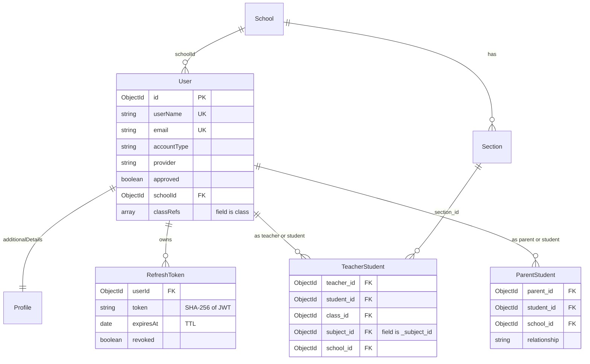

Curriculum, question bank and practice:

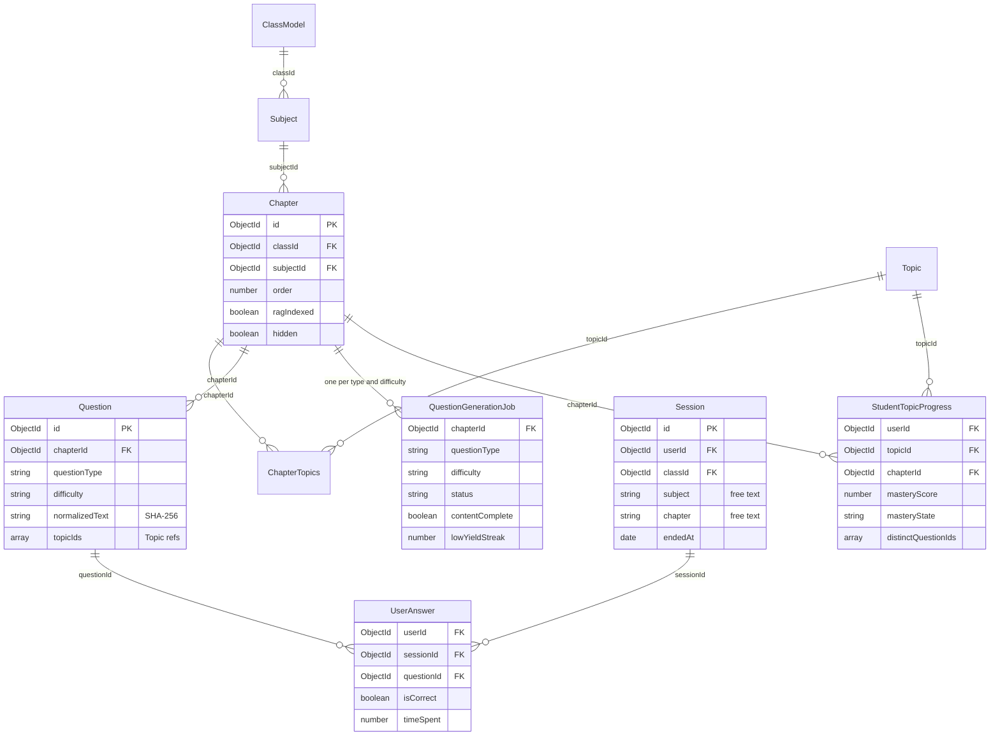

`ClassModel` is the `Class` model; `Class` is a reserved word in Mermaid ER diagrams.

Quizzes:

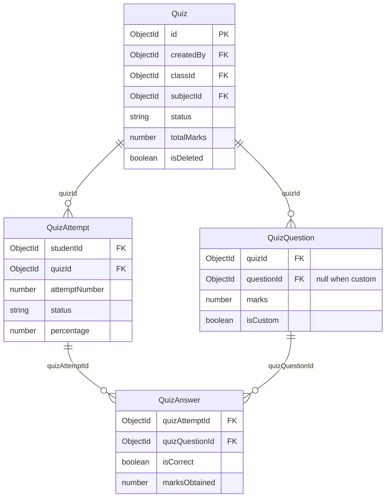

### 6.3 Indexes that matter

| Collection | Index | Why it matters |
|---|---|---|
| `Question` | unique `(chapterId, questionType, normalizedText)` with `partialFilterExpression` on string `normalizedText` | DB-level dedupe of AI output; `insertMany(ordered: false)` tolerates collisions (`question.model.js`, `questions.service.js`) |
| `Question` | `(chapterId, questionType, difficulty)`, `(chapterId, questionType, difficulty, createdAt)`, `(chapterId, createdAt)` | Batch selection and counts |
| `QuestionGenerationJob` | unique `(chapterId, questionType, difficulty)` | Makes the atomic job claim race-safe: a concurrent upsert fails with 11000 and loses the claim |
| `StudentTopicProgress` | unique `(userId, topicId, chapterId)` | One mastery row per student, topic and chapter |
| `UserAnswer` | `(userId, sessionId, createdAt)`, `(userId, subjectId, chapterId)` | Session review, answered-question exclusion, dashboard aggregations |
| `Session` | `(userId, endedAt, createdAt)` and four other `userId` indexes | Last incomplete session, history |
| `RefreshToken` | TTL on `expiresAt` (`expireAfterSeconds: 0`), `(userId, revoked)` | Auto-expiry and active-token counting |
| `OTP` | TTL 300 s on `createdAt` | OTPs expire after 5 minutes |
| `ApiLog` | TTL 30 days on `createdAt`; `(endpoint, createdAt)`, `(userId, createdAt)`, `correlationId` | Bounded log retention, log search |
| `Chapter`, `Subject` | unique `(name, subjectId, classId)`, unique `(name, classId)` | Re-uploading a chapter by name reuses the existing document |
| `ChapterTopics` | unique `(chapterId, topicId, classId, subjectId, order)` | Includes `order`, so it does not by itself prevent a duplicate chapter-topic pair; ingestion upserts on `(chapterId, topicId)` |
| `TeacherStudent` | unique `(teacher_id, student_id, class_id, _subject_id, school_id)` | Assignment identity; used for quiz access and dashboards |
| `QuizAttempt` | unique `(studentId, quizId, attemptNumber)` | Attempt numbering |
| Others | unique `SuggestionUpvote(suggestionId, userId)`, `DailyChallenge(userId, date)`, `Streak.userId`, `Goal.userId`, `Referral.userId` and `referralCode`; sparse unique `InlineFeedback(userId, feature)`, `SessionFeedback(userId, sessionId)` | One row per user per concern |

### 6.4 Source of truth vs derived data

| Data | Kind | Maintained by |
|---|---|---|
| `User`, `Profile`, `School`, `Section`, `TeacherStudent`, `ParentStudent` | Source of truth | CRUD endpoints |
| `Class`, `Subject`, `Chapter`, `Topic`, `ChapterTopics` | Source of truth; topics and mappings are created from AI `topic_keys` at ingestion | `content.service.js` |
| `Chapter.ragIndexed` | Mirror of AI-side index state (set true on a 2xx upload response, never reset) | `_processChapterWithAI` |
| `Question` | Source of truth once persisted (AI-generated or teacher-created) | `questions.service.js` |
| `QuestionGenerationJob` | Control state for generation | `questions.service.js` |
| `Session`, `UserAnswer` | Source of truth for practice | `progress.service.js` |
| `StudentTopicProgress` | Derived, incremental (not recomputed from scratch) from `UserAnswer` plus `Question.topicIds` at session end | `calculateAndUpdateProgress` |
| `Streak` | Derived from session-end events (dates in IST) | `streak.service.js` |
| `Profile.achievements` | Derived from `Session` history by badge checks | `badge.service.js`, daily scheduler |
| `DailyChallenge` | Generated snapshot per user per IST date | `dailyChallenge.service.js` |
| `Quiz.totalQuestions`, `Quiz.totalMarks` | Denormalised from `QuizQuestion` | `quiz.service.js` |
| `QuizAttempt` score fields | Derived from `QuizAnswer` at submit | `submitQuiz` |
| `Suggestion.upvoteCount` | Counter mirroring `SuggestionUpvote` rows (`$inc`) | `toggleUpvote` |
| `User.class` | Partially synced from `TeacherStudent` bulk inserts | `createTeacherStudentBulk` |
| `User.lastLoginAt`, `User.loginCount`, `ApiLog` | Telemetry | `recordLogin`, `apiLogBuffer.js` |
| `Feedback` | Source of truth; a Google Sheet row is a best-effort mirror | `supporting.service.js` |
| Vectors, embeddings, AI conversations | Owned by the AI Service; the Backend stores only `ragIndexed` and proxies conversation calls | AI Service |

### 6.5 Caching

| Cache | Scope | TTL | Invalidation | File |
|---|---|---|---|---|
| Study hierarchy (`getAllStudyData`) | In-process `Map`, per instance | 5 min | None on content changes (entries expire by age) | `src/modules/content/services/content.service.js` |
| Dashboard progress (`getProgress`) | Redis via `cache.js` | 300 s | `invalidateUserProgress` on answer submit | `progress.service.js` |
| Admin metrics | None (pass-through `withCache`) | n/a | n/a | `adminMetrics.service.js` |
| Share-card PNG | Client/CDN via `Cache-Control: public, max-age=86400` | 1 day | n/a | `sessions.controller.js` |

The Redis cache is effectively disabled: `src/shared/utils/cache.js` statically imports `ioredis`, which is not a dependency. `progress.service.js` loads it with a dynamic `import()` inside `try/catch`, so the import fails and a no-op cache is used. Enabling it requires adding `ioredis` and setting `REDIS_URL`.

### 6.6 Data lifecycle

- TTL expiry: `OTP` (5 min), `RefreshToken` (at `expiresAt`), `ApiLog` (30 days).
- Deleting chapters removes `Chapter` and `ChapterTopics` rows and asks the AI Service to delete vectors; `Question`, `QuestionGenerationJob` and `StudentTopicProgress` rows for those chapters are not deleted (`deleteChapters`).
- Deleting an account removes only `User` and `Profile` (`user.service.js` `deleteAccount`).
- Draft quizzes are hard-deleted with their `QuizQuestion` rows; closed quizzes, and published quizzes whose deadline has passed (or with force), are soft-deleted (`isDeleted`, `deletedAt`).

## 7. API design

Conventions:

- Base path `/api/v1` (`routes/index.js`, `routes/v1/index.js`); JSON request and response bodies except multipart PDF upload, PDF/PNG downloads and the SSE stream.
- Authentication: `Authorization: Bearer <accessToken>`.
- Success envelope: `{ success: true, message, data }` plus optional `pagination` (`responseHandler.js`). Auth endpoints return `tokens` and `user` at the top level instead of `data`.
- Error envelopes: see 10.3.
- Full endpoint reference: [API Reference](../reference/api-reference.md). Swagger UI: `GET /api-docs`.

| Base path | Module | Auth / roles | Purpose |
|---|---|---|---|
| `/authenticate` | auth | Public with route limiters; `changepassword` needs `auth` | Signup, login, Google, refresh, logout, OTP, password flows |
| `/profile` | user | `auth`; `GET /public/:userId` public | Own profile, picture, delete account |
| `/student` | user | `auth` + `isTeacherOrPrincipal` | School-managed student accounts |
| `/classes`, `/subjects` | content | `auth` | Curriculum lists |
| `/chapters` | content | `GET /class/:classId/subject/:subjectId` public; create, `create-with-pdf`, delete need `isTeacher`; `check-rag-status` needs `auth` | Chapters and PDF ingestion |
| `/topic` | content | `auth`; create and mapping need `isTeacher` | Topics and chapter mapping |
| `/study` | content | `/configuration` public (cached); `/filter` needs `auth` | Practice picker hierarchy |
| `/questions` | questions | `auth` for reads and batches; create, `generate/chapter/:id`, `counts` need `isTeacher`; `public-batch` and `public-preview` public | Question bank and generation |
| `/sessions` | progress | `auth`; `DELETE /` SuperAdmin (inline check) | Practice sessions, share card |
| `/user-answers` | progress | `auth` | Answer batches and history |
| `/topic-progress` | progress | `auth`; `teacher/class-insights` needs `isTeacher` | Chapter/subject mastery, AI insights |
| `/progress` | progress | `auth` | Dashboard aggregate |
| `/streaks`, `/daily-challenge`, `/badges`, `/session-feedback` | progress | `auth` | Engagement features |
| `/teacher` | teacher | `auth` + `isPrincipal` | Teacher accounts |
| `/teacher-students` | teacher | `auth` + `isTeacherOrPrincipal` | Assignments |
| `/teacher-dashboard` | teacher | `auth` + `isTeacher` (router level) | Teacher analytics |
| `/parent-students` | parent | Bulk and list: `isTeacherOrPrincipal`; unlink: `isParent` | Parent links |
| `/parent-dashboard` | parent | `auth` + `isParent` (router level) | Child analytics |
| `/principal` | principal | `auth` + `isPrincipal` (router level) | School dashboards |
| `/principals` | principal | `auth` + `isSuperAdmin` (router level) | Principal accounts |
| `/quiz` | quiz | `auth`; ownership and assignment checks in service | Quizzes and attempts |
| `/school`, `/sections` | school | `auth`; writes need `isPrincipal` | Schools and sections |
| `/leaderboard` | supporting | `auth` | Top-10 leaderboards |
| `/feedback` | supporting | `POST /` public (limiter + `optionalAuth`); `/admin*` needs `isSuperAdmin` | Feedback inbox |
| `/logs` | supporting | `auth` + SuperAdmin (inline check) | API log search, stats, purge |
| `/stats` | supporting | Public | Public counters |
| `/admin/metrics` | supporting | `auth` + `isSuperAdmin` (router level) | SuperAdmin dashboards, user approval toggle |
| `/admin/system/llm` | supporting | `auth` + `isSuperAdmin` (router level); `POST /test` 10 per minute, `POST /active` and `/reset` 5 per 10 min | Live LLM status, model list, test, switch, reset to env default |
| `/referral`, `/goals` | referral, goal | `auth` | Referral code, daily goal |
| `/question-paper` | question-paper | `auth`; `POST /public/generate` public | Papers and PDFs |
| `/ai-assistant` | ai-assistant | `auth` + `isTeacher` | AI agent proxy, SSE, conversations, PDF export |
| `/inline-feedback` | feedback | `auth` (POST limited to 10 per minute); sentiment reads need `isTeacherOrPrincipal` or `isSuperAdmin` | Feature reactions |
| `/behavioral-prompt` | feedback | `auth` | Feedback prompt gating |
| `/suggestions` | feedback | `auth`; `respond`, `hide`, `unhide` need `isSuperAdmin` | Suggestion board and moderation |
| `/campaign` | campaign | `/unsubscribe` public (GET and POST); rest `auth` + `isSuperAdmin` | Email campaigns |

Root endpoints outside `/api`: `GET /ping`, `GET /`, `GET /health`, `/api-docs`.

## 8. Key flows

### 8.1 Signup, login, OTP, JWT and refresh

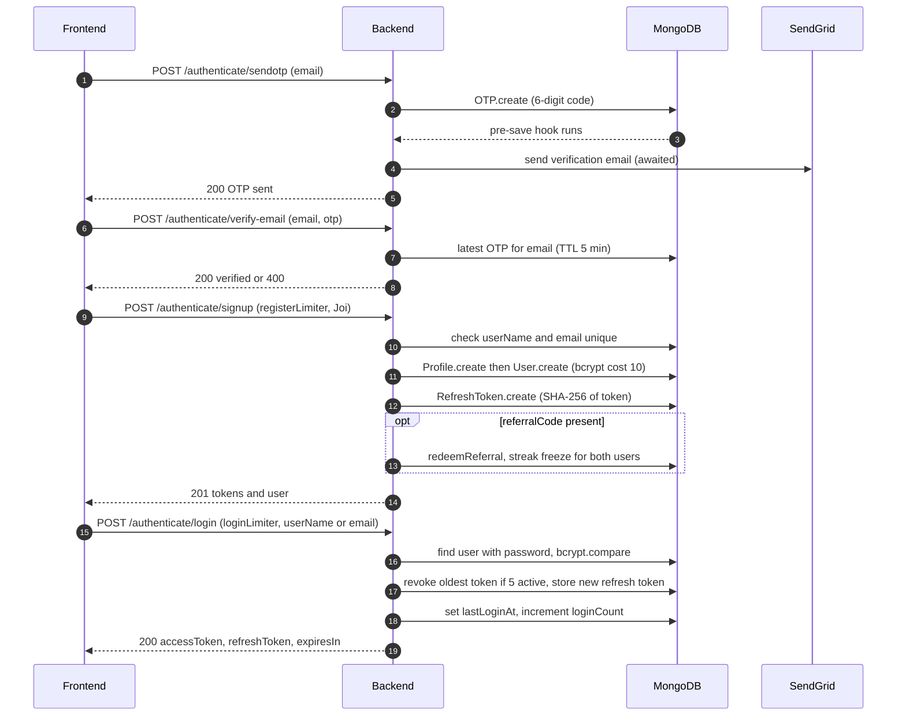

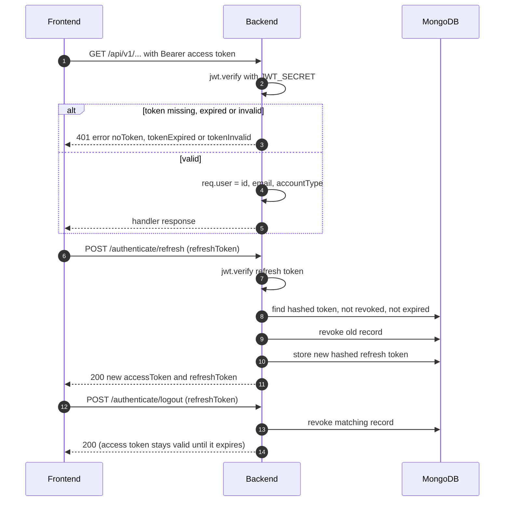

| Item | Value | Source |
|---|---|---|
| Access token lifetime | `ACCESS_TOKEN_EXPIRY`, default `2h` | `auth.service.js` |
| Refresh token lifetime | `REFRESH_TOKEN_EXPIRY`, default `7d` (parsed for `expiresAt` from `Nd`, `Nh`, `Nm`, `Ns`) | `auth.service.js` |
| Claims | `id`, `email`, `accountType` (both tokens signed with `JWT_SECRET`) | `auth.service.js` |
| Active refresh tokens per user | `MAX_REFRESH_TOKENS`, default 5; oldest revoked when exceeded | `storeRefreshToken` |
| Revoke all | On password change and on password reset | `revokeAllUserTokens` |
| Password reset token | 20 random bytes (hex), SHA-256 stored in `User.token`, expires after 5 min, link `FRONTEND_URL/update-password/<token>` | `generateResetToken` |
| Google login | `verifyIdToken` against any of `GOOGLE_CLIENT_ID`, `GOOGLE_CLIENT_ID_ANDROID`, `GOOGLE_CLIENT_ID_IOS`; match by `googleId`, else link by email, else create a `Student` with `provider: 'google'` | `loginWithGoogle` |
| Self-signup roles | Joi allows `Student`, `Teacher`, `Parent`, `Principal`; `Principal` is created with `approved: false` | `auth.validator.js`, `auth.service.js` |
| Password policy | 8 to 128 characters with upper, lower, digit and one of `!@#$%^&*` | `auth.validator.js` |

### 8.2 Chapter PDF upload and AI ingestion

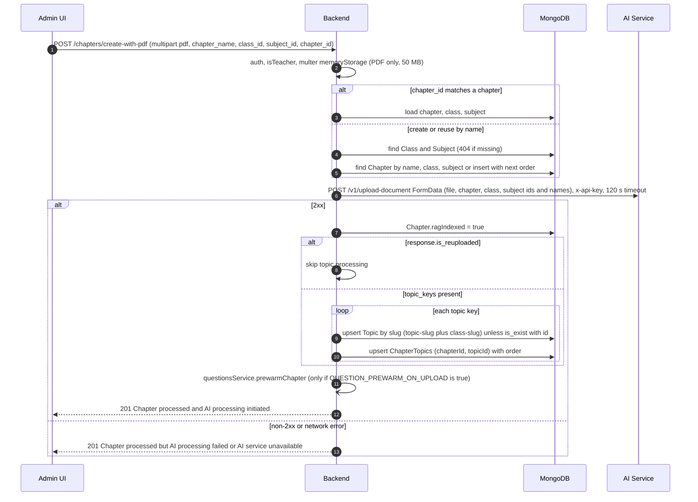

- The chapter document is persisted before the AI call; on AI failure it stays with `ragIndexed: false` and is therefore not startable.
- The study-hierarchy cache is not invalidated by uploads; `isStartable` in `/study/configuration` can lag by up to 5 minutes.
- Deletion (`DELETE /chapters`): verifies chapters belong to the class and subject, calls `POST /v1/delete-document` for each in parallel (30 s default timeout, failures only logged), then deletes `ChapterTopics` and `Chapter` rows regardless.
- RAG status (`POST /chapters/check-rag-status`): calls `POST /v1/search-document` sequentially per chapter (30 s each) and reports `found` per chapter.

### 8.3 Question generation, prefetch and "content complete"

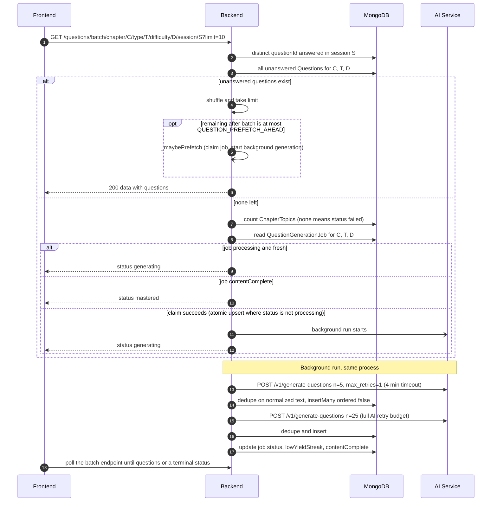

`QuestionGenerationJob` states (one document per chapter, question type and difficulty):

| From | Event | To |
|---|---|---|
| none / `completed` / `failed` | `_claimGenerationJob` wins (`findOneAndUpdate` with `status != processing`, upsert) | `processing` |
| `processing` | Both tiers finish, at least one question returned | `completed` (with `lowYieldStreak`, `contentComplete`) |
| `processing` | AI returned zero questions across both tiers | `failed` ("AI returned no questions"), not counted towards mastery |
| `processing` | Exception (timeout, non-2xx, no topics, no questions exist) | `failed` with `errorMessage` |
| `processing`, `updatedAt` older than 5 min | Poll arrives | Restarted in place (guarded by the old `updatedAt`) |
| `failed` for more than 2 min | Poll arrives | `processing` (auto-recovery); within 2 min the poll returns `failed` |
| any | `contentComplete` is true | Poll returns `mastered`; no more generation |

`contentComplete` becomes true when the selection's total question count reaches `QUESTION_HARD_CAP`, or when `lowYieldStreak` reaches `QUESTION_LOW_YIELD_LIMIT`, where a run is low-yield if it inserted fewer than `QUESTION_MIN_NEW_PER_RUN` new questions. The 4-minute AI timeout is deliberately below the 5-minute stale threshold so a hung call fails before a duplicate restart can start (`_callAIService`). The `retry` query flag is passed into `_handleNoQuestions` but not read there; recovery relies on the cooldown.

| Variable | Default | Effect |
|---|---|---|
| `QUESTION_PREFETCH_AHEAD` | 10 | Prefetch when this many or fewer unanswered questions remain after the batch |
| `QUESTION_MIN_NEW_PER_RUN` | 3 | A run adding fewer new questions is low-yield |
| `QUESTION_LOW_YIELD_LIMIT` | 2 | Consecutive low-yield runs before `contentComplete` |
| `QUESTION_HARD_CAP` | 300 | Absolute cap per chapter, type and difficulty |
| `QUESTION_FIRST_BATCH_SIZE` | 5 | Tier-1 size |
| `QUESTION_BATCH_SIZE` | 30 | Total per run (tier 2 is the remainder) |
| `QUESTION_FIRST_BATCH_MAX_RETRIES` | 1 | Sent as `max_retries` for tier 1 |
| `QUESTION_PREWARM_ON_UPLOAD` | `false` | Pre-generate after ingestion |
| `QUESTION_PREWARM_TYPES` | `mcq` | Types to pre-warm |
| `QUESTION_PREWARM_DIFFICULTIES` | `Easy,Medium,Hard` | Difficulties to pre-warm |

Other triggers: `POST /questions/generate/chapter/:chapterId` (teacher/admin, not env-gated, `mcq` for all three difficulties, 409 `NO_TOPICS` without topics) and `prewarmChapter` after upload.

### 8.4 Study session: start, answer, end, topic progress

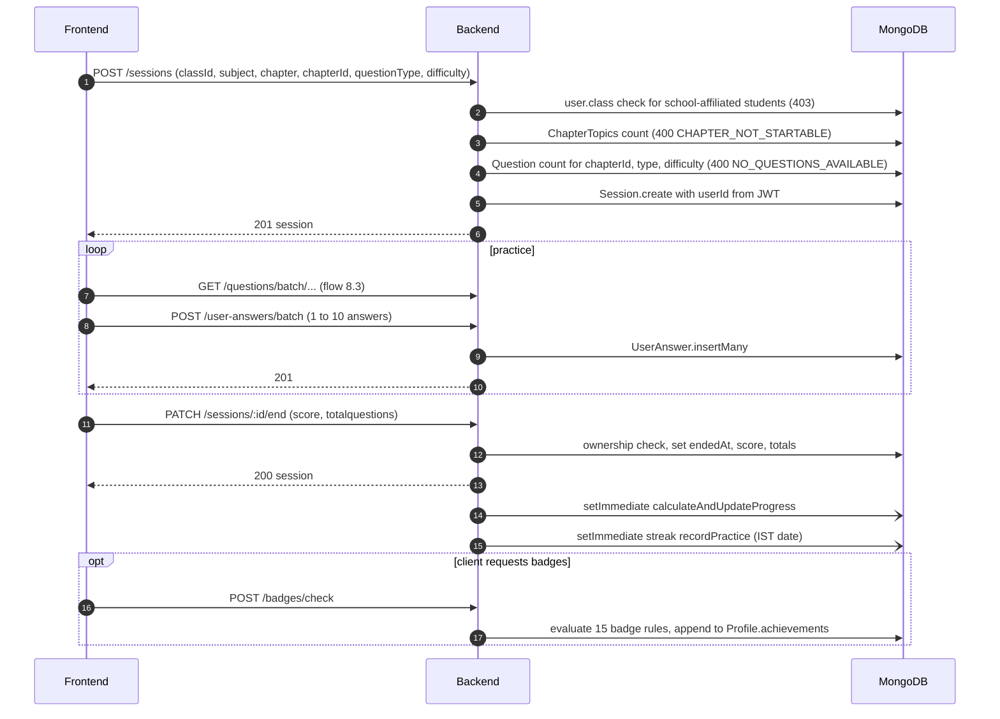

`calculateAndUpdateProgress` groups the session's answers by every topic in `Question.topicIds` and updates one `StudentTopicProgress` per (subject, chapter, topic):

| Step | Rule | Source |
|---|---|---|
| Counters | Increment total and per-difficulty attempts and correct counts; unknown difficulty counts as medium | `updateTopicProgress` |
| Evidence | `distinctQuestionIds` set of answered questions | `updateTopicProgress` |
| Score | Weighted accuracy over attempted tiers only (easy 0.25, medium 0.35, hard 0.40, renormalised); multiplied by 0.9 if average time exceeds 60 s; rounded to 2 decimals | `calculateMasteryScore` |
| State | `score < 0.4` WEAK, `score < 0.6` LEARNING, `score < 0.8` PRACTICING, otherwise MASTERED | `getMasteryState` |
| Evidence gate | PRACTICING and MASTERED are capped to LEARNING until distinct questions reach the smaller of `MASTERY_MIN_EVIDENCE` (default 8) and the topic's available questions | `getMasteryStateGated` |
| Chapter view | Average topic score: `score < 0.4` WEAK, `score < 0.6` NEEDS_REVISION, `score < 0.8` GOOD, otherwise STRONG; coverage = attempted topics / chapter topics | `topicProgress.controller.js` |

### 8.5 Quiz lifecycle and attempt

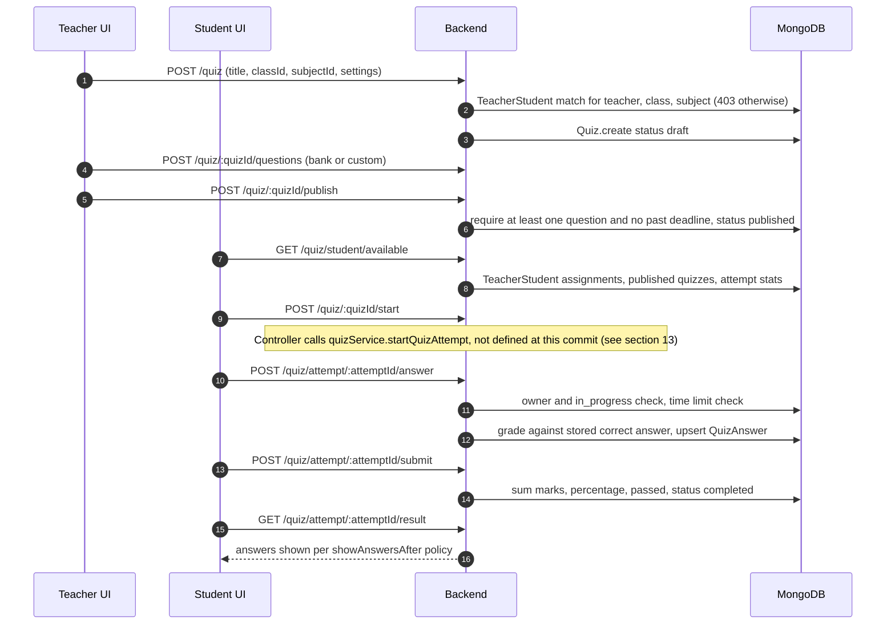

Quiz settings defaults (`createQuiz`): `allowedAttempts` 1, `passingPercentage` 50, `showAnswersAfter` `immediately` (other values `submission`, `deadline`, `never`), optional `timeLimit` in minutes and `deadline`. Unlike practice, quiz answers are graded on the server.

### 8.6 AI insights proxy

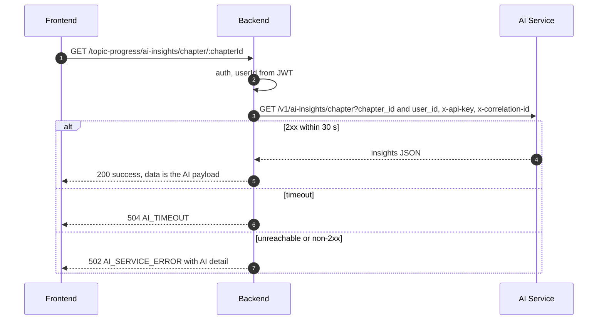

The subject variant calls `/v1/ai-insights/subject` with `subject_id`; the teacher variant (`/topic-progress/teacher/class-insights?subjectId=`) calls `/v1/ai-insights/teacher/class` with `teacher_id`. All three use `proxyAiService` (`src/shared/utils/requestContext.js`).

### 8.7 Feedback submission and moderation

Public feedback inbox:

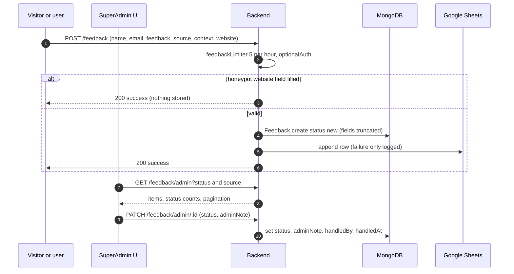

Suggestion board:

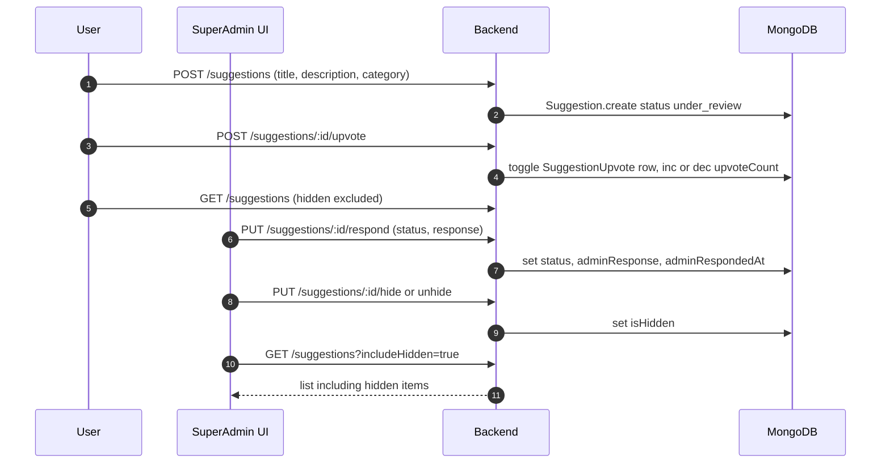

Related: `POST /inline-feedback` upserts one reaction per user and feature (10 per minute limiter); `GET /behavioral-prompt/check` decides whether to show a prompt; session reactions and NPS go to `/session-feedback` (NPS shown at the 5th session and every 20 sessions after, `sessionFeedback.service.js`).

## 9. Integration with AI Service

All calls go to `process.env.AI_ENDPOINT` + `/v1/...`. `correlationHeaders()` (`src/shared/utils/requestContext.js`) adds `x-correlation-id` from AsyncLocalStorage and `x-api-key` from `AI_SERVICE_API_KEY` when set. `proxyAiService()` wraps `fetchWithTimeout` (default 30 s) and maps errors: abort to `AppError(504, 'AI_TIMEOUT')`, network failure to `502 AI_SERVICE_ERROR`, non-2xx to `502` with the AI `detail` or `message`. No outbound call has an automatic retry in the Backend; the only retry setting is `max_retries` forwarded to the AI Service for tier-1 generation.

| Backend file | Endpoint | Headers via `correlationHeaders` | Timeout | Failure handling |
|---|---|---|---|---|
| `index.js` | `GET /ping` (root, not `/v1`) | No | 30 s | Fire-and-forget warm-up, warning logged |
| `content.service.js` `_processChapterWithAI` | `POST /v1/upload-document` (multipart) | Yes | 120 s | Non-blocking: 201 with a failure message, `ragIndexed` unchanged |
| `content.service.js` `deleteChapters` | `POST /v1/delete-document` | Yes | 30 s | Non-blocking: logged, Mongo deletes proceed |
| `content.service.js` `checkRagStatus` | `POST /v1/search-document` | Yes | 30 s per chapter, sequential | Per-chapter `status: 'error'` in the result |
| `questions.service.js` `_callAIService` | `POST /v1/generate-questions` | Yes | 4 min (AbortController) | Background: job marked `failed`; client sees `generating` or `failed` on poll |
| `topicProgress.controller.js` | `GET /v1/ai-insights/chapter`, `/subject`, `/teacher/class` | Yes | 30 s (`proxyAiService`) | Blocking: 502 or 504 to the client |
| `ai-assistant.service.js` `processAgentRequest` | `POST /v1/ai-agent` | Yes | 10 min | Blocking: 502, 504 or 500 |
| `ai-assistant.service.js` `streamAgentRequest` | `POST /v1/ai-agent/stream` | Yes | 10 min until response headers, none after | Blocking until headers, then piped as SSE |
| `ai-assistant.service.js` `getAvailableTasks` | `GET /v1/ai-agent/tasks` | Yes | None | Blocking: 500 |
| `ai-assistant.service.js` `checkHealth` | `GET /v1/ai-agent/health` | Yes | None effective (a `timeout` option is passed, which `fetch` ignores) | Returns `unhealthy` instead of throwing |
| `ai-assistant.service.js` `getTeacherClasses` | `GET /v1/ai-agent/classes` | No | None | Blocking error |
| `ai-assistant.service.js` `getGeneration` (used by `exportPDF`) | `GET /v1/ai-agent/generation/:id` | No | None | 404 `GENERATION_NOT_FOUND` on non-2xx |
| `ai-assistant.service.js` conversations | `POST/GET /v1/conversations`, `GET/POST /v1/conversations/:id/messages`, `DELETE /v1/conversations/:id` | No | None | Blocking: 502 or 503 |
| `llmSystem.service.js` `getStatus`, `listModels`, `resetToEnvDefault` | `GET /v1/admin/llm/status`, `GET /v1/admin/llm/models`, `POST /v1/admin/llm/reset` | Yes | 20 s, 30 s, 20 s | Blocking. Own `callAi` wrapper, not `proxyAiService`: AI `400`/`409`/`503`/`504` pass through with the AI `detail`; other non-2xx become 502 |
| `llmSystem.service.js` `testModel`, `activateModel` | `POST /v1/admin/llm/test`, `POST /v1/admin/llm/active` | Yes | 100 s, 110 s (above the AI Service's 90 s `LLM_TEST_TIMEOUT`) | Same as above; `activated: false` comes back as 200 (nothing switched) |

Request/response contracts are documented in `shared-contracts` and in [Integration](../reference/integration.md).

## 10. Cross-cutting concerns

### 10.1 Configuration

Environment is loaded with `dotenv` (`config/server.config.js` and several modules). Names only; defaults are code defaults.

| Variable | Meaning | Read in |
|---|---|---|
| `PORT` | HTTP port (default 4000) | `config/server.config.js` |
| `DATABASE_URL` | MongoDB connection string (exported as `ATLAS_DB_URL`) | `config/server.config.js` |
| `NODE_ENV` | Environment; `development` enables the route-count log and debug log level, `test` disables file and Loki transports | `index.js`, `logger.js` |
| `JWT_SECRET` | Signs access and refresh JWTs and unsubscribe HMACs | `auth.js`, `auth.service.js`, `unsubscribeToken.js` |
| `ACCESS_TOKEN_EXPIRY`, `REFRESH_TOKEN_EXPIRY`, `MAX_REFRESH_TOKENS` | Token lifetimes (2h, 7d) and active refresh-token cap (5) | `auth.service.js` |
| `GOOGLE_CLIENT_ID`, `GOOGLE_CLIENT_ID_ANDROID`, `GOOGLE_CLIENT_ID_IOS` | Accepted Google ID-token audiences | `auth.service.js` |
| `AI_ENDPOINT` | AI Service base URL (no path) | content, questions, progress, ai-assistant, supporting (`llmSystem.service.js`), `index.js` |
| `AI_SERVICE_API_KEY` | Sent as `x-api-key` | `requestContext.js` |
| `SENDGRID_API_KEY`, `EMAIL` | SendGrid API key and verified sender address | `mailSender.js` |
| `FRONTEND_URL` | Base for password-reset links (default local dev URL) | `auth.service.js` |
| `BACKEND_URL` | Keep-alive target and unsubscribe-link base (falls back to a hard-coded production URL) | `keepAlive.js`, `unsubscribeToken.js` |
| `QUESTION_*` (10 variables) | Question-generation tuning (table in 8.3) | `questions.service.js` |
| `MASTERY_MIN_EVIDENCE` | Distinct-question evidence gate (default 8) | `progress.service.js` |
| `LOG_LEVEL` | Overrides the Winston level | `logger.js` |
| `LOKI_HOST`, `LOKI_USERNAME`, `LOKI_PASSWORD`, `LOKI_BATCHING`, `LOKI_BATCH_INTERVAL` | Optional Grafana Loki shipping (off unless `LOKI_HOST` is set; batching off by default, interval 5 s) | `logger.js` |
| `API_LOG_FLUSH_INTERVAL_MS`, `API_LOG_FLUSH_THRESHOLD`, `API_LOG_MAX_BUFFER` | ApiLog buffer tuning (2000 ms, 50, 1000) | `apiLogBuffer.js` |
| `API_LOG_SLOW_MS`, `API_LOG_SAMPLE_RATE` | Slow-request threshold (1000 ms) and sampling rate (1.0) for persisted logs | `apiLogger.middleware.js` |
| `REDIS_URL` | Redis for `cache.js`; unused while `ioredis` is absent | `cache.js` |

`.env.example` also lists variables no code reads (`RAZORPAY_*`, `CLOUD_NAME`, `API_KEY`, `API_SECRET`, `MONGODB_URL`, `GOOGLE_CLIENT_SECRET`; `FOLDER_NAME` appears only in commented-out code).

### 10.2 Authentication and authorization

| Mechanism | Behaviour | File |
|---|---|---|
| Token transport | `Authorization: Bearer`. `auth` also looks at `req.cookies.token`, but no cookie parser is installed and the server never sets cookies | `src/shared/middleware/auth.js` |
| `auth` | 401 with `error: noToken`, `tokenExpired` or `tokenInvalid`; sets `req.user` to the decoded claims | `auth.js` |
| `optionalAuth` | Attaches `req.user` when a valid token is present; never rejects | `auth.js` |
| Role guards | `isStudent`, `isTeacher`, `isPrincipal`, `isParent`, `isNormalUser`, `isTeacherOrPrincipal` (all also admit `SuperAdmin`), `isSuperAdmin` (only `SuperAdmin`); 403 on mismatch | `auth.js` |
| Ownership helper | `canAccessUser(reqUser, ownerId)`: owner, or any of `SuperAdmin`, `Teacher`, `Principal`, `Parent` | `src/shared/utils/access.js` |
| Ownership checks | Applied per controller or service (for example sessions, share cards, quiz attempts, parent-child links, principal school scope), not by a shared middleware | module controllers and services |

| Role | Created by | Typical scope |
|---|---|---|
| `SuperAdmin` | Not creatable through the API | Admin metrics, logs, feedback inbox, suggestions moderation, campaigns, principal accounts, live LLM selection |
| `Principal` | Self-signup (`approved: false`) or SuperAdmin via `/principals` | School dashboards, teacher accounts, schools and sections |
| `Teacher` | Self-signup or principal via `/teacher` | Content upload, question generation, quizzes, papers, AI assistant, teacher dashboards |
| `Parent` | Self-signup or teacher/principal via `/parent-students/bulk` | Parent dashboard for linked children |
| `Student` | Self-signup, Google login, or teacher/principal via `/student/create` | Practice, quizzes, progress |
| `NormalUser` | Enum value only (not selectable in the signup schema) | Guard exists (`isNormalUser`) |

The `approved` flag is changed by `PATCH /admin/metrics/users/:id/approval`; see [Authentication](./development/authentication.md).

### 10.3 Errors and response envelope

| Situation | Status | Body |
|---|---|---|
| Success | 200/201 | `{ success: true, message, data, pagination? }` |
| Auth endpoints success | 200/201 | `{ success: true, message, tokens, user? }` |
| Thrown error (any class with `statusCode`) | `err.statusCode` or 500 | `{ success: false, message, code }` |
| Joi validation failure | 400 | `{ success: false, message: 'Validation failed', error: { errors: [ { field, message } ] } }` |
| `auth` failure | 401 | `{ success: false, message, error: 'noToken' or 'tokenExpired' or 'tokenInvalid' }` |
| Role guard failure | 403 | `{ success: false, message }` |
| Route limiter | 429 | `{ success: false, message }` (global limiter uses the library default body) |
| Unknown route | 404 | `{ success: false, message: 'Route not found: ...', code: 'NOT_FOUND' }` |

`errorHandler` (`src/shared/middleware/errorHandler.js`) also maps Mongoose `ValidationError` to 400 `VALIDATION_ERROR`, `CastError` to 400 `INVALID_ID`, duplicate key 11000 to 409 `DUPLICATE_KEY`, and JWT errors to 401. Module error classes: `AppError` (shared, `isOperational`), `AIAssistantError` (extends `AppError`), and `AuthError`, `CampaignError`, `ContentError`, `GoalError`, `ParentError`, `ParentDashboardError`, `PrincipalAccountError`, `PrincipalDashboardError`, `ProgressError`, `ShareCardError`, `QuestionPaperError`, `QuestionsError`, `QuizError`, `ReferralError`, `SchoolError`, `SupportingError`, `TeacherError`, `TeacherDashboardError`, `UserError` (each extends `Error` with `statusCode` and `code`). The quiz controller builds its own error responses. See also [Error Handling](./development/error-handling.md).

### 10.4 Logging and observability

| Component | Behaviour | File |
|---|---|---|
| Winston levels | `error`, `warn`, `info`, `http`, `debug`; default `debug` in development, `http` elsewhere, `LOG_LEVEL` overrides | `src/shared/utils/logger.js` |
| Transports | Console always; outside `test`: daily-rotated files under `logs/` (error 14 days, combined 14 days, http 7 days, gzip) plus `exceptions.log` and `rejections.log` handlers | `logger.js` |
| Loki | When `LOKI_HOST` is set: labels `service=backend` and `env`; metadata coerced to strings; per-line push unless `LOKI_BATCHING=true`; 10 s push timeout | `logger.js` |
| Correlation ID | `x-correlation-id` accepted or generated, returned as a response header, stored in AsyncLocalStorage and forwarded to the AI Service | `apiLogger.middleware.js`, `requestContext.js` |
| Request logs | Start line at `http`, completion at `info` (success) or `warn` (status 400+) with duration and status | `apiLogger.middleware.js` |
| Persisted API logs | Candidates: non-GET requests and any error; errors and requests slower than `API_LOG_SLOW_MS` always kept; others sampled by `API_LOG_SAMPLE_RATE`. Bodies masked for keys containing `password`, `token`, `secret`, `authorization`, `apiKey`, `otp`, `creditCard` and truncated above 5 KB | `apiLogger.middleware.js` |
| Log buffer | In-memory, `insertMany(ordered: false)` every 2 s or at 50 entries; bounded at 1000 (oldest dropped, drop count logged); drained on shutdown | `src/shared/utils/apiLogBuffer.js` |
| Health | `GET /ping` (static), `GET /health` (Mongo `readyState`, 200 healthy or 503 degraded) | `index.js` |
| API docs | Swagger UI at `/api-docs` from JSDoc in route files | `config/swagger.config.js` |

### 10.5 Rate limiting

All limiters use `express-rate-limit` with the default in-memory store, keyed by client IP.

| Limiter | Window | Limit | Applies to | File |
|---|---|---|---|---|
| Global | 5 min | 500 | Every request except `/api-docs*`, `/ping`, loopback IPs | `index.js` |
| `loginLimiter` | 15 min | 10 | `POST /authenticate/login`, `POST /authenticate/google` | `auth.routes.js` |
| `registerLimiter` | 60 min | 10 | `POST /authenticate/signup` | `auth.routes.js` |
| `resetLimiter` | 15 min | 5 | `POST /authenticate/reset-password-token`, `POST /authenticate/reset-password` | `auth.routes.js` |
| `feedbackLimiter` | 60 min | 5 | `POST /feedback` | `supporting/routes/feedback.routes.js` |
| `reactionLimiter` | 1 min | 10 | `POST /inline-feedback` (after `auth`) | `feedback/routes/inlineFeedback.routes.js` |
| `testLimiter` | 1 min | 10 | `POST /admin/system/llm/test` (after `auth` + `isSuperAdmin`) | `supporting/routes/llmSystem.routes.js` |
| `switchLimiter` | 10 min | 5 | `POST /admin/system/llm/active`, `POST /admin/system/llm/reset` | `supporting/routes/llmSystem.routes.js` |

### 10.6 Email via SendGrid

- `mailSender(email, title, body, options)` calls `@sendgrid/mail` `send()` with `from: EMAIL` and optional custom headers (`src/shared/utils/mailSender.js`). SMTP is not used.
- Transactional mail: OTP (sent in the `OTP` pre-save hook, awaited, so a send failure fails `/sendotp`), password reset link (awaited), password-change confirmation (fire-and-forget).
- Broadcast mail: campaigns (5.17) exclude users with `active: false` or `emailOptOut: true`, send in batches of 50 with `Promise.allSettled` and a 300 ms pause, and add `List-Unsubscribe` and `List-Unsubscribe-Post: List-Unsubscribe=One-Click` headers.
- Unsubscribe tokens are stateless: `base64url(userId).base64url(HMAC-SHA256(userId, JWT_SECRET))`, verified with `timingSafeEqual`, no expiry (`src/shared/utils/unsubscribeToken.js`).
- Templates: `src/shared/templates/email/` (`emailVerificationTemplate.js`, `passwordReset.js`, `passwordUpdate.js`, `campaignTemplate.js`).

### 10.7 Security measures

| Measure | Detail |
|---|---|
| Headers | `helmet()` defaults |
| CORS | Origin reflected, credentials allowed; no cookies are issued by the server |
| Passwords | bcrypt cost 10; `password` field `select: false` on `User` |
| Stored tokens | Refresh tokens and password-reset tokens stored as SHA-256 hashes |
| Token revocation | Refresh-token rotation; revoke-all on password change or reset |
| Input validation | Joi on auth, content, questions, teacher, parent, principal routes (46 route definitions); regex inputs escaped in log search (`escapeRegex`) |
| Uploads | PDF MIME filter and 50 MB limit, memory storage, never written to disk |
| Log hygiene | Sensitive keys masked, bodies truncated, ApiLog TTL 30 days |
| Spam controls | Honeypot field and 5-per-hour limiter on public feedback |
| AI Service auth | Shared `x-api-key` on calls built with `correlationHeaders()` |

### 10.8 Server-side rendering (PDF/PNG)

`puppeteer.launch` with `@sparticuz/chromium` args, executable path and headless mode, `page.setContent(html)` then `page.pdf` (A4) or a screenshot, browser closed in `finally`. Used by `questionPaper.service.js` `renderPDF`, `shareCard.service.js` `generateShareImage` and `ai-assistant.service.js` `exportPDF`.

## 11. Background jobs and scheduling

| Job | Trigger | Defined in | What it does |
|---|---|---|---|
| Achievement sweep | `node-cron` `35 11 * * *` (server local time, no `timezone` option) | `src/modules/supporting/jobs/achievementScheduler.js` | Loads every user ID and runs `badgeService.checkAndAwardBadges` sequentially as a safety net for `POST /badges/check` |
| Keep-alive | `node-cron` `*/14 * * * *` | `src/shared/jobs/keepAlive.js` | `GET` the Backend's own `/ping` via `node-fetch` so the host does not idle; results ignored |
| Question generation | Poll with an empty pool, prefetch threshold, admin trigger, or upload pre-warm | `questions.service.js` | Fire-and-forget promise per (chapter, type, difficulty) job; state in `QuestionGenerationJob` |
| Post-session updates | `setImmediate` after `PATCH /sessions/:id/end` | `progress.service.js` | `calculateAndUpdateProgress` and `streakService.recordPractice` |
| Campaign send | `POST /campaign/:id/send` returns immediately | `campaign.controller.js`, `campaign.service.js` | Batched SendGrid sends, status `sending` then `sent` or `failed` |
| ApiLog flush | 2 s timer (unref'd) or 50 buffered entries; also on SIGTERM/SIGINT | `src/shared/utils/apiLogBuffer.js` | `ApiLog.insertMany` |
| Startup warm-ups | After `app.listen` | `index.js` | Study-hierarchy cache pre-warm, AI Service `/ping` |

Both cron jobs start through side-effect imports at the top of `index.js`. There is no job queue or distributed lock; every running instance schedules its own copy.

## 12. Testing

| Item | Detail |
|---|---|
| Framework | Jest 30 in native ESM mode (`NODE_OPTIONS=--experimental-vm-modules`); no Jest config file at the repo root (defaults) |
| Layout | `src/modules/<module>/tests/*.service.test.js`: 12 files covering `auth`, `content`, `principal` (2), `progress`, `question-paper`, `questions`, `quiz`, `school`, `supporting`, `teacher`, `user`; roughly 310 `it`/`test` cases (grep count) |
| No tests | `ai-assistant`, `campaign`, `feedback`, `goal`, `parent`, `referral`; no controller, route or middleware tests |
| Mocking | `jest.unstable_mockModule` declared before `await import()` of the service; Mongoose models mocked by module path; `logger.js` disables file and Loki transports when `NODE_ENV=test` |
| Commands | `npm test` (all), `NODE_OPTIONS=--experimental-vm-modules npx jest path/to/file.test.js` (single file), `npm run lint`, `npm run lint:fix` |
| CI | No CI workflow in the repo |
| Other | `edu-platform-tester/` is a separate TypeScript/Playwright project with its own `package.json` and Jest config |

More detail: [Testing](./development/testing.md).

## 13. Design constraints and known limitations

Runtime and scaling:

1. Single-process design. Background generation, campaign sends and post-session updates are in-memory promises; a restart loses them. Generation recovers through the 5-minute stale restart and 2-minute failed cooldown; campaigns stay in `sending` and cannot be re-sent through the API (`sendCampaign` rejects `sending`).
2. Per-instance in-memory state: rate-limit counters, the study-hierarchy cache and the ApiLog buffer. Running more than one instance would multiply effective rate limits, let caches diverge and run each cron job once per instance.
3. The global rate limiter is registered before `cors`, so a global 429 carries no CORS headers and browsers report it as a CORS failure (`index.js`).
4. `DBConnection()` runs inside the `app.listen` callback, so the port accepts traffic before MongoDB is connected; Mongoose buffers queries until then.
5. Graceful shutdown flushes API logs and closes the HTTP server but does not close the Mongo connection or wait for background tasks (10 s failsafe exit).
6. Each PDF/PNG render launches its own Chromium instance; there is no browser pool.
7. The Redis cache is a no-op (6.5); admin metrics and leaderboards run full aggregations on every request.
8. Time zones are mixed: cron uses server local time, streaks and daily challenges use IST date strings, and dashboard "today" stats use server-local midnight (`progress.service.js`).

Data integrity:

9. Leaderboards and mastery are derived from stored practice answers; quiz answers are graded on the server.
10. `StudentTopicProgress` is updated incrementally at session end rather than recomputed, so it depends on each session being finalized exactly once.
11. `Session` stores `subject` and `chapter` as strings; the `chapterId` sent at creation is used for validation but not persisted, and `getLastIncompleteSession` selects `subjectId`/`chapterId` fields that are not in the schema.
12. `UserAnswer.difficulty` is lowercase (`easy`, `medium`, `hard`) while `Question`, `Session` and `QuestionGenerationJob` use capitalised values.
13. Chapter and account deletion do not cascade (6.6).
14. Question dedupe is exact after normalisation (lowercase, alphanumerics only); semantic near-duplicates are not detected.
15. Study-hierarchy cache entries are not invalidated on upload or delete (up to 5 minutes stale).

Defects present at this commit:

16. `POST /quiz/:quizId/start` calls `quizService.startQuizAttempt`, which is not defined in `quiz.service.js`, and nothing else creates `QuizAttempt` documents, so starting a quiz returns 500 "Failed to start quiz".
17. `getTeacherClassInsights` reads `req.user._id`, but the JWT claims carry `id`, so `GET /topic-progress/teacher/class-insights` fails with 500.
18. In `auth.service.js` `signup`, the referral-failure branch calls `logger.warn` without importing `logger`; a failed referral redemption surfaces as a 500 after the user has already been created.
19. `resetPasswordSchema` validates `newPassword` and `confirmPassword`, while `password.controller.js` compares `password` with `confirmPassword` and saves `password`.
20. `goalService.recordProgress` has no callers, so `Goal.currentProgress` is never advanced on the server.
21. The `retry` query parameter of the batch endpoint is not used by `_handleNoQuestions`.

Integration and tooling:

22. Conversation, `ai-agent/classes` and `ai-agent/generation/:id` calls use a bare `fetch` instead of the shared request helpers, so they carry no correlation ID and have no timeout; no AI call is retried by the Backend.
23. `supporting.service.js` imports `googleSheets.js`, which loads its Google credentials synchronously at import time; the process cannot start without them.
24. Profile pictures are not uploaded anywhere (Cloudinary call commented out) and WhatsApp delivery is a logging mock.
25. `npm test` uses POSIX inline environment syntax and needs a POSIX shell (Git Bash, WSL) on Windows.
26. `scripts/` is gitignored, so seed and maintenance scripts referenced in repo docs may not exist in a given checkout.
27. Joi validation covers 46 of 198 route definitions; the rest rely on controller and service checks.

## 14. Related docs

- [System HLD](../reference/hld.md)
- [Backend Architecture](./architecture.md)
- [Database Schema](./reference/database-schema.md) (full field lists)
- [System Design Overview](./reference/system-design.md)
- [Module Reference](./development/module-reference.md)
- [API Reference](../reference/api-reference.md)
- [Integration (Backend and AI Service)](../reference/integration.md)
- [Authentication](./development/authentication.md)
- [Error Handling](./development/error-handling.md)
- [Testing](./development/testing.md)
- [Deployment](./development/deployment.md)
