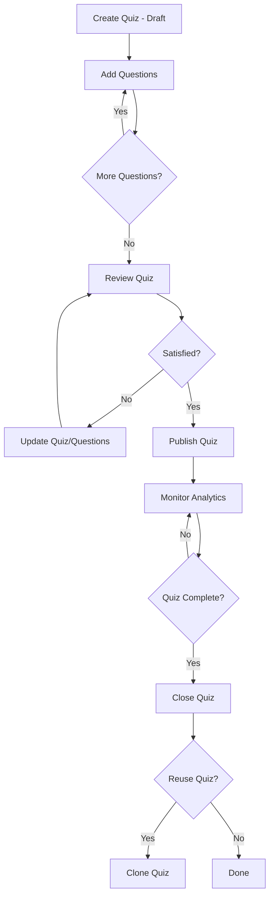
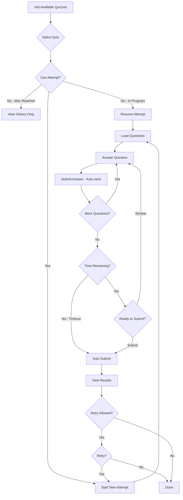
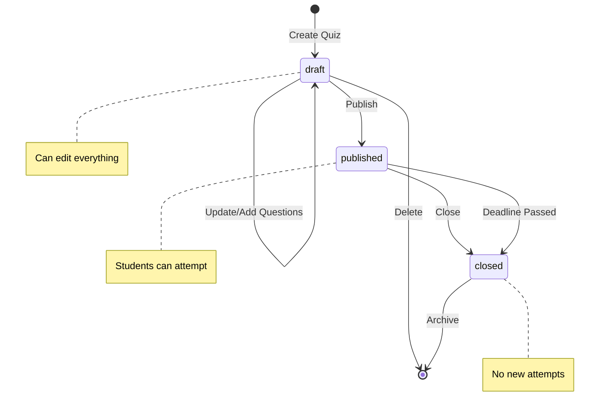

# Quiz Module - Frontend API Documentation

This document provides comprehensive documentation for the Quiz Module APIs, including all endpoints, request/response formats, data models, and workflow diagrams to help frontend developers integrate the quiz functionality.

## Table of Contents

- [Overview](#overview)
- [Data Models](#data-models)
- [API Endpoints](#api-endpoints)
  - [Teacher APIs](#teacher-apis)
  - [Student APIs](#student-apis)
- [Workflow Diagrams](#workflow-diagrams)
- [Error Codes](#error-codes)
- [Best Practices](#best-practices)

---

## Overview

The Quiz Module allows teachers to create, manage, and publish quizzes, while students can take quizzes and view their results. The module supports:

- **Teachers**: Create quizzes (draft), add questions (from question bank or custom), publish, close, clone, and view analytics
- **Students**: View available quizzes, start attempts, submit answers, view results and history

### Base URL

All quiz endpoints are prefixed with:
```
/api/v1/quiz
```

### Authentication

All endpoints require authentication via Bearer token:
```
Authorization: Bearer <token>
```

### Standard Response Format

All API responses follow this structure:
```json
{
  "success": true | false,
  "message": "Optional status message",
  "data": { ... },
  "code": "ERROR_CODE"  // Only on error
}
```

---

## Data Models

### Quiz

| Field | Type | Description |
|-------|------|-------------|
| `_id` | ObjectId | Unique quiz identifier |
| `createdBy` | ObjectId | Teacher who created the quiz |
| `title` | String | Quiz title (required) |
| `description` | String | Quiz description |
| `classId` | ObjectId | Target class (required) |
| `subjectId` | ObjectId | Target subject (required) |
| `chapterIds` | ObjectId[] | Related chapters |
| `sectionIds` | ObjectId[] | Target sections (for filtering students) |
| `settings` | Object | Quiz configuration (see below) |
| `status` | String | `draft` \| `published` \| `closed` |
| `totalQuestions` | Number | Number of questions in quiz |
| `totalMarks` | Number | Total marks possible |
| `publishedAt` | Date | When the quiz was published |
| `closedAt` | Date | When the quiz was closed |
| `createdAt` | Date | Creation timestamp |
| `updatedAt` | Date | Last update timestamp |

### Quiz Settings

| Field | Type | Default | Description |
|-------|------|---------|-------------|
| `timeLimit` | Number | `null` | Time limit in **minutes** (null = unlimited) |
| `shuffleQuestions` | Boolean | `false` | Randomize question order per attempt |
| `shuffleOptions` | Boolean | `false` | Randomize option order (not implemented yet) |
| `showAnswersAfter` | String | `immediately` | When to reveal correct answers: `immediately` \| `submission` \| `deadline` \| `never` |
| `allowedAttempts` | Number | `1` | Max attempts per student (null = unlimited) |
| `passingPercentage` | Number | `50` | Minimum % to pass |
| `deadline` | Date | `null` | Quiz deadline (null = no deadline) |

### QuizQuestion

| Field | Type | Description |
|-------|------|-------------|
| `_id` | ObjectId | Unique quiz-question link ID |
| `quizId` | ObjectId | Parent quiz |
| `questionId` | ObjectId | Reference to question bank (null if custom) |
| `order` | Number | Display order in quiz |
| `marks` | Number | Points for this question (default: 1) |
| `isCustom` | Boolean | `true` if custom question, `false` if from bank |
| `customQuestion` | Object | Custom question data (if `isCustom: true`) |

### CustomQuestion (embedded in QuizQuestion)

| Field | Type | Description |
|-------|------|-------------|
| `questionText` | String | The question text |
| `options` | Array | Array of options |
| `correctAnswer` | String | The correct answer |
| `explanation` | String | Explanation for the answer |
| `questionType` | String | `mcq` \| `fillblanks` |
| `difficulty` | String | `Easy` \| `Medium` \| `Hard` |

### QuizAttempt

| Field | Type | Description |
|-------|------|-------------|
| `_id` | ObjectId | Unique attempt ID |
| `studentId` | ObjectId | Student taking the quiz |
| `quizId` | ObjectId | The quiz being attempted |
| `attemptNumber` | Number | Which attempt (1, 2, etc.) |
| `startedAt` | Date | When attempt started |
| `submittedAt` | Date | When attempt was submitted |
| `timeSpent` | Number | Total time in seconds |
| `status` | String | `in_progress` \| `completed` \| `abandoned` |
| `totalQuestions` | Number | Number of questions in quiz |
| `totalAnswers` | Number | Questions answered |
| `totalCorrectAnswers` | Number | Correct answers |
| `score` | Number | Marks obtained |
| `percentage` | Number | Score percentage |
| `passed` | Boolean | Whether student passed |

### QuizAnswer

| Field | Type | Description |
|-------|------|-------------|
| `_id` | ObjectId | Unique answer ID |
| `quizAttemptId` | ObjectId | Parent attempt |
| `quizQuestionId` | ObjectId | The question answered |
| `selectedAnswer` | String | Student's answer |
| `isCorrect` | Boolean | Whether answer is correct |
| `marksObtained` | Number | Points earned |
| `answeredAt` | Date | When answered |
| `timeTaken` | Number | Seconds spent on this question |

---

## API Endpoints

### Teacher APIs

#### 1. Search Questions from Question Bank ⭐ NEW

Browse and search questions from the question bank to add to a quiz.

```http
GET /api/v1/quiz/questions/search
```

**Query Parameters:**
| Parameter | Type | Required | Description |
|-----------|------|----------|-------------|
| `chapterIds` | String | Yes | Comma-separated chapter IDs |
| `classId` | String | Yes | Class ID (for access validation) |
| `subjectId` | String | Yes | Subject ID (for access validation) |
| `questionType` | String | No | `mcq` or `fillblanks` |
| `difficulty` | String | No | `Easy`, `Medium`, or `Hard` |
| `search` | String | No | Search text in question content |
| `excludeQuizId` | String | No | Quiz ID to exclude already added questions |
| `page` | Number | No | Page number (default: 1) |
| `limit` | Number | No | Results per page (default: 20, max: 50) |

**Example Request:**
```
GET /api/v1/quiz/questions/search?chapterIds=ch1,ch2&classId=cls1&subjectId=sub1&questionType=mcq&difficulty=Easy&search=algebra&page=1&limit=20
```

**Response (200):**
```json
{
  "success": true,
  "data": {
    "questions": [
      {
        "_id": "q1",
        "questionText": "What is 2+2?",
        "options": ["1", "2", "3", "4"],
        "correctAnswer": "4",
        "explanation": "Basic addition",
        "questionType": "mcq",
        "difficulty": "Easy",
        "chapterId": {
          "_id": "ch1",
          "name": "Algebra Basics"
        },
        "createdAt": "2026-01-10T10:00:00Z"
      }
    ],
    "pagination": {
      "page": 1,
      "limit": 20,
      "total": 150,
      "pages": 8
    }
  }
}
```

> [!TIP]
> **Workflow for adding questions:**
> 1. Call this endpoint to browse available questions
> 2. Let teacher select questions (store their `_id` values)
> 3. Call `POST /api/v1/quiz/:quizId/questions` with selected question IDs

**Errors:**
- `400` - Missing required fields (`MISSING_FIELDS`)
- `400` - Invalid chapter IDs (`INVALID_CHAPTERS`)
- `403` - Teacher not assigned to this class/subject (`ACCESS_DENIED`)

---

#### 2. Create Quiz (Draft)

Creates a new quiz in draft status.

```http
POST /api/v1/quiz
```

**Request Body:**
```json
{
  "title": "Chapter 1 Weekly Quiz",
  "description": "Test your knowledge of Chapter 1",
  "classId": "507f1f77bcf86cd799439011",
  "subjectId": "507f1f77bcf86cd799439012",
  "chapterIds": ["507f1f77bcf86cd799439013"],
  "sectionIds": ["507f1f77bcf86cd799439014"],
  "settings": {
    "timeLimit": 30,
    "shuffleQuestions": true,
    "showAnswersAfter": "submission",
    "allowedAttempts": 2,
    "passingPercentage": 60,
    "deadline": "2026-01-20T23:59:59Z"
  }
}
```

**Response (201):**
```json
{
  "success": true,
  "message": "Quiz created successfully",
  "data": {
    "quiz": {
      "_id": "507f1f77bcf86cd799439015",
      "title": "Chapter 1 Weekly Quiz",
      "status": "draft",
      "totalQuestions": 0,
      "totalMarks": 0,
      ...
    }
  }
}
```

**Errors:**
- `400` - Missing required fields (`title`, `classId`, `subjectId`)
- `403` - Teacher not assigned to this class/subject

---

#### 3. Get Quiz by ID

Retrieve quiz details with all questions.

```http
GET /api/v1/quiz/:quizId
```

**Response (200):**
```json
{
  "success": true,
  "data": {
    "quiz": {
      "_id": "507f1f77bcf86cd799439015",
      "title": "Chapter 1 Weekly Quiz",
      "classId": { "_id": "...", "name": "Class 10" },
      "subjectId": { "_id": "...", "name": "Mathematics" },
      "chapterIds": [{ "_id": "...", "name": "Algebra" }],
      "createdBy": { "_id": "...", "name": "Teacher Name", "email": "..." },
      ...
    },
    "questions": [
      {
        "_id": "quizQuestionId1",
        "questionId": {
          "_id": "...",
          "questionText": "What is 2+2?",
          "options": [...],
          "correctAnswer": "4"
        },
        "order": 1,
        "marks": 1,
        "isCustom": false
      }
    ]
  }
}
```

---

#### 4. Update Quiz (Draft Only)

Update quiz details. Only works for draft quizzes.

```http
PUT /api/v1/quiz/:quizId
```

**Request Body:**
```json
{
  "title": "Updated Quiz Title",
  "description": "Updated description",
  "chapterIds": ["newChapterId"],
  "settings": {
    "timeLimit": 45,
    "passingPercentage": 70
  }
}
```

**Updatable Fields:** `title`, `description`, `chapterIds`, `sectionIds`, `settings`

> [!WARNING]
> Cannot update `classId` or `subjectId` after creation.

**Errors:**
- `400` - Cannot update a published quiz (`QUIZ_PUBLISHED`)
- `403` - Access denied

---

#### 5. Delete Quiz (Draft Only)

Delete a quiz and all its questions.

```http
DELETE /api/v1/quiz/:quizId
```

**Response (200):**
```json
{
  "success": true,
  "message": "Quiz deleted successfully"
}
```

**Errors:**
- `400` - Cannot delete a published quiz (`QUIZ_PUBLISHED`)

---

#### 6. Get Teacher's Quizzes

List all quizzes created by a teacher with filtering and pagination.

```http
GET /api/v1/quiz/teacher/:teacherId
```

**Query Parameters:**
| Parameter | Type | Description |
|-----------|------|-------------|
| `status` | String | Filter: `draft` \| `published` \| `closed` |
| `subjectId` | String | Filter by subject |
| `classId` | String | Filter by class |
| `page` | Number | Page number (default: 1) |
| `limit` | Number | Results per page (default: 10) |

**Response (200):**
```json
{
  "success": true,
  "data": {
    "quizzes": [...],
    "pagination": {
      "page": 1,
      "limit": 10,
      "total": 25,
      "pages": 3
    }
  }
}
```

---

#### 7. Add Questions to Quiz

Add questions from question bank or create custom questions.

```http
POST /api/v1/quiz/:quizId/questions
```

**Request Body - From Question Bank:**
```json
{
  "questions": [
    {
      "questionId": "existingQuestionId1",
      "marks": 2
    },
    {
      "questionId": "existingQuestionId2",
      "marks": 1
    }
  ]
}
```

**Request Body - Custom Questions:**
```json
{
  "questions": [
    {
      "marks": 3,
      "customQuestion": {
        "questionText": "What is the capital of France?",
        "options": ["London", "Paris", "Berlin", "Madrid"],
        "correctAnswer": "Paris",
        "explanation": "Paris is the capital city of France.",
        "questionType": "mcq",
        "difficulty": "Easy"
      }
    }
  ]
}
```

**Response (201):**
```json
{
  "success": true,
  "message": "Questions added successfully",
  "data": {
    "added": 2,
    "totalQuestions": 5,
    "totalMarks": 10
  }
}
```

---

#### 8. Remove Question from Quiz

```http
DELETE /api/v1/quiz/:quizId/questions/:questionId
```

> [!IMPORTANT]
> The `questionId` parameter is the **QuizQuestion._id**, NOT the original Question._id from the question bank.

---

#### 9. Reorder Questions

```http
PUT /api/v1/quiz/:quizId/questions/reorder
```

**Request Body:**
```json
{
  "order": [
    "quizQuestionId3",
    "quizQuestionId1",
    "quizQuestionId2"
  ]
}
```

If `order` is not provided, gaps in ordering will be auto-fixed.

---

#### 10. Publish Quiz

Makes the quiz available to students.

```http
POST /api/v1/quiz/:quizId/publish
```

**Response (200):**
```json
{
  "success": true,
  "message": "Quiz published successfully",
  "data": {
    "quiz": {
      "status": "published",
      "publishedAt": "2026-01-16T10:00:00Z",
      ...
    }
  }
}
```

**Errors:**
- `400` - Already published (`ALREADY_PUBLISHED`)
- `400` - No questions added (`NO_QUESTIONS`)

---

#### 11. Close Quiz

Prevents new attempts.

```http
POST /api/v1/quiz/:quizId/close
```

---

#### 12. Clone Quiz

Duplicate a quiz as a new draft.

```http
POST /api/v1/quiz/:quizId/clone
```

**Request Body (optional):**
```json
{
  "title": "New Quiz Title"
}
```

If no title provided, defaults to `"Original Title (Copy)"`.

---

#### 13. Get Quiz Analytics

View performance statistics for a published quiz.

```http
GET /api/v1/quiz/:quizId/analytics
```

**Response (200):**
```json
{
  "success": true,
  "data": {
    "quiz": {
      "_id": "...",
      "title": "Chapter 1 Quiz",
      "totalMarks": 20,
      "totalQuestions": 10,
      "status": "published"
    },
    "overview": {
      "totalStudentsAssigned": 30,
      "totalAttempts": 25,
      "completedAttempts": 23,
      "inProgressAttempts": 2,
      "avgScore": 72,
      "passRate": 85,
      "avgTimeSpent": 1200
    },
    "questionAnalysis": [
      {
        "questionId": "...",
        "questionText": "What is 2+2?",
        "order": 1,
        "marks": 2,
        "totalAttempts": 23,
        "correctPercentage": 91,
        "avgTimeSpent": 30,
        "optionDistribution": {
          "4": 21,
          "3": 1,
          "5": 1
        }
      }
    ],
    "topPerformers": [
      {
        "student": { "_id": "...", "name": "John", "email": "..." },
        "score": 20,
        "percentage": 100,
        "timeSpent": 800
      }
    ],
    "strugglingStudents": [
      {
        "student": { "_id": "...", "name": "Jane", "email": "..." },
        "score": 6,
        "percentage": 30
      }
    ]
  }
}
```

---

### Student APIs

#### 1. Get Available Quizzes

List all quizzes the student can attempt.

```http
GET /api/v1/quiz/student/available
```

**Query Parameters:**
| Parameter | Type | Description |
|-----------|------|-------------|
| `subjectId` | String | Filter by subject |
| `classId` | String | Filter by class |

**Response (200):**
```json
{
  "success": true,
  "data": {
    "quizzes": [
      {
        "_id": "...",
        "title": "Chapter 1 Quiz",
        "description": "...",
        "classId": { "_id": "...", "name": "Class 10" },
        "subjectId": { "_id": "...", "name": "Mathematics" },
        "chapterIds": [...],
        "totalQuestions": 10,
        "totalMarks": 20,
        "settings": {
          "timeLimit": 30,
          "allowedAttempts": 2,
          "deadline": "2026-01-20T23:59:59Z",
          ...
        },
        "attemptInfo": {
          "totalAttempts": 1,
          "completedAttempts": 1,
          "inProgressAttempt": null,
          "canAttempt": true,
          "bestScore": 85
        }
      }
    ]
  }
}
```

> [!NOTE]
> `attemptInfo` provides crucial data for UI:
> - `canAttempt`: Whether student can start a new attempt
> - `inProgressAttempt`: ID of in-progress attempt (to resume)
> - `bestScore`: Highest percentage achieved

---

#### 2. Start Quiz Attempt

Start a new attempt or resume an in-progress attempt.

```http
POST /api/v1/quiz/:quizId/start
```

**Response (201):**
```json
{
  "success": true,
  "message": "Quiz started",
  "data": {
    "attempt": {
      "_id": "attemptId",
      "studentId": "...",
      "quizId": "...",
      "attemptNumber": 1,
      "startedAt": "2026-01-16T10:30:00Z",
      "status": "in_progress",
      "totalQuestions": 10
    },
    "questions": [
      {
        "_id": "quizQuestionId1",
        "questionText": "What is 2+2?",
        "options": ["1", "2", "3", "4"],
        "questionType": "mcq",
        "difficulty": "Easy",
        "marks": 2,
        "order": 1
      }
    ],
    "quiz": {
      "_id": "...",
      "title": "...",
      "settings": {...}
    }
  }
}
```

> [!IMPORTANT]
> - **Correct answers are NOT included** in the questions response
> - If an in-progress attempt exists, it returns that attempt instead of creating a new one
> - Store the `attempt._id` - you'll need it for submitting answers

**Errors:**
- `400` - Quiz not available (`QUIZ_NOT_AVAILABLE`) - not published
- `400` - Deadline passed (`DEADLINE_PASSED`)
- `400` - Max attempts reached (`MAX_ATTEMPTS_REACHED`)
- `403` - Student not assigned to this class/subject

---

#### 3. Submit Answer

Submit answer for a single question (auto-saves).

```http
POST /api/v1/quiz/attempt/:attemptId/answer
```

**Request Body:**
```json
{
  "quizQuestionId": "quizQuestionId1",
  "selectedAnswer": "4"
}
```

**Response (200):**
```json
{
  "success": true,
  "data": {
    "saved": true,
    "isCorrect": true,
    "marksObtained": 2
  }
}
```

> [!TIP]
> - Call this API whenever a student selects an answer
> - If the student changes their answer, call again with the new answer
> - The response includes immediate feedback based on quiz settings

**Errors:**
- `400` - Already submitted (`ALREADY_SUBMITTED`)
- `400` - Time exceeded (`TIME_EXCEEDED`)

---

#### 4. Submit Quiz (Final Submission)

Submit the entire quiz attempt.

```http
POST /api/v1/quiz/attempt/:attemptId/submit
```

**Response (200):**
```json
{
  "success": true,
  "message": "Quiz submitted successfully",
  "data": {
    "attempt": {
      "_id": "...",
      "status": "completed",
      "submittedAt": "2026-01-16T11:00:00Z",
      "timeSpent": 1800,
      "totalAnswers": 10,
      "totalCorrectAnswers": 8,
      "score": 16,
      "percentage": 80,
      "passed": true
    },
    "results": {
      "totalQuestions": 10,
      "totalAnswered": 10,
      "correctAnswers": 8,
      "score": 16,
      "totalMarks": 20,
      "percentage": 80,
      "passed": true,
      "timeSpent": 1800
    }
  }
}
```

---

#### 5. Get Attempt Result

View detailed results of a completed attempt.

```http
GET /api/v1/quiz/attempt/:attemptId/result
```

**Response (200):**
```json
{
  "success": true,
  "data": {
    "attempt": {
      "_id": "...",
      "status": "completed",
      "startedAt": "...",
      "submittedAt": "...",
      "timeSpent": 1800,
      "totalQuestions": 10,
      "totalAnswers": 10,
      "correctAnswers": 8,
      "score": 16,
      "percentage": 80,
      "passed": true
    },
    "quiz": {
      "_id": "...",
      "title": "Chapter 1 Quiz",
      "totalMarks": 20,
      "passingPercentage": 50
    },
    "questionDetails": [
      {
        "questionText": "What is 2+2?",
        "options": ["1", "2", "3", "4"],
        "selectedAnswer": "4",
        "isCorrect": true,
        "marksObtained": 2,
        "timeTaken": 30,
        "correctAnswer": "4",
        "explanation": "2+2 equals 4"
      }
    ],
    "showAnswers": true
  }
}
```

> [!NOTE]
> `correctAnswer` and `explanation` are only included when `showAnswers: true`.
> This depends on the quiz's `showAnswersAfter` setting:
> - `immediately` / `submission`: Always shown
> - `deadline`: Shown only after deadline passes
> - `never`: Never shown

---

#### 6. Get Quiz History

View student's past quiz attempts.

```http
GET /api/v1/quiz/student/history
```

**Query Parameters:**
| Parameter | Type | Description |
|-----------|------|-------------|
| `subjectId` | String | Filter by subject |
| `page` | Number | Page number (default: 1) |
| `limit` | Number | Results per page (default: 10) |

**Response (200):**
```json
{
  "success": true,
  "data": {
    "attempts": [
      {
        "_id": "...",
        "quizId": {
          "_id": "...",
          "title": "Chapter 1 Quiz",
          "subjectId": { "name": "Mathematics" },
          "classId": { "name": "Class 10" }
        },
        "attemptNumber": 1,
        "submittedAt": "2026-01-16T11:00:00Z",
        "score": 16,
        "percentage": 80,
        "passed": true
      }
    ],
    "pagination": {
      "page": 1,
      "limit": 10,
      "total": 15,
      "pages": 2
    }
  }
}
```

---

## Workflow Diagrams

### Teacher Quiz Creation Flow



### Student Quiz Taking Flow



### Quiz State Machine



---

## Error Codes

| Code | HTTP Status | Description |
|------|-------------|-------------|
| `MISSING_FIELDS` | 400 | Required fields not provided |
| `QUIZ_PUBLISHED` | 400 | Cannot modify a published quiz |
| `ALREADY_PUBLISHED` | 400 | Quiz is already published |
| `ALREADY_CLOSED` | 400 | Quiz is already closed |
| `NO_QUESTIONS` | 400 | Cannot publish quiz with no questions |
| `QUIZ_NOT_AVAILABLE` | 400 | Quiz not published |
| `DEADLINE_PASSED` | 400 | Quiz deadline has passed |
| `MAX_ATTEMPTS_REACHED` | 400 | Student reached max attempts |
| `ALREADY_SUBMITTED` | 400 | Attempt already submitted |
| `TIME_EXCEEDED` | 400 | Time limit exceeded |
| `ACCESS_DENIED` | 403 | User doesn't have access |
| `NOT_FOUND` | 404 | Resource not found |
| `QUESTION_NOT_FOUND` | 404 | Question not found |

---

## Best Practices

### For Teachers (Frontend)

1. **Draft Lifecycle**
   - Always create quizzes in draft mode first
   - Add all questions before publishing
   - Test the quiz flow before publishing

2. **Question Management**
   - Use question bank questions when possible for consistency
   - Custom questions should have clear explanations
   - Set appropriate marks based on difficulty

3. **Settings Recommendations**
   - Set reasonable time limits (10-15 min for 10 questions)
   - Allow 1-2 attempts for formative assessments
   - Use `submission` for `showAnswersAfter` for learning

### For Students (Frontend)

1. **Auto-save Answers**
   - Call `submitAnswer` API when student selects an option
   - Show "Saved" indicator to reassure students
   - Handle network errors gracefully

2. **Time Management**
   - Display countdown timer if `timeLimit` is set
   - Show warning at 5 minutes and 1 minute remaining
   - Auto-submit when time expires

3. **Resume Capability**
   - Check `attemptInfo.inProgressAttempt` on quiz list
   - Show "Resume" button instead of "Start" for in-progress
   - Restore answers when resuming

4. **Results Display**
   - Show immediate results after submission
   - Respect `showAnswers` flag for correct answers
   - Display pass/fail status prominently

### Error Handling

```javascript
try {
  const response = await api.post('/quiz/123/start');
  // Handle success
} catch (error) {
  const { code, message } = error.response.data;
  
  switch (code) {
    case 'MAX_ATTEMPTS_REACHED':
      showToast('You have used all your attempts for this quiz');
      break;
    case 'DEADLINE_PASSED':
      showToast('This quiz is no longer available');
      break;
    case 'QUIZ_NOT_AVAILABLE':
      showToast('This quiz has not been published yet');
      break;
    default:
      showToast(message || 'Something went wrong');
  }
}
```

---

## Related Documentation

- [API Reference](/docs/reference/api-reference)
- [Authentication](../../backend/development/authentication)
- [Error Handling](../../backend/development/error-handling)

---

*Last updated: 2026-01-16*
