# Frontend — Low-Level Design

> **Verified against:** `frontend` @ `75ce259` (main), 2026-09-26; routing, shell, API layer, token refresh, study session, SEO, hooks, storage and testing re-checked at `c2aa6a2`, 2026-10-10. See also: [System HLD](../reference/hld.md), [Architecture](./architecture.md).

All paths below are relative to the Frontend repo root. Claims that could not be confirmed from code are marked "(not verified)".

## 1. Scope and responsibilities

The Frontend is a single-page React application that serves every AskAide AI user surface: public marketing and SEO pages, the student practice app, quizzes, and the Teacher, Principal, Parent and SuperAdmin consoles.

| Responsibility | In scope | Notes |
|---|---|---|
| UI rendering and client-side routing | Yes | React 18 + React Router 7, one `BrowserRouter` (`src/main.jsx`) |
| Auth UX: login, signup, Google sign-in, password reset | Yes | Tokens issued by the Backend, stored client-side (see section 11) |
| Access control | UI-only | Route guards hide screens. The Backend enforces authorisation. |
| Data access | Via Backend REST only | Base URL `VITE_API_URL`. The browser never calls the AI Service directly. |
| AI features (question generation, insights, teacher content generation, chapter ingestion) | Trigger and display only | Proxied by Backend endpoints such as `/questions/batch/...`, `/topic-progress/ai-insights/...`, `/ai-assistant/*`, `/chapters/create-with-pdf` |
| SEO | Yes | Build-time prerendering of 501 public routes, per-page meta, JSON-LD, sitemap |
| Offline and PWA | Partial | Workbox service worker, offline banner, local retry queues for answers |
| In-app notifications | Yes | Bell, panel and toast over `/notifications`, polled every 60 s |
| Analytics | Yes | Microsoft Clarity (`src/utils/clarity.js`) plus a second script injected by `index.html` |

Out of scope: business rules, grading, question generation, persistence (all Backend or AI Service).

## 2. Tech stack and build

### 2.1 Dependencies (declared ranges from `package.json`)

| Area | Package | Version | Used for |
|---|---|---|---|
| Core | `react`, `react-dom` | ^18.3.1 | UI, `hydrateRoot` / `createRoot` |
| Routing | `react-router-dom` | ^7.5.2 | `BrowserRouter`, nested `Routes`, `StaticRouter` in prerender |
| State | `@reduxjs/toolkit`, `react-redux` | ^2.7.0, ^9.2.0 | 4 slices (section 6) |
| HTTP | `axios` | ^1.6.7 | Shared instance `src/api/axios.js` |
| Forms | `react-hook-form` | ^7.56.3 | 10 files (auth, profile and admin CRUD forms) |
| Validation | `zod` | ^3.22.4 | Declared, **0 imports** in `src/` |
| Head / SEO | `react-helmet-async` | ^2.0.5 | `SEOHead` and JSON-LD components |
| Toasts | `react-hot-toast` | ^2.5.2 | 47 files import it |
| UI primitives | `@headlessui/react` | ^1.7.18 | `src/components/ui/Dropdown.jsx` (Listbox) |
| Icons | `lucide-react` | ^0.344.0 | About 137 files |
| Charts | `recharts` | ^3.8.1 | Admin overview metrics only |
| Markdown | `react-markdown`, `remark-gfm` | ^10.1.0, ^4.0.1 | AI chat bubbles, AI insights, blog posts |
| Tours | `react-joyride` | ^3.1.0 | `src/components/tour/AppTour.jsx` |
| Google sign-in | `@react-oauth/google` | ^0.13.5 | Only mounted when `VITE_GOOGLE_CLIENT_ID` is set. Buttons go through `auth/FitGoogleLogin.jsx`. |
| QR codes | `qrcode.react` | ^4.2.0 | Class-link QR in `teacher/TeacherClassLinks.jsx` |
| Analytics | `@microsoft/clarity` | ^1.0.2 | `src/utils/clarity.js` |
| PDF | `jspdf` | ^4.2.1 | Dynamic `import('jspdf')` in `PublicPaperGenerator.jsx` only |
| Build | `vite`, `@vitejs/plugin-react` | ^5.4.18, ^4.4.0 | Bundler and dev server (port 5173) |
| SEO build | `vite-prerender-plugin` | ^0.5.13 | Static HTML for public routes |
| PWA | `vite-plugin-pwa` | ^1.2.0 | Workbox service worker |
| Styling | `tailwindcss`, `postcss`, `autoprefixer` | ^3.4.1 | Utility CSS plus CSS variables |
| Tests | `vitest`, `jsdom`, Testing Library | ^4.1.9, ^29.1.1 | Section 10 |
| Browser automation | `playwright` | 1.63.0 (pinned) | CLI-driven manual verification, no test suite |
| Lint / types | `eslint` 9, `typescript-eslint`, `typescript` | ^9.9.1, ^8.3.0, ^5.8.3 | See section 11 for lint coverage |

### 2.2 npm scripts

| Script | Command | Notes |
|---|---|---|
| `dev` | `vite` | HMR dev server. PWA disabled in dev (`devOptions.enabled: false`). |
| `build` | `npm run sitemap && vite build` | Regenerates `public/sitemap.xml` and `public/_redirects` first |
| `sitemap` | `node scripts/generate-sitemap.mjs` | Also writes `_redirects` (trailing-slash 301s plus SPA catch-all) |
| `content` | `node scripts/generate-chapter-content.mjs` | **Manual.** Snapshots public question previews into `src/data/chapter-content.generated.js`. Not part of `build`. |
| `test`, `test:watch` | `vitest run`, `vitest` | |
| `lint` | `eslint .` | |
| `preview` | `vite preview` | |
| `server`, `dev:server` | `node server/index.js` | Legacy. No `server/` directory exists. |

### 2.3 Vite configuration (`vite.config.ts`)

| Setting | Value | Purpose |
|---|---|---|
| Plugins, in order | `react()`, `vitePrerenderPlugin`, `cleanup-jsdom`, `remove-prerender-script`, `VitePWA` | |
| `vitePrerenderPlugin` | `renderTarget: '#root'`, `additionalPrerenderRoutes` = `PUBLIC_ROUTES` minus `/` | Entry is the `<script prerender>` tag in `index.html` pointing at `src/prerender.jsx` |
| `cleanup-jsdom` | `closeBundle` (order `pre`) deletes `global.document/window/navigator` | Removes the Node polyfills set by `src/prerender.jsx` |
| `remove-prerender-script` | `transformIndexHtml` regex | Strips the prerender script tag from the shipped HTML |
| `VitePWA` | `registerType: 'autoUpdate'`, `manifest: false` (uses `public/manifest.json`) | Precache `**/*.{js,css,ico,png,svg,woff2}` (includes the self-hosted fonts) plus 2 runtime caches (section 9.6) |
| `define` | `process.env` = only `VITE_*` keys of the build environment | No `process.env` reads exist in `src/` |
| `resolve.alias` | `decode-named-character-reference` pinned to its `index.js` | Build workaround for a markdown dependency (reason not verified) |
| `esbuild` | `loader: 'jsx'` for `src/**/*.js(x)` | Allows JSX in `.js` files |
| `optimizeDeps.exclude` | `lucide-react` | |
| `build.rollupOptions.output.manualChunks` | `react-vendor` (react, react-dom, react-router-dom), `redux-vendor` (RTK, react-redux), `ui-vendor` (lucide-react, headlessui) | Long-term cacheable vendor chunks |
| `build.chunkSizeWarningLimit` | 500 (KB) | |
| `build.sourcemap` | `false` | No production source maps |
| `test` | `globals: true`, `environment: 'jsdom'`, `setupFiles: ['./src/setupTests.js']` | Vitest config lives here |

There are no path aliases for app code (imports are relative, e.g. `'../../api'`). The `@/api` form in a comment in `src/api/index.js` is not configured.

### 2.4 Language mix and styling

| Item | Fact |
|---|---|
| Source files | 206 `.jsx`, 74 `.js` (includes tests and data), 1 `.ts` (`src/vite-env.d.ts`), 0 `.tsx` |
| TypeScript | `tsconfig.app.json` is strict with `noEmit`. No type-check script. Only `vite.config.ts` is TS. |
| Tailwind | `tailwind.config.js`: `darkMode: 'class'`, content `./index.html` + `./src/**/*.{js,ts,jsx,tsx}`, custom font families, no plugins |
| Theme tokens | 77 CSS custom properties in `src/index.css`, defined under `:root` / `:root.light` and `:root.dark` |
| Fonts | Fraunces, Inter Tight, JetBrains Mono, self-hosted as variable woff2 files in `public/fonts/` (Fontsource builds, OFL). `index.html` preloads the four latin files and declares `@font-face`; latin-ext files load only when a page uses those glyphs. Constants in `src/constants/fonts.js`. |
| SSR | None at runtime. Build-time prerender only (section 9.5). |

## 3. Code structure

```text
src/
├── main.jsx               entry: providers, hydrate-vs-render decision, initClarity()
├── App.jsx                shell layout + all top-level routes (lazy)
├── prerender.jsx          build-time renderToString for public routes
├── prerender_routes.js    static routes + curriculum routes to prerender
├── seo.config.js          site-wide SEO defaults, generatePageSEO()
├── index.css              Tailwind layers + theme CSS variables
├── setupTests.js          jest-dom for Vitest
├── __tests__/             23 Vitest files (flat)
├── api/                   axios instance, endpoints, 19 *.api.js modules, barrel
├── components/
│   ├── admin/             SuperAdmin tabs (CRUD, upload, feedback, campaigns, system/ AI System)
│   │   └── overview/      metrics panels, NewUsersPanel, UserDetailDrawer, DatePicker
│   ├── ai-agent/          floating teacher AI chat widget (SSE streaming)
│   ├── auth/              Login, Signup, ForgotPassword, UpdatePassword, route guards
│   ├── blog/              blog list/post + static blogData.js
│   ├── common/            shared widgets (ErrorBoundary, ConfirmDialog, Loader, badges, streaks)
│   ├── dashboard/         role dashboards, onboarding (FirstRunGate, OnboardingOverlay)
│   ├── feedback/          InlineFeedback, QuickPulse, MicroReaction, FeedbackPrompt, WhatsNew
│   ├── layout/            Navbar, AppSidebar, BottomNav, MobileMenu, GuestMobileCTA
│   ├── notifications/     NotificationBell, NotificationCenter, NotificationToaster
│   ├── pages/             route pages (landing, SEO, challenge, join, referral, profile, ...)
│   │   └── info/          About, Pricing, How it works + InfoLayout
│   ├── profile/           NameEditor, EmailChanger
│   ├── principal/         Principal analytics screens + shared tabs
│   ├── progress/          SubjectSummary, ChapterList, ChapterDetailView (AI insights)
│   ├── question-paper/    generator, preview, history
│   ├── seo/               SEOHead + JSON-LD schema components
│   ├── student/quiz/      quiz list, attempt, result, history
│   ├── study/             /study practice flow
│   ├── teacher/           teacher analytics, class links, report, certificate, AI generator, quiz authoring, shared/
│   ├── tour/              AppTour (react-joyride)
│   └── ui/                Dropdown, RangeSlider
├── config/                navItems.js (role nav model), tourSteps.js
├── constants/             badges.js, fonts.js
├── contexts/              ThemeContext, SoundContext
├── data/                  curriculum.static.js, chapter-topics.js, chapter-content.generated.js
├── hooks/                 10 custom hooks + index.js barrel
├── mocks/                 teacherData.js (used), studyData.js (unused)
├── store/                 index.js + slices/ (auth, profile, session, aiAgent)
└── utils/                 clarity, displayName, jsonld, text, timeAgo, acquisition, pendingChallenge, tryChoice
```

| Folder | Responsibility |
|---|---|
| `src/api/` | The only HTTP layer. One axios instance, endpoint constants, per-domain operation modules. |
| `src/store/` | Redux store: auth tokens, user profile, study-session flag, AI chat state |
| `src/contexts/` | UI preferences (theme, sound), persisted to localStorage |
| `src/hooks/` | Reusable behaviour: question polling, session guards, feedback gating, tours, responsive checks |
| `src/config/` | Declarative config. `navItems.js` is the single source for role-based navigation. |
| `src/data/` | Static curriculum used by SEO pages, prerender route list and sitemap |
| `src/components/<area>/` | Feature areas. Route containers plus their presentational children. |
| `src/components/common`, `ui`, `teacher/shared`, `seo` | Shared presentational components |
| `scripts/` | Build and dev tooling: sitemap/redirects, content snapshot, icon generation, Playwright auth state |
| `public/` | Static assets, fonts, favicon and PWA icons, `manifest.json`, `robots.txt`, generated `sitemap.xml` and `_redirects` |

## 4. Application shell and routing

### 4.1 Entry point and provider stack

`src/main.jsx` calls `initClarity()` and then mounts the tree below. The same providers (minus Google and with `StaticRouter`) are used by `src/prerender.jsx`.

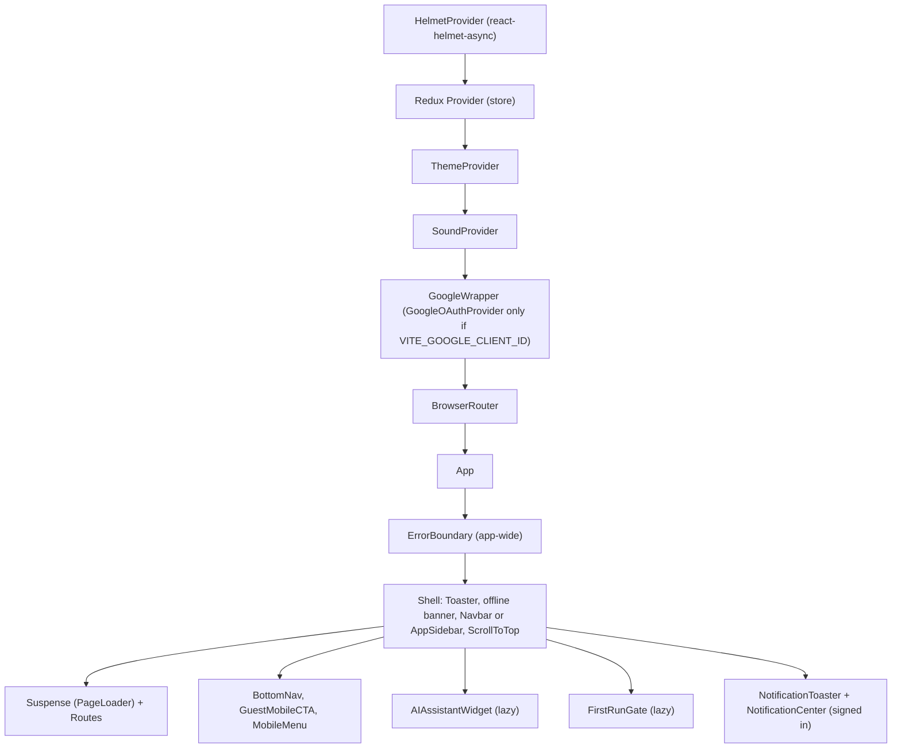

**Hydrate or render.** `main.jsx` reads the path of the `link[rel=canonical]` baked into the HTML. If `#root` has children and that path equals the current path (trailing slash ignored), it calls `hydrateRoot`. Otherwise it empties `#root` and calls `createRoot().render()`. This handles the host's SPA fallback, which serves the prerendered home page for every non-prerendered path.

### 4.2 Shell layout rules (`src/App.jsx`)

| Element | Shown when |
|---|---|
| `Navbar` | Not on `/login` or `/signup`, and the sidebar is not shown |
| `AppSidebar` (desktop) | A user is loaded and the path is in `AUTH_PATHS` (`/study`, `/dashboard`, `/profile`, `/settings`, `/progress`, `/quizzes`, `/quiz`, `/parent`, `/teacher`, `/principal`, `/admin`, `/question-paper`, `/referral`). Content is offset by the CSS variable `--app-sidebar-width`, which `AppSidebar` sets in a layout effect. |
| `BottomNav` (mobile) | Path is not public (see `PUBLIC_ROUTES` plus the prefixes `/update-password/`, `/student/`, `/class/`, `/blog/`, `/join/`, and `/c/` except `/c/:code/results`) |
| `GuestMobileCTA` | Public path, no user, and not a challenge or join page |
| `MobileMenu` | Everywhere except `/login` and `/signup` |
| `AIAssistantWidget` | Non-public paths, except challenge (`/c/...`) and join (`/join/...`) pages. The widget itself renders nothing unless `accountType` is `Teacher` or `SuperAdmin`. |
| `FirstRunGate` | Non-public paths with a user, except challenge and join pages. Shows onboarding to first-time students only. |
| `NotificationToaster`, `NotificationCenter` | A user is loaded (any path). One panel for every bell (section 5.8). |
| Tab title (`SEOHead`, `noindex`) | Paths in `AUTH_PATHS`: `<Page> \| AskAide` from the first matching prefix in `APP_TITLES` |
| Offline banner | `navigator.onLine` is false (window `online`/`offline` listeners) |

Public-route matching strips one trailing slash first, because prerendered URLs end in `/`. The Toaster moves to bottom-center when the viewport is narrower than 768 px.

### 4.3 Route guards

| Guard | File | Logic |
|---|---|---|
| `ProtectedRoute` | `src/components/auth/ProtectedRoute.jsx` | If `state.auth.token` is falsy, redirect to `/login` with `state.from = location`. The token is not decoded, so expiry is not checked here. |
| `RoleProtectedRoute` | `src/components/auth/RoleProtectedRoute.jsx` | No token: redirect to `/login`. Token but no `profile.user`: spinner. `user.accountType` not in `allowedRoles`: `toast.error` and redirect to `/`. |

Roles are the `accountType` values `SuperAdmin`, `Teacher`, `Principal` and `Parent`. Students may have no `accountType`. `getAccountType()` in `src/config/navItems.js` treats a missing value as `Student`.

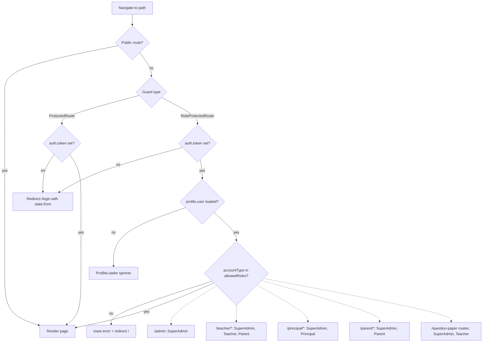

### 4.4 Lazy loading

Every route-level component in `App.jsx` is `React.lazy()` behind one `Suspense` with a `PageLoader` fallback (43 lazy route components plus `AIAssistantWidget` and `FirstRunGate`). The guards, layout components, `ErrorBoundary` and `SEOHead` are imported eagerly. Second-level splitting exists only in `PrincipalDashboard.jsx`, which lazy-loads its 6 screens. `TeacherDashboard` and `AdminDashboard` import their children eagerly, so each dashboard is one chunk.

### 4.5 Route groups

Full per-route detail: [Pages and Routes](./development/pages-and-routes.md).

| Group | Paths | Guard | Layout |
|---|---|---|---|
| Marketing | `/`, `/try`, `/for-schools`, `/free-paper-generator`, `/about`, `/pricing`, `/how-it-works`, `/blog`, `/blog/:slug`, `/feedback`, `/privacy-policy`, `/terms-of-service` | none | Navbar, prerendered |
| Challenges and class links | `/c/:code`, `/join/:code` (public); `/c/:code/results` (`ProtectedRoute`) | as listed | Navbar; no onboarding, assistant or guest CTA bar |
| SEO curriculum | `/class/:classId`, `/class/:classId/subject/:subjectId`, `/class/:classId/subject/:subjectId/chapter/:chapterId` | none | Navbar, prerendered |
| Auth | `/login`, `/signup`, `/forgot-password`, `/update-password/:id` | none | No Navbar on login/signup. `/signup` is prerendered with noindex. `/login` is not prerendered. |
| Public profile | `/student/:userId` | none | noindex |
| Student app | `/study`, `/dashboard`, `/progress`, `/profile`, `/settings`, `/referral`, `/suggestions`, `/whats-new` | `ProtectedRoute` | Sidebar, except `/suggestions` and `/whats-new`, which are not in `AUTH_PATHS` and keep the Navbar |
| Quizzes | `/quizzes`, `/quiz/:quizId/attempt/:attemptId`, `/quiz/result/:attemptId`, `/quiz/history` | `ProtectedRoute` | Sidebar |
| Teacher | `/teacher/*` (nested routes in `TeacherDashboard.jsx`, incl. `classes`, `classes/:id/report`, `certificate`) | Role | Sidebar |
| Question papers | `/question-paper`, `/question-paper/preview/:paperId`, `/question-paper/history` | Role | Sidebar |
| Principal | `/principal/*` (nested, `index`, `classes`, `subjects`, `teachers`, `students`, `student/:studentId`) | Role | Sidebar |
| Parent | `/parent/*` (single screen, no nested routes) | Role | Sidebar |
| Admin | `/admin` (tabbed, no sub-routes) | Role | Sidebar |
| Fallback | `*` | none | `NotFound` |

`ErrorBoundary` additionally wraps `/study`, `/dashboard`, all quiz routes, and all role routes.

## 5. Component design

### 5.1 Container vs presentational split

| Layer | Examples | Pattern |
|---|---|---|
| Route containers | `study/Home.jsx`, `dashboard/Dashboard.jsx`, `teacher/TeacherSubjectDashboard.jsx`, `student/quiz/QuizAttempt.jsx`, `dashboard/AdminDashboard.jsx` | Fetch in `useEffect` by calling `*.api.js` functions directly, keep results in local `useState`, and select `profile.user` from Redux. There is no data-fetching cache library (no React Query or SWR). |
| Feature sections | `study/QuestionPractice.jsx`, `admin/FeedbackInbox.jsx`, `admin/overview/NewUsersPanel.jsx` | Stateful, own their API calls and toasts |
| Presentational | `study/CurrentQuestion.jsx`, `study/QuestionHistoryItem.jsx` (the only `memo` component), `teacher/shared/*`, `common/StreakDisplay.jsx` | Props in, callbacks out |
| Shared UI library | `ui/Dropdown` (HeadlessUI Listbox), `ui/RangeSlider`, `common/ConfirmDialog`, `common/Loader`, `common/AuthLoadingSkeleton`, `common/ErrorBoundary`, `admin/overview/DatePicker`, `teacher/shared` (`StatCard`, `StatusBadge`, `ProgressBar`, `MasteryGauge`, `EmptyState`, `LoadingSkeleton`) | Project convention: use these instead of native select, range, confirm and date inputs |
| SEO | `seo/SEOHead`, `seo/*Schema` | Emit head tags and JSON-LD only |

Navigation surfaces (`AppSidebar`, `Navbar`, `BottomNav`, `MobileMenu`) all derive their items from `src/config/navItems.js` (`NAV_ITEMS`, `getVisibleGroups`, `getPrimaryForRole`, `isPathActive`). They use `useLeaveSessionGuard` to confirm before leaving an active practice session.

### 5.2 Student study screen (`/study`)

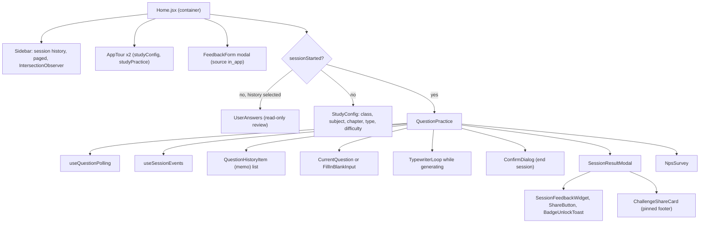

`Home` renders separate mobile and desktop layouts driven by `useIsMobile()` (768 px breakpoint, 150 ms debounced resize).

### 5.3 Quiz surfaces

| Component | Role |
|---|---|
| `student/quiz/StudentQuizList.jsx` | Lists available quizzes, starts or resumes attempts |
| `student/quiz/QuizAttempt.jsx` | Question navigator, flags, countdown timer, autosave per answer with a local retry queue, submit confirmation |
| `student/quiz/QuizResult.jsx` | Score breakdown |
| `student/quiz/QuizHistory.jsx` | Past attempts |
| `teacher/quiz/*` | `TeacherQuizList`, `QuizForm` (create, view, edit modes), `QuizQuestionManager`, `QuestionBankSelector`, `CustomQuestionForm`, `QuizAnalytics`, `shared/QuizCard` |

### 5.4 Teacher dashboard (`/teacher/*`)

```mermaid
flowchart TD
  TD["TeacherDashboard.jsx (nested Routes)"] --> IDX["index: TeacherSubjectSelector"]
  TD --> SD["subject/:subjectId: TeacherSubjectDashboard"]
  TD --> SL["subject/:subjectId/students: TeacherStudentsList"]
  TD --> SP["subject/:subjectId/student/:studentId: TeacherStudentProgress"]
  TD --> CA["subject/:subjectId/chapter/:chapterId: TeacherChapterAnalytics"]
  TD --> WT["subject/:subjectId/weak-topics: TeacherWeakTopicsReport"]
  TD --> AF["subject/:subjectId/activity: TeacherActivityFeed"]
  TD --> CL["classes: TeacherClassLinks"]
  TD --> CR["classes/:id/report: TeacherClassReport"]
  TD --> CE["certificate: TeacherCertificate"]
  TD --> AIG["ai-generator: TeacherAIGenerator"]
  TD --> QZ["quizzes, quiz/new, quiz/:quizId, quiz/:quizId/edit, quiz/:quizId/questions, quiz/:quizId/analytics"]
```

The teacher analytics screens render hard-coded data from `src/mocks/teacherData.js` when the viewer is a SuperAdmin (`useMock = user?.accountType === 'SuperAdmin'`, e.g. `TeacherSubjectSelector.jsx`).

### 5.5 Admin / SuperAdmin (`/admin`)

`AdminDashboard.jsx` is a local-state tab bar (`activeTab`). Only the active tab component is mounted.

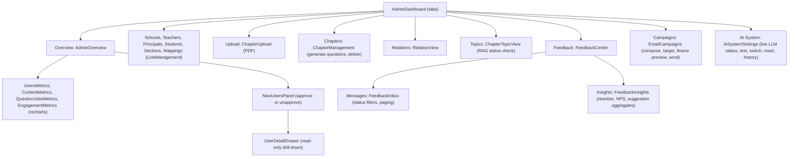

`EmailCampaigns.jsx` builds its preview iframe as a deliberate mirror of the Backend campaign email template, so the two must be changed together (comment in `EmailCampaigns.jsx`).

`admin/system/AiSystemSettings.jsx` (AI System tab) controls the AI Service's live LLM through `/admin/system/llm/*`. It shows the running provider/model, whether it came from the admin panel or the env default, who set it and when, and which providers have a key. **Test running model** runs the three checks (plain, JSON, MCQ schema). **Try a model** picks a provider and model (live suggestions, OpenRouter free-only filter, or any typed ID) and tests it side by side with the live model; **Make this the live model** is offered only for the exact provider + model that just passed, behind a confirm dialog, and switches every AI feature instantly. Also: switch back to the previous model, reset to env default, and the recent change history. Backend 400/409/503/504 messages (missing key, switch in progress, can't save, timeout) are shown as-is.

### 5.6 Other role dashboards

| Surface | Structure |
|---|---|
| `dashboard/Dashboard.jsx` (student) | `NotificationBell` (phones only, beside the greeting), `ContinueSessionBanner` (whole banner resumes), `DailyChallenge`, `DailyGoalCard`, `StreakDisplay`/`StreakCalendar`, `MasteryOverview`, `BadgeGrid`, `WeeklyActivityChart`, `ClassLeaderboard` (weekly), `ReferralCard`, `FeedbackPrompt`, dashboard tour |
| `teacher/TeacherSubjectSelector.jsx` (teacher home) | "Invite students" button; with no students, a "Create your class link" welcome card instead of the old "contact your administrator" empty state |
| `dashboard/PrincipalDashboard.jsx` | `PrincipalTabs` + lazy nested routes (`src/components/principal/`) |
| `dashboard/ParentDashboard.jsx` | Child selector, then child overview (`parentDashboardApi`) |

### 5.7 Auth pages

| Component | Notes |
|---|---|
| `auth/Login.jsx` | `useForm` (no schema resolver). Single "email or username" identifier field. Optional Google button (`FitGoogleLogin`). Inline error only, with the server message shown verbatim on 429. Shows a toast if `auth:sessionExpired` is set. Post-login redirect resolver (section 8.1). Link to `/signup?role=teacher`. |
| `auth/Signup.jsx` | `useForm`. `?role=teacher` sets `accountType: 'Teacher'` (also for Google) and hides the referral code field. Reads `?ref=` into `referralCode`; the thunks also send `getAcquisition()` (first-touch code and UTMs). Password: 8+ characters with a letter and a number. Auto-login on success, then the role's home (`/teacher`) or `/study`, unless `postAuthPath()` has a pending class join or challenge. |
| `auth/FitGoogleLogin.jsx` | Measures its container with a `ResizeObserver` and passes that width (200–400) to `GoogleLogin`, which only takes a fixed pixel width |
| `auth/ForgotPassword.jsx`, `auth/UpdatePassword.jsx` | Wrapped with `SEOHead noindex` in `App.jsx`. Reset errors keep the user on the page. |

### 5.8 Challenges, class links and notifications

| Component | Notes |
|---|---|
| `pages/ChallengePlay.jsx` (`/c/:code`) | Steps: loading, intro (guest name), playing (no right/wrong reveal), submitting, result. `markChallengeSource()` records the arrival. A guest's attempt returns a `claimToken`, saved by `savePendingChallenge()`; sign-up then lands on `/c/:code/results` through `postAuthPath()`. |
| `pages/ChallengeResults.jsx` | Claims a pending guest attempt, then loads `/challenges/:code/review`. "Practise this chapter" saves a try choice and opens `/study` with `preselectConfig`. |
| `common/ChallengeShareCard.jsx` | Hidden below 3 answers (`canChallenge`). Opens a blank window first, creates the challenge, then points it at `wa.me`. `variant="footer"` is pinned in `SessionResultModal`. |
| `pages/JoinClass.jsx` (`/join/:code`) | Public class info; a signed-in student joins with `POST`. A guest's code is stored by `savePendingJoin()` and joined automatically on return (it wins over a pending challenge in `postAuthPath()`). |
| `pages/ReferralPage.jsx` | Loads `/referral/my-code` and `/challenges/mine` in parallel. Practice-paper redeem uses a 60 s timeout. |
| `notifications/NotificationCenter.jsx` | Portal, mounted once in `App.jsx`. Top sheet on phones (body scroll locked), popover next to the anchor bell on desktop. Opening loads `/notifications` and, if anything is unread, posts `{ all: true }` to `/notifications/read`. Cursor paging with "Show older". |
| `notifications/NotificationToaster.jsx` | When the unread count rises, fetches the latest 5 and toasts the newest unread one newer than `askaide:notifToastAt`. Skipped on `/study` and `/quiz/`. Tapping marks that item read and follows its link. |
| `notifications/NotificationBell.jsx` | Bell button plus `UnreadBadge` and `bellLabel()`, reused by `AppSidebar`, `BottomNav` (Menu tab) and `MobileMenu` (Notifications row). |

## 6. State management

Overview and usage guidelines: [State Management](./development/state-management.md).

### 6.1 Redux store (`src/store/index.js`)

`combineReducers` of 4 slices, `configureStore` with default middleware. The root reducer is exported separately so `src/prerender.jsx` can build a fresh store per render. There are no RTK Query APIs and no redux-persist. Persistence is hand-written inside the slices (see 6.5).

| Slice | State shape | Actions and thunks | Written by |
|---|---|---|---|
| `auth` (`slices/authSlice.js`) | `signupData`, `loading`, `token`, `refreshToken` | `setSignupData`, `setLoading`, `setToken`, `setRefreshToken`. The token reducers also write or remove localStorage. | `auth.api.js` thunks, axios refresh interceptor, `Signup.jsx` |
| `profile` (`slices/profileSlice.js`) | `user` (Backend user object incl. `_id`, `accountType`, names, `image`), `loading` | `setUser`, `setLoading` (the latter is unused) | `auth.api.js` (`login`, `loginWithGoogle`, `signUp`, `fetchUserDetails`, `logout`) |
| `session` (`slices/sessionSlice.js`) | `sessionHistory` (array, rehydrated), `userAnswers`, `sessionStarted` | `setSessionHistory`, `clearSessionHistory`, `setUserAnswers`, `setSessionStarted`, `resetSessionStarted` | `Home.jsx`, `QuestionPractice.jsx`, `useLeaveSessionGuard`. `setSessionHistory` has no callers. |
| `aiAgent` (`slices/aiAgentSlice.js`) | `conversations`, `activeConversationId`, `messages`, `streamingContent`, `isStreaming`, `isThinking`, `error`, `isOpen` | Reducers: `setOpen`, `toggleOpen`, `setActiveConversation`, `addMessage`, `updateStreamingContent`, `setStreamingContent`, `setStreaming`, `setThinking`, `setError`, `clearError`, `clearMessages`. Thunks (`createAsyncThunk`): `createConversation`, `fetchConversations`, `fetchMessages`, `deleteConversation`. | `ai-agent/*` components |

Key selectors in use: `state.auth.token` (guards, `App.jsx`), `state.profile.user` (guards, nav, most containers), `state.session.sessionStarted` (study flow, nav guards, `useFeedbackGate`), `state.aiAgent.*` (chat widget).

### 6.2 React contexts (`src/contexts/`)

| Context | Value | Persistence | Notes |
|---|---|---|---|
| `ThemeContext` | `theme`, `toggleTheme(newTheme)` | localStorage `theme` | Toggles `dark`/`light` class on `html`. Initial value is read back from the class set by the blocking script in `index.html`, so the first render matches the painted theme and the prerendered markup (always light). |
| `SoundContext` | `soundEnabled` and `play*` helpers (toggle, click, success, error, notification) | localStorage `soundEnabled` | Sounds are synthesised with the Web Audio API (`AudioContext`), with no audio files |

Both hooks (`useTheme`, `useSound`) are re-exported from `src/hooks/index.js`.

### 6.3 Custom hooks (`src/hooks/`)

| Hook | Exported from barrel | Purpose |
|---|---|---|
| `useQuestionPolling` | yes | Question batch loading, polling (5 s, max 60 polls), bounded retry on `failed` (2 retries, 3 s delay), `mastered` terminal state, full-screen vs inline errors. Pauses while the tab is hidden. Detail: [Study Session Flow](./features/study-session-flow.md). |
| `useSessionEvents` | yes | During an active session: online/offline handling (pauses and resumes the timer) and intercepts clicks on nav buttons found by CSS selector to open the leave dialog. No `visibilitychange` or `beforeunload` handling: answers are saved as they are given. |
| `useLeaveSessionGuard` | no (direct import) | `guardedNavigate` + `ConfirmDialog` props shared by all nav surfaces. Leaving dispatches `resetSessionStarted`. |
| `useFeedbackGate` | yes | Central throttle for all feedback UI: 72 h global cooldown, 24 h per key, 30-day silence after 3 dismissals, never during an active session. Stored in localStorage `askaide_feedback_gate`. |
| `usePublicStats` | yes | `GET /stats/public` for landing and `/try` social-proof counters. Returns `null` until real data arrives, so no placeholder numbers get baked into prerendered HTML. |
| `useAppTour` | no (direct import) | react-joyride tour state per key. Completion stored as `tour_completed_` + key. Steps in `src/config/tourSteps.js` (`tour_dashboard`, `tour_study_config`, `tour_study_practice`). |
| `useTypewriter`, `useOptionsTypewriter` | yes | Typewriter animation for AI text |
| `useIsMobile` | yes | `innerWidth` below the breakpoint (default 768), debounced |
| `useNotifications` | no (direct import) | Module-level store read with `useSyncExternalStore`: `useUnreadNotifications()` (unread count; the first user starts polling every 60 s while visible plus on `visibilitychange`/`focus`, the last stops it) and `useNotificationPanel()` (`open`, `anchor`). Both pass a server snapshot so prerendering doesn't fail with React #407. |
| `useReferralCode` | no (direct import) | The signed-in student's invite code, cached in `askaide:myRefCode`; `withRef(url, code)` adds `?ref=` to links to our own site (used by `ShareButton`) |

### 6.4 Local and router state

| Kind | Examples |
|---|---|
| Component state | All server data in containers, tab selection (`AdminDashboard`, `FeedbackCenter`), dialogs, form UI, the study session object and question list (`Home`, `QuestionPractice`), quiz answers, flags and timer (`QuizAttempt`) |
| Refs | Poll timers and mount flags (`useQuestionPolling`), buffered answers for unmount flush (`QuestionPractice`), `AbortController` for SSE (`ChatWindow`) |
| Router `location.state` | `from` (guard to login), `session` (dashboard "continue" to `/study`), `preselectConfig` (Progress page, onboarding, joined class or challenge results to `/study`), `initialData` (optional quiz bootstrap read by `QuizAttempt`) |
| URL | Route params for all entity IDs. `?ref=` and UTM tags on any first visit (captured by `captureAcquisition()` in `App.jsx`). `?role=teacher` on signup. |

### 6.5 Browser storage keys (names only)

| Storage | Key | Owner |
|---|---|---|
| localStorage | `token`, `refreshToken` | `authSlice`, `auth.api.js`, `src/api/axios.js` (JSON-stringified) |
| localStorage | `user` | `auth.api.js`, rehydrated by `profileSlice` |
| localStorage | `sessionHistory` | `sessionSlice` |
| localStorage | `theme`, `soundEnabled` | contexts, plus `index.html` inline script for `theme` |
| localStorage | `unsyncedAnswers` | `QuestionPractice.jsx`, `useSessionEvents.js`, drained by `Home.jsx` |
| localStorage | `pendingQuizAnswers:<attemptId>` | `QuizAttempt.jsx` |
| localStorage | `onboarding_<userId>` | `OnboardingOverlay.jsx`, `FirstRunGate.jsx` |
| localStorage | `tour_completed_<tourKey>` | `useAppTour.js` |
| localStorage | `askaide-sidebar-collapsed` | `AppSidebar.jsx` |
| localStorage | `askaide_feedback_gate` | `useFeedbackGate.js` |
| localStorage | `askaide:tryChoice` | `utils/tryChoice.js` (24 h, read once) |
| localStorage | `askaide:acquisition` | `utils/acquisition.js` (30 days, cleared after sign-in) |
| localStorage | `askaide:pendingChallenge`, `askaide:pendingJoin` | `utils/pendingChallenge.js` |
| localStorage | `askaide:myRefCode` | `hooks/useReferralCode.js` |
| localStorage | `askaide:notifToastAt` | `NotificationToaster.jsx` |
| sessionStorage | `auth:sessionExpired`, `auth:returnTo` | Set by `clearAuthAndRedirect()` in `src/api/axios.js`, consumed by `Login.jsx` |

Slice initialisers use a `readStored()` helper that guards `typeof window`, removes the literal strings `"undefined"`/`"null"`, and drops malformed JSON so a corrupt key cannot crash store creation.

## 7. API layer

Endpoint catalogue and examples: [API Integration](./development/api-integration.md).

### 7.1 Axios instance (`src/api/axios.js`)

| Aspect | Implementation |
|---|---|
| Base URL | `import.meta.env.VITE_API_URL`. There is **no fallback** in the client. |
| Defaults | `Content-Type: application/json`, `timeout: 30000` ms. Per-call overrides: `aiAssistantApi.processRequest` and `continueSession` use 600000 ms. PDFs use `responseType: 'blob'`. |
| Request interceptor | Reads localStorage `token`, JSON-parses it (falls back to the raw string), sets `Authorization: Bearer ...` |
| Refresh trigger | Response `401` whose `data.error` or `data.message` equals `tokenExpired` (case-insensitive), the request is not already `_retry`, and the URL is not `/authenticate/refresh` |
| Stale-token shortcut | If the request was sent with an access token older than the one now in localStorage (another tab already refreshed), it is retried with the stored token and no refresh |
| Single-flight refresh | `refreshAccessToken()`: one shared promise per tab, run under the Web Lock `askaide-token-refresh` (`navigator.locks`) across tabs. After taking the lock it compares the stored refresh token with the one it started with: if another tab has replaced it, it reuses that tab's tokens instead of refreshing again. Otherwise it calls `POST /authenticate/refresh`. Refresh tokens are single-use, so this stops two tabs from logging each other out. |
| On refresh success | Writes both tokens to localStorage, dispatches `setToken`/`setRefreshToken`, replays the original request with the new token |
| `authorizedFetch(url, init)` | `fetch` with the stored token and the same refresh-and-retry on a `tokenExpired` 401. Used by `aiAssistantApi.streamRequest` (SSE) and the PDF `DownloadButton` in `MessageBubble.jsx`. |
| On refresh failure or any other 401 | `clearAuthAndRedirect()`: removes `token`, `refreshToken`, `user`, sets `auth:sessionExpired` and `auth:returnTo` (path + query) in sessionStorage, then does a hard `window.location.href = '/login'`. It is a no-op redirect if already on `/login`, so failed login attempts do not loop. |
| Network errors | Rejected unchanged (empty `else if (error.request)` branch) |
| Error normalisation | None centrally. Callers use `err.response?.data?.message` with a fallback string. Some module functions swallow errors and return `null` (e.g. `adminApi.listFeedback`, `feedbackApi.submitInlineReaction`). |

The Backend response envelope is `success`, `message`, `data`. Most module functions return `response.data` (the envelope). `admin.api.js` metric and feedback helpers return `response.data?.data ?? null`. `normalizeListResponse()` in `admin.api.js` flattens paginated list payloads so `.data` is always an array.

### 7.2 Endpoint constants (`src/api/endpoints.js`)

`ENDPOINTS` groups: `AUTH`, `PROFILE`, `STUDY`, `PROGRESS`, `CHAPTERS`, `ADMIN` (incl. `METRICS`, `SYSTEM_LLM`), `TEACHER_DASHBOARD`, `PARENT`, `PARENT_STUDENTS`, `QUIZ`, `QUESTION_PAPER`, `REFERRAL`, `NOTIFICATIONS`, `CHALLENGES`, `TEACHER_CLASSES`, `BADGES`, `FEEDBACK`, `CAMPAIGN`. These modules read them: `auth`, `profile`, `referral`, `challenge`, `notification`, `teacherClass`, `feedback`, `quiz` and `admin`. The others (notably `study.api.js`) inline their path strings or use a module-level `BASE_PATH`, so `endpoints.js` is not a complete inventory.

### 7.3 Operation modules

`src/api/index.js` barrel-exports `studyApi`, `adminApi`, the auth thunks, `principalApi`, `profileApi`, `referralApi`, `challengeApi`, `notificationApi`, `teacherClassApi`, `goalApi`, `statsApi`, `ENDPOINTS`, `API_BASE_URL` and `api`. The other modules are imported by file path.

| Module | Export(s) | Backend base paths | Notes |
|---|---|---|---|
| `auth.api.js` | `signUp`, `login`, `loginWithGoogle`, `logout`, `getPasswordResetToken`, `resetPassword`, `fetchUserDetails`, `updateDisplayPicture`, `removeDisplayPicture`, `updateProfile` | `/authenticate/*`, `/profile/*` | **Only** module that returns Redux thunks, writes localStorage, shows toasts and fires Clarity events. Signup and Google send `acquisition`; every thunk navigates through `postAuthPath()`. `loginWithGoogle` takes `{ accountType }` for teacher sign-up. |
| `study.api.js` | `studyApi` | `/study/configuration`, `/questions/*`, `/sessions/*`, `/user-answers/*`, `/progress/user/*`, `/topic-progress/*`, `/chapters/*`, `/leaderboard`, `/streaks/*`, `/daily-challenge/*`, `/session-feedback/*`, `/badges/*` | Plain promise functions. Includes admin chapter operations (`createChapter`, `deleteChapters`, `checkRagStatus`, `generateChapterQuestions`, `getChapterQuestionCounts`). `endSessionOnPageExit` is a `keepalive` fetch. `checkNewBadges` maps the Backend's `{ badgeId, title }` objects to IDs. |
| `quiz.api.js` | `quizApi` | `/quiz/*` | Teacher CRUD, publish, close, clone, analytics, question-bank search. Student `start`, `answer`, `submit`, `result`, `history`. |
| `questionPaper.api.js` | `questionPaperApi` | `/question-paper/*` | `generatePublicPaper` targets `/question-paper/public/generate` (lead magnet). PDF via blob. |
| `ai-assistant.api.js` | `aiAssistantApi` | `/ai-assistant/*` | Generate, continue, tasks, health, export PDF, conversations CRUD. `streamRequest` uses `authorizedFetch` to `/ai-assistant/stream` (SSE, bypasses axios). |
| `admin.api.js` | `adminApi` | `/school`, `/teacher`, `/principals`, `/student`, `/teacher-students`, `/classes`, `/subjects/class/*`, `/sections/*`, `/admin/metrics/*`, `/admin/system/llm/*`, `/feedback/admin`, `/campaign/*` | `normalizeListResponse`, `cleanParams`; `getLlmStatus`, `getLlmModels`, `testLlmModel`, `activateLlmModel`, `resetLlmModel` (AI System tab) |
| `teacher-dashboard.api.js` | `teacherDashboardApi` (re-exports `mockTeacherData`) | `/teacher-dashboard/:teacherId/*` | |
| `principal.api.js` | `principalApi` | `/principal/*` | School-scoped analytics |
| `parent.api.js` | `parentDashboardApi`, `parentStudentApi` | `/parent-dashboard/*`, `/parent-students/*` | |
| `feedback.api.js` | `feedbackApi` | `/feedback`, `/inline-feedback/*` | Free-text submit carries a `website` honeypot field |
| `suggestion.api.js` | `suggestionApi` | `/suggestions/*` | SuperAdmin moderation: `respond`, `hide`, `unhide` |
| `behavioral.api.js` | `behavioralApi` | `/behavioral-prompt/*` | Behaviour-triggered feedback prompt |
| `goal.api.js` | `goalApi` | `/goals` | |
| `referral.api.js` | `referralApi` | `/referral/*` | `getMyReferral`, `redeemReferral`, `redeemPracticePaper` (60 s timeout) |
| `challenge.api.js` | `challengeApi` | `/challenges/*` | `create`, `get` and `submitAttempt` (public; a signed-in player's token is still sent), `claim`, `review`, `mine` |
| `teacherClass.api.js` | `teacherClassApi` | `/teacher-classes/*` | `create`, `mine`, `setActive`, `report`, `certificate`; `getJoinInfo` (public) and `join` (student) |
| `notification.api.js` | `notificationApi` | `/notifications/*` | `list`, `unreadCount`, `markRead`. No toasts: the bell polls quietly. |
| `stats.api.js` | `statsApi` | `/stats/public` | Unauthenticated |
| `profile.api.js` | `profileApi` | `/profile/public/:userId`, `/profile/name`, `/profile/email/*` | Public profile (a student's streak and stats included; `StudentPublicProfile` makes only this call, so it works for signed-out visitors), `updateName`, `requestEmailChange`, `confirmEmailChange`. Errors are rethrown as `Error` with the Backend message. |

Raw `fetch` calls: `aiAssistantApi.streamRequest` and the PDF `DownloadButton` in `src/components/ai-agent/MessageBubble.jsx` go through `authorizedFetch`. `studyApi.endSessionOnPageExit` attaches the stored token by hand, because a `keepalive` request on `pagehide` can't wait for a refresh.

## 8. Key flows

### 8.1 Login, token storage and redirect

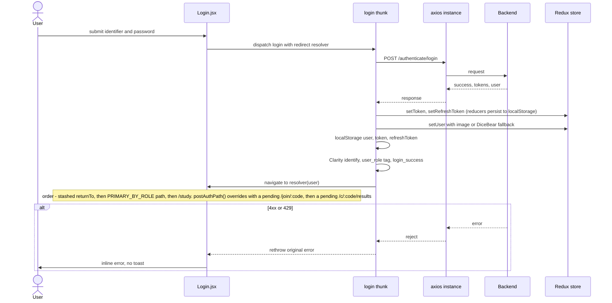

`PRIMARY_BY_ROLE` (`src/config/navItems.js`) sends Teacher to `/teacher`, Principal to `/principal`, Parent to `/parent` and SuperAdmin to `/admin`. Google sign-in follows the same path via `POST /authenticate/google` with the Google ID token. Logout sends `POST /authenticate/logout` with the refresh token (best effort), clears Redux and localStorage, and navigates to `/login`.

### 8.2 Access-token refresh

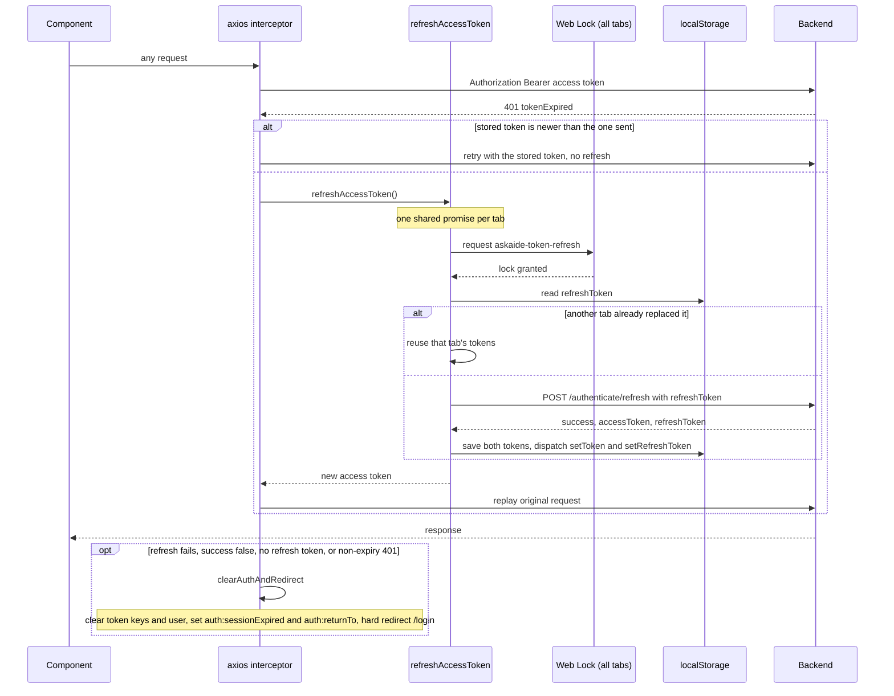

`authorizedFetch()` follows the same path for raw `fetch` calls: on a `tokenExpired` 401 it awaits `refreshAccessToken()` and retries once.

### 8.3 App boot and session restore

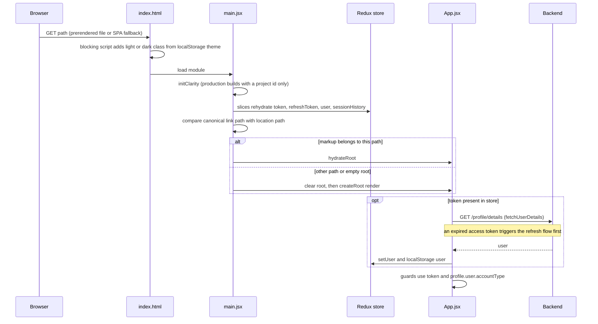

Until `/profile/details` responds, role guards use the `user` rehydrated from localStorage. `fetchUserDetails` fails silently and keeps the stored user.

### 8.4 Student study session

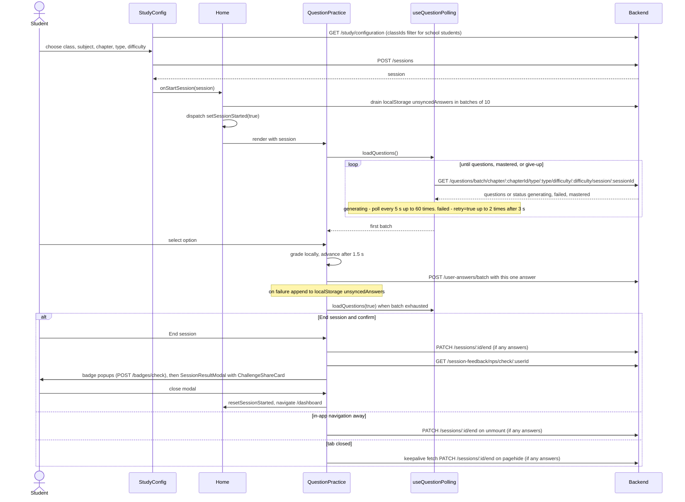

The UI compares `selectedOption` with `currentQuestion.correctAnswer` (trimmed) for immediate feedback, and each answer is sent to the Backend on its own through `/user-answers/batch` as soon as it is given (holding them for a batch of 10 lost them whenever a student left mid-batch). The practice tour starts about 1.8 s after the first answer. If `/try` saved a chapter (`askaide:tryChoice`), `Home` opens the config on it once, unless onboarding is pending, in which case the wizard uses it. The Backend triggers AI generation when the bank is thin (Backend concern, see [Study Session Flow](./features/study-session-flow.md)).

### 8.5 Quiz attempt

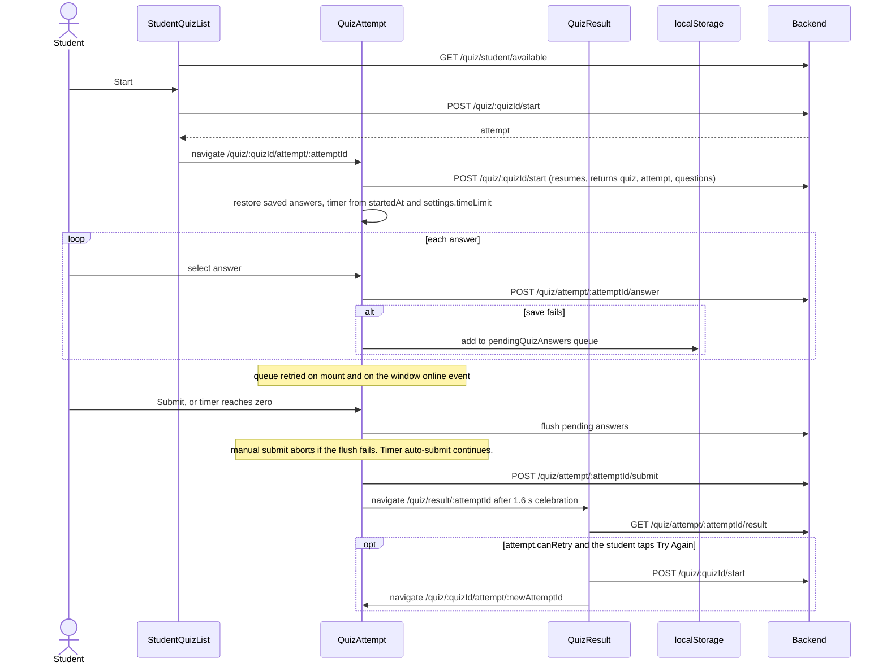

The quiz list header and the result page also link to `/quiz/history` (`QuizHistory`).

### 8.6 Chapter ingestion (SuperAdmin) and insights

Chapter PDF upload is a SuperAdmin-only tab in `/admin`. No teacher-facing upload screen exists in this snapshot.

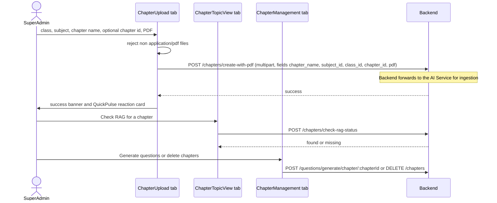

Teacher analytics and student AI insights:

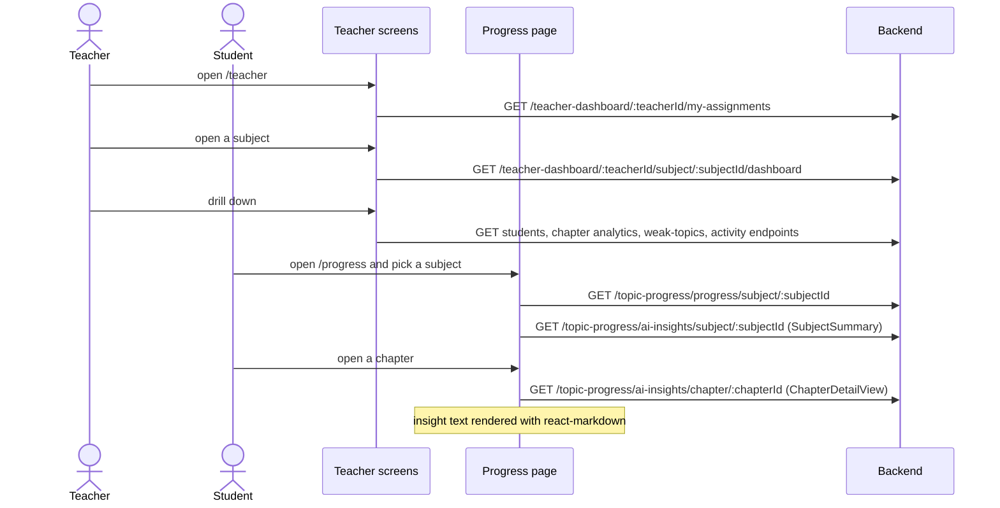

The Frontend does not call a teacher-class AI insights endpoint. Teacher analytics come from `/teacher-dashboard/*`.

### 8.7 Feedback, suggestions and admin moderation

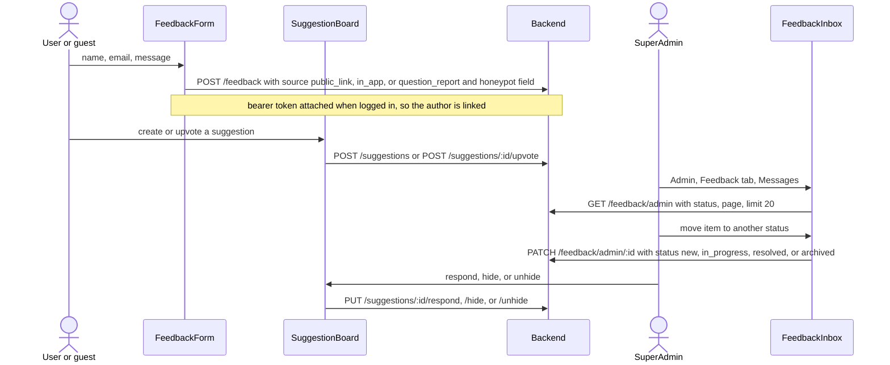

Lightweight feedback widgets (`InlineFeedback`, `QuickPulse`, `FeedbackPrompt` with `MicroReaction`) post to `/inline-feedback` and are all throttled by `useFeedbackGate`. `FeedbackPrompt` first asks `GET /behavioral-prompt/check` whether to show. Aggregates appear in `FeedbackInsights` via `GET /admin/metrics/feedback-insights`.

### 8.8 Teacher AI assistant (streaming)

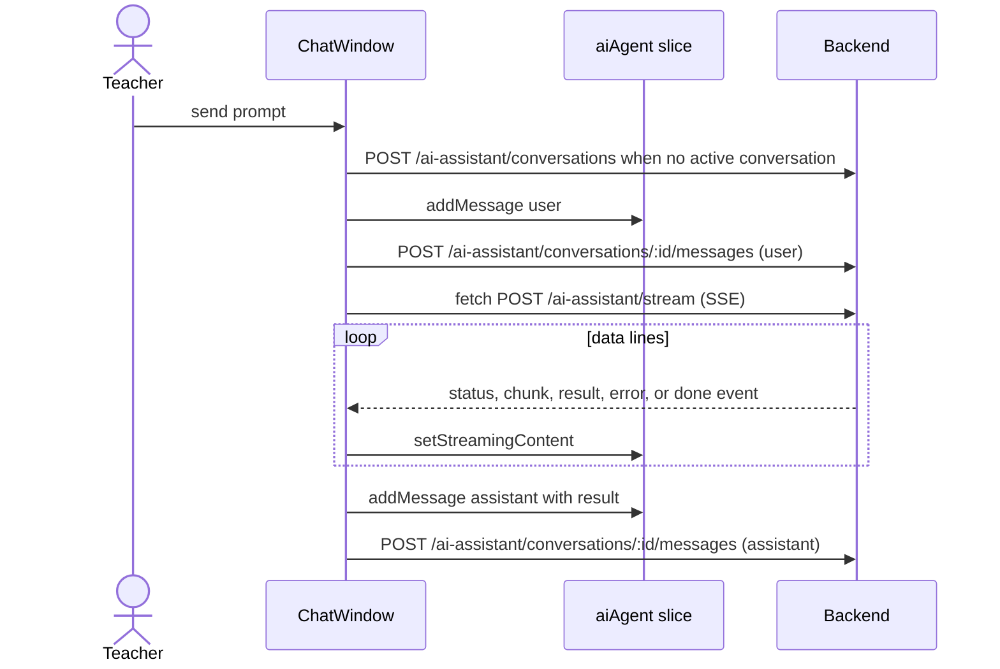

`TeacherAIGenerator` (`/teacher/ai-generator`) uses the non-streaming `POST /ai-assistant` and `/ai-assistant/continue` (clarification round-trip) with a 600 s timeout, and `GET /ai-assistant/export/:generationId` for PDF.

## 9. Cross-cutting concerns

### 9.1 Environment variables

Only `VITE_*` variables reach client code. Template: `.env.example`.

| Variable | Required | Meaning |
|---|---|---|
| `VITE_API_URL` | yes | Backend base URL including the API version prefix. Used by `src/api/axios.js`, the SSE and PDF `fetch` calls, and at build time for the PWA API cache pattern. |
| `VITE_SITE_URL` | yes | Public site origin for canonical URLs, OG tags, share links and the sitemap |
| `VITE_CONTACT_EMAIL` | yes | Contact address on legal pages and in structured data |
| `VITE_GOOGLE_CLIENT_ID` | no | Enables `GoogleOAuthProvider` and the Google buttons |
| `VITE_CLARITY_PROJECT_ID` | no | Enables Microsoft Clarity in non-dev builds |
| `VITE_CONTACT_PHONE`, `VITE_ADDRESS_STREET`, `VITE_ADDRESS_LOCALITY`, `VITE_ADDRESS_REGION`, `VITE_ADDRESS_POSTAL_CODE` | no | Organisation structured data (`src/seo.config.js`) |
| `SITE_URL`, `SITEMAP_DATE` | script only | `scripts/generate-sitemap.mjs` base URL fallback and reproducible `lastmod` |
| `CONTENT_API_BASE`, `CONTENT_PREVIEW_LIMIT`, `CONTENT_CONCURRENCY` | script only | `scripts/generate-chapter-content.mjs` |
| `PW_TARGET`, `PW_USERNAME`, `PW_PASSWORD`, `PW_API_URL`, `PW_APP_ORIGIN` | script only | `scripts/pw-auth.mjs` (Playwright storage-state minting) |

`vite.config.ts` and the two content scripts fall back to a hard-coded production Backend URL when `VITE_API_URL` is unset. `src/api/axios.js` does not.

### 9.2 Errors and notifications

| Mechanism | Detail |
|---|---|
| `ErrorBoundary` (`src/components/common/ErrorBoundary.jsx`) | Wraps the whole app, key routes, the AI widget and `FirstRunGate`. "Try again" remounts the subtree through a keyed Fragment (`retryKey`). If the retry crashes again immediately, it does `window.location.reload()`. The secondary button hard-navigates to `/dashboard`. Errors are only logged to the console (no remote error reporting). |
| Toasts | One `Toaster` in `App.jsx`. Auth thunks own their toasts. Components use `toast.error(err.response?.data?.message ...)`. `Login` uses inline errors instead of toasts. `NotificationToaster` uses `toast.custom` with the fixed id `notification-news`. |
| Session expiry UX | The axios interceptor stashes the reason and return path, and `Login.jsx` shows a lock toast |
| Question loading | `useQuestionPolling` separates `error` (nothing ever loaded, full screen) from `inlineError` (mid-session) |
| Offline | Global banner in `App.jsx`. Answer retry queues in `unsyncedAnswers` and `pendingQuizAnswers:<attemptId>`. |

### 9.3 Loading states

`PageLoader` (route Suspense), `ProfileLoader` (role guard), `AuthLoadingSkeleton` (auth pages and prerender Suspense fallback), `common/Loader`, `teacher/shared/LoadingSkeleton` (card skeletons), `principal/shared` `LoadingBlock`, and per-feature spinners and skeletons (e.g. `CurrentQuestion` handles its own skeleton, `TypewriterLoop` during AI generation).

### 9.4 Analytics and third-party client services

| Service | Integration | Gating |
|---|---|---|
| Microsoft Clarity | `@microsoft/clarity` via `src/utils/clarity.js`: `initClarity`, `identifyUser`, `setTag`, `trackEvent`, `upgradeSession`, constants `ClarityEvents` and `ClarityTags` | Disabled when `import.meta.env.DEV` is true or the project id is missing |
| Rybbit analytics | Inline script in `index.html` injects the vendor script | Skipped on `localhost` and `127.0.0.1` |
| Google Identity | `@react-oauth/google` | Only when `VITE_GOOGLE_CLIENT_ID` is set |
| Fonts | Self-hosted in `public/fonts/`, preloaded from `index.html` | Same origin; no third-party font request. In the service worker precache. |
| DiceBear | Avatar URL fallback when the user has no image (`auth.api.js`, `StudentPublicProfile.jsx`) | Always |
| Share / contact links | WhatsApp deep link (`FloatingWhatsAppButton.jsx`), X and Facebook share intents | User-initiated |

Clarity events are fired from `auth.api.js` and 13 component files: `Home.jsx` (study start), `Dashboard.jsx`, `Progress.jsx`, `QuizAttempt.jsx` (quiz start and complete), `PublicPaperGenerator.jsx`, `TryNow.jsx`, `ChallengePlay.jsx`, `ChallengeResults.jsx`, `ChallengeShareCard.jsx`, `ReferralPage.jsx`, `ReferralCard.jsx`, `NotificationCenter.jsx` and `NotificationToaster.jsx`.

### 9.5 SEO and meta

| Mechanism | Detail |
|---|---|
| Prerender | `vite-prerender-plugin` renders `PUBLIC_ROUTES` (`src/prerender_routes.js`): 23 static and blog routes (incl. `/about`, `/pricing`, `/how-it-works`) plus 478 curriculum routes (7 class hubs, 31 subjects, 440 chapters, from `getAllCurriculumRoutes()` in `src/data/curriculum.static.js`), 501 in all. `src/prerender.jsx` maps a URL to a page loader with `getPageLoader()`, which uses dynamic `import()` so Rollup doesn't fold every page and the question snapshot into one chunk preloaded on every page. It renders the same shell as `App.jsx` with `StaticRouter`, decodes Helmet's HTML entities, and returns `title`, `meta`, `link` and `script` tags as head elements with `lang: 'en-IN'`. |
| Hydration parity | `prerender.jsx` mirrors the public shell exactly (Navbar, GuestMobileCTA, closed MobileMenu, no BottomNav) to avoid hydration mismatches (comment in `prerender.jsx`). The theme class is applied before paint for the same reason. |
| Build-time content | `src/data/chapter-content.generated.js` embeds real preview questions so they appear in prerendered HTML. It is refreshed manually with `npm run content`. |
| Per-page head | `src/components/seo/SEOHead.jsx`: title, description, canonical (always with a trailing slash), robots, OG, Twitter. `index.html` deliberately has no static description, OG or canonical tags. |
| Robots | `noindex` on login, signup, forgot and update password, `NotFound`, `StudentPublicProfile`, and every signed-in app page (the per-route tab title `SEOHead`). `SeoChapterPage` emits `noindex, follow` when its chapter has no snapshot questions. `public/robots.txt` disallows app paths, incl. `/referral`, `/suggestions` and `/whats-new`. |
| Legacy chapter URLs | `SeoChapterPage` redirects old slugs built from raw DB names to the current chapter slug, and is keyed on the class/subject/chapter params so the redirected page remounts with fresh state |
| Trailing slash | An inline script at the top of `index.html` replaces slash-less public URLs with their trailing-slash form before the app loads |
| Icons | Real `favicon.ico`, `favicon.svg`, `apple-touch-icon.png` and PWA icons (48–512 px plus maskable) in `public/`, generated by `scripts/generate-icons.mjs` |
| JSON-LD | `Organization`, `WebSite`, `FAQ`, `Course`, `Breadcrumb`, `Article`, `Quiz`, `SoftwareApplication` schema components (`ReviewSchema` is unused), serialised with `safeJsonLd()` (`src/utils/jsonld.js`) |
| Sitemap and redirects | `scripts/generate-sitemap.mjs` writes `public/sitemap.xml` (120 URLs; content-less chapters are left out) and `public/_redirects`: a 301 from each slashless prerendered path to its slash form, then the catch-all SPA rewrite `/* /index.html 200`. The script comments name Cloudflare Pages as the host. |

### 9.6 Performance techniques

| Technique | Where |
|---|---|
| Route-level code splitting | `React.lazy` for every route in `App.jsx`, nested lazy routes in `PrincipalDashboard.jsx`, lazy AI widget and onboarding gate |
| Vendor chunking | `manualChunks` in `vite.config.ts` |
| Dynamic import of heavy libs | `jspdf` loaded on demand in `PublicPaperGenerator.jsx` |
| Memoisation | `React.memo` on `QuestionHistoryItem` only. `useMemo`/`useCallback` in 33 files. |
| Polling hygiene | One timer in flight, paused on hidden tabs, bounded counts, no retry storms on timeouts (`useQuestionPolling.js`) |
| Answer saving | One small request per answer, sent as it is given (`BATCH_SIZE` in `QuestionPractice.jsx` now only numbers the answers) |
| Fonts | Self-hosted and preloaded, so first visits paint in the final font (no swap shift) |
| Layout stability | Landing counters render from first paint in a fixed-width slot of tabular digits; `DailyGoalCard` has a fixed minimum height |
| Notification polling | One poller for the whole app, every 60 s and only while the tab is visible |
| Service worker caches | `api-cache` (NetworkFirst for URLs under `VITE_API_URL`, 10 s network timeout, 100 entries, 24 h), `images-cache` (CacheFirst, 50 entries, 30 days). Fonts are precached. |
| Debounced resize | `useIsMobile` (150 ms) |
| Infinite scroll | Study history sidebar pages of 20 via `IntersectionObserver` |

### 9.7 Accessibility

| Aspect | State in code |
|---|---|
| Focus | Global `*:focus-visible` styles and ring utilities in `src/index.css` |
| Motion | `prefers-reduced-motion` media query in `src/index.css` and a check in `LandingPage.jsx` |
| ARIA | About 50 `aria-label`, 31 `aria-hidden`, `role="dialog"` with `aria-modal` on modals, `aria-live` in 2 places, `aria-current` in nav |
| Controls | HeadlessUI Listbox for dropdowns (keyboard support) |
| Gaps | No skip link found. `sr-only` used in 1 file. No i18n framework (English UI, `lang="en-IN"`). |

## 10. Testing

| Item | Detail |
|---|---|
| Framework | Vitest 4 (`test` block in `vite.config.ts`), `jsdom` environment, globals enabled |
| Libraries | `@testing-library/react`, `@testing-library/user-event`, `@testing-library/jest-dom` (loaded by `src/setupTests.js`) |
| Layout | Flat `src/__tests__/`, 23 files, no co-located tests |
| Coverage areas | Login identifier field and role-based redirect, nav role model, onboarding gate and preselect handoff, `/try` chapter handoff (`try-choice`), answer saving and session end on leave (`question-practice-answer-saving`), token refresh across tabs and `authorizedFetch` (`token-refresh`), badge unlock flow, challenge share card and gift note, referral attribution and pending claims, notification bell and panel, profile name and email change, teacher AI clarification, AI System tab and model-per-feature card, prerender route matcher, curriculum data integrity (route count 478), SEO page rendering (4 files), `stripInlineMarkdown`, plus a `1 + 1` placeholder. Full list: [Testing](./development/testing.md). |
| Mocking | `vi.mock('../api', ...)` or a single module (e.g. `../api/notification.api`) with `vi.hoisted`, `vi.mock('react-router-dom', ...)`, `vi.mock('@react-oauth/google', ...)` |
| Coverage tooling | Not configured |
| E2E | No Playwright test suite or config. `playwright` 1.63 is used only for manual CLI-driven checks: `node scripts/pw-auth.mjs <role> --target=local` logs in through the Backend API and writes a storage-state file with the `token`, `refreshToken` and `user` localStorage keys. Local credentials live in the gitignored `.playwright/` folder. |
| CI | No CI workflow in the repo (no `.github/`) |

```bash
npm test                                   # vitest run
npm run test:watch                         # watch mode
npx vitest run src/__tests__/navigation-role-model.test.jsx
npx vitest run -t "should pass a smoke test"
```

## 11. Design constraints and known limitations

Technical facts first listed from the code at `75ce259`. Rows 6, 8, 10, 16, 19 and 22 and rows 27–29 were updated at `c2aa6a2`, row 12 at `ca26383`. There are no `TODO`/`FIXME` markers in `src/`.

| # | Constraint or limitation | Evidence |
|---|---|---|
| 1 | Access and refresh tokens are stored as JSON strings in localStorage, readable by any script on the origin. No httpOnly cookie flow. | `authSlice.js`, `auth.api.js`, `axios.js` |
| 2 | `ProtectedRoute` checks token presence only (no expiry decode). Role checks trust `profile.user.accountType`, which is rehydrated from localStorage before `/profile/details` returns. All authorisation must be enforced by the Backend. | `ProtectedRoute.jsx`, `RoleProtectedRoute.jsx` |
| 3 | `RoleProtectedRoute` calls `toast.error` during render. | `RoleProtectedRoute.jsx` |
| 4 | Reducers perform side effects: `setToken`, `setRefreshToken`, `setSessionHistory` and `clearSessionHistory` write localStorage. | `authSlice.js`, `sessionSlice.js` |
| 5 | Circular import: store, then `aiAgentSlice`, then `ai-assistant.api`, then `axios`, then store. It works only because `store` is read lazily inside interceptors. | `store/index.js`, `api/axios.js` |
| 6 | Resolved: SSE streaming and the chat PDF download now use `authorizedFetch`, which refreshes on `tokenExpired`. The page-exit session end (`endSessionOnPageExit`) still sends the stored token by hand with no refresh, so a session left after the access token expired is not ended by that request. | `axios.js`, `ai-assistant.api.js`, `MessageBubble.jsx`, `study.api.js` |
| 7 | `streamRequest` calls `onDone` for a `done` event and again when the reader finishes. `ChatWindow`'s `onDone` appends and saves the assistant message each time it runs. Whether the Backend emits a `done` event is not verified. | `ai-assistant.api.js`, `ChatWindow.jsx` |
| 8 | Resolved: a refresh that resolves with `success: false` now throws, so the waiting requests reject and `clearAuthAndRedirect()` runs. In browsers without `navigator.locks`, the cross-tab guard falls back to per-tab only. | `axios.js` |
| 9 | If `VITE_API_URL` is unset, the axios `baseURL` is undefined and requests go to the frontend origin. The production fallback exists only in `vite.config.ts` (PWA pattern) and the scripts. | `axios.js`, `vite.config.ts` |
| 10 | `PATCH /sessions/:id/end` is sent once per session with at least one answer: on End Session, on unmount (in-app navigation), or as a `keepalive` fetch on `pagehide`. A session with no answers is never ended. | `QuestionPractice.jsx` |
| 11 | `unsyncedAnswers` is drained only when `Home` mounts or a new session starts. | `Home.jsx` |
| 12 | Resolved: `QuizResult`'s Try Again (shown when `attempt.canRetry` is `true`) starts a new attempt with `POST /quiz/:quizId/start` and opens it; a failure shows a toast. | `QuizResult.jsx` |
| 13 | `POST /quiz/:quizId/start` runs twice on the normal path (list, then attempt page). The Backend is relied on to resume the in-progress attempt. | `StudentQuizList.jsx`, `QuizAttempt.jsx` |
| 14 | Teacher analytics screens show mock data to SuperAdmins. | `src/mocks/teacherData.js`, `TeacherSubjectSelector.jsx` and siblings |
| 15 | `App.jsx` allows `Parent` on `/teacher/*`, while `navItems.js` hides the Teacher link from Parents. | `App.jsx`, `navItems.js` |
| 16 | `useSessionEvents` binds click interceptors by CSS selector (`.navbar button`, `.bottom-navbar button`, `.mobile-nav-drawer button`, `button[aria-label="Open menu"]`), which couples it to layout markup. | `useSessionEvents.js` |
| 17 | The ESLint flat config applies rules only to `**/*.{ts,tsx}`, so the `.jsx`/`.js` sources are effectively unlinted. `tsconfig.app.json` includes a non-existent `../trash/Home.tsx`. | `eslint.config.js`, `tsconfig.app.json` |
| 18 | `zod` is a dependency with no imports. Forms use `react-hook-form` without schema resolvers. `dotenv` is a runtime dependency used only by `vite.config.ts`. | `package.json`, grep of `src/` |
| 19 | Resolved: the manifest icons, `favicon.ico`, `favicon.svg` and `apple-touch-icon.png` now exist in `public/`, and the screenshot entries were dropped. | `public/manifest.json`, `vite.config.ts` |
| 20 | `api-cache` (NetworkFirst, 24 h) can store authenticated GET responses. Logout clears localStorage but not Cache Storage. | `vite.config.ts`, `auth.api.js` `logout` |
| 21 | `generate-sitemap.mjs` keeps its own inline copy of the curriculum ("mirrors `src/data/curriculum.static.js`"), so the two can drift. The chapter-content snapshot is refreshed manually, not by `build`. | `scripts/generate-sitemap.mjs`, `package.json` |
| 22 | On non-prerendered routes the host serves the prerendered home HTML, which `main.jsx` discards before rendering. Slash-less public URLs are sent to their slash form by the inline script in `index.html` before this happens. | `main.jsx` comment, `index.html` |
| 23 | No request cancellation except the SSE `AbortController`. Polling and fetch effects use mounted or cancelled flags instead. | `useQuestionPolling.js`, `usePublicStats.js` |
| 24 | Dead code: `study/QuestionArea.jsx`, `common/LockIndicator.jsx`, `mocks/studyData.js`, and `sessionSlice.sessionHistory` (never written by the UI). | import scan |
| 25 | Convention drift: `style` props are used extensively (about 3,250 occurrences), `window.confirm` appears in `SuggestionBoard.jsx`, and `alert` in `MessageBubble.jsx`. | grep of `src/` |
| 26 | Errors reach only the console. There is no remote error or performance monitoring beyond Clarity sessions. | `ErrorBoundary.jsx` |
| 27 | Notifications arrive by polling (60 s while visible), so news can take up to a minute to show. The toaster remembers its last toast per browser in localStorage, so a second device may toast the same item again. | `useNotifications.js`, `NotificationToaster.jsx` |
| 28 | `useNotifications.js` must keep the third (server snapshot) argument to `useSyncExternalStore`; without it prerendering fails with React #407. | `useNotifications.js` |
| 29 | Attribution, pending challenge and pending class join live only in localStorage. A visitor who switches device or browser before signing up loses them. | `utils/acquisition.js`, `utils/pendingChallenge.js` |

## 12. Related docs

| Doc | Use for |
|---|---|
| [System HLD](../reference/hld.md) | Cross-service architecture |
| [Frontend Architecture](./architecture.md) | Short overview |
| [Pages and Routes](./development/pages-and-routes.md) | Per-route list and features |
| [State Management](./development/state-management.md) | Slice usage guidance, the notification store, feature storage keys |
| [API Integration](./development/api-integration.md) | Endpoint table. Some older snippets (admin, question paper) are abridged, so prefer section 7 here. |
| [Study Session Flow](./features/study-session-flow.md) | Polling contract and mastered state in depth |
| [Quiz Module API](./development/quiz-module-api.md) | Quiz endpoints |
| [Teacher Dashboard API](./development/teacher-dashboard-api.md) | Teacher analytics endpoints |
| [Testing](./development/testing.md) | Testing guide |
| [Deployment](./development/deployment.md) | Hosting and release |
| [SEO Checklist](./development/seo-checklist.md) | SEO process |
