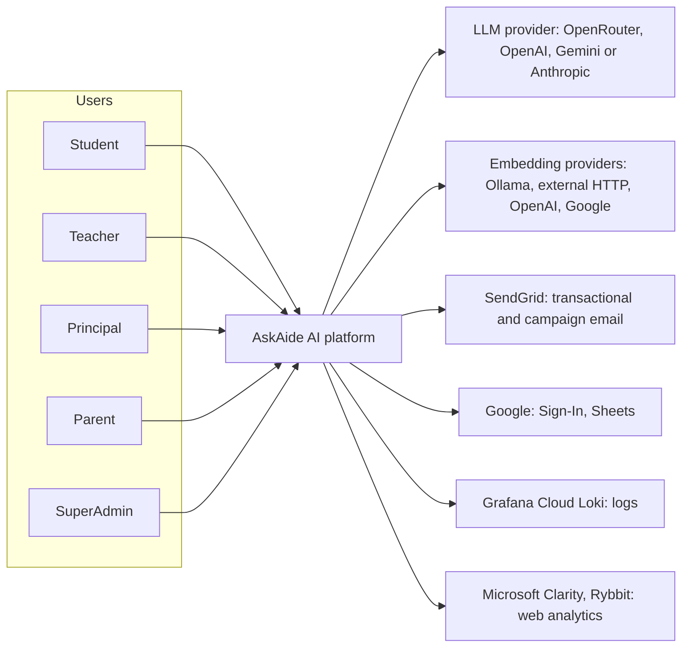
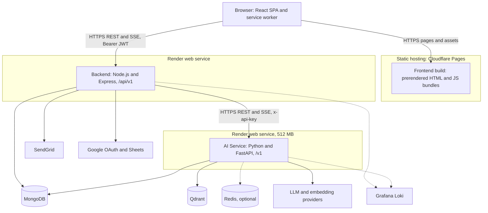
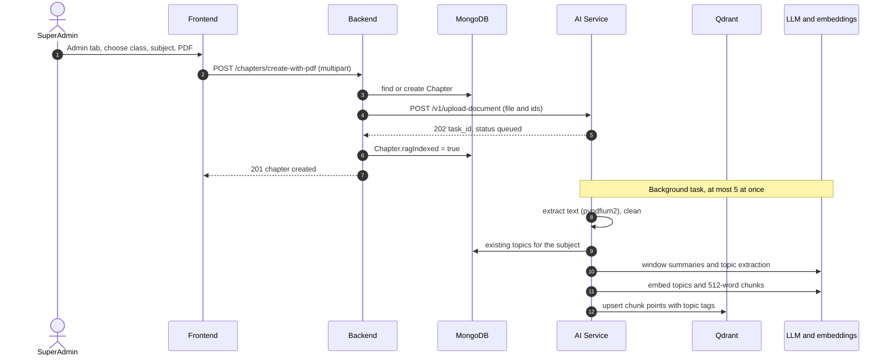
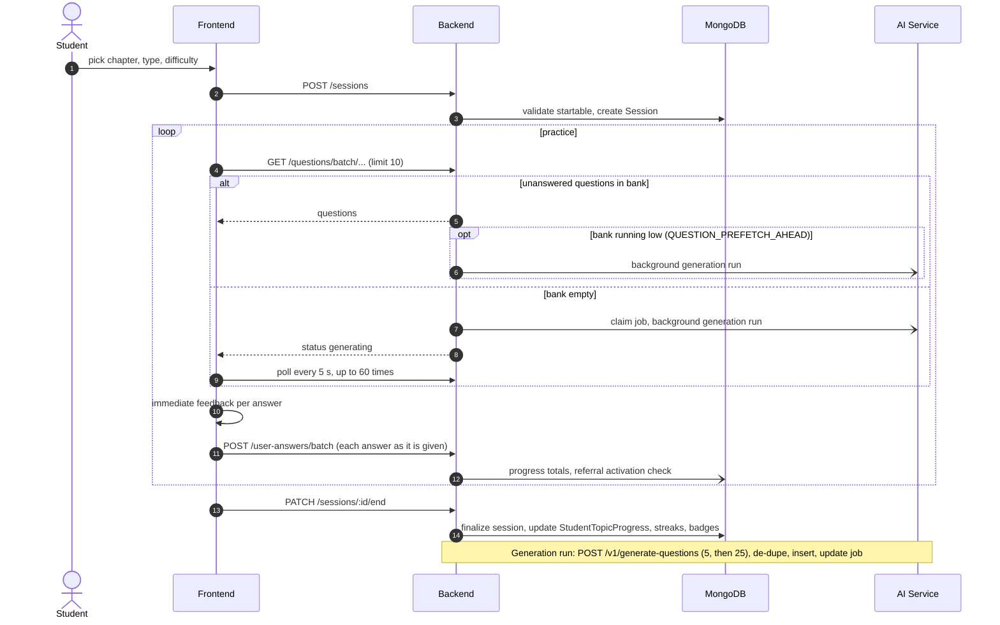
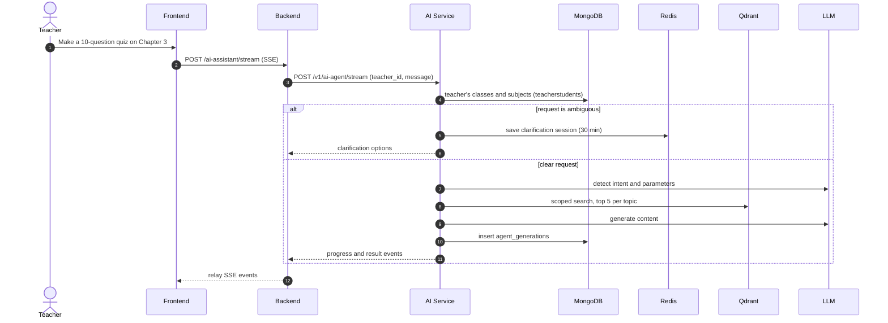
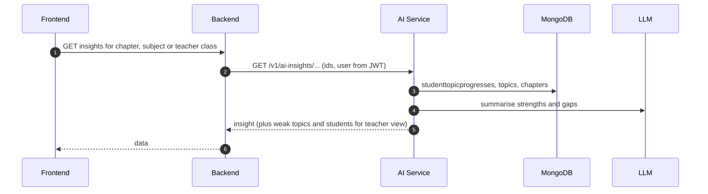
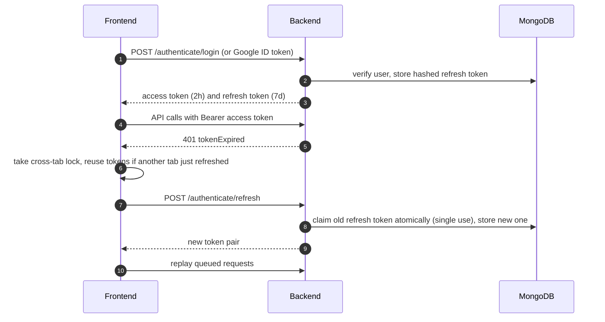
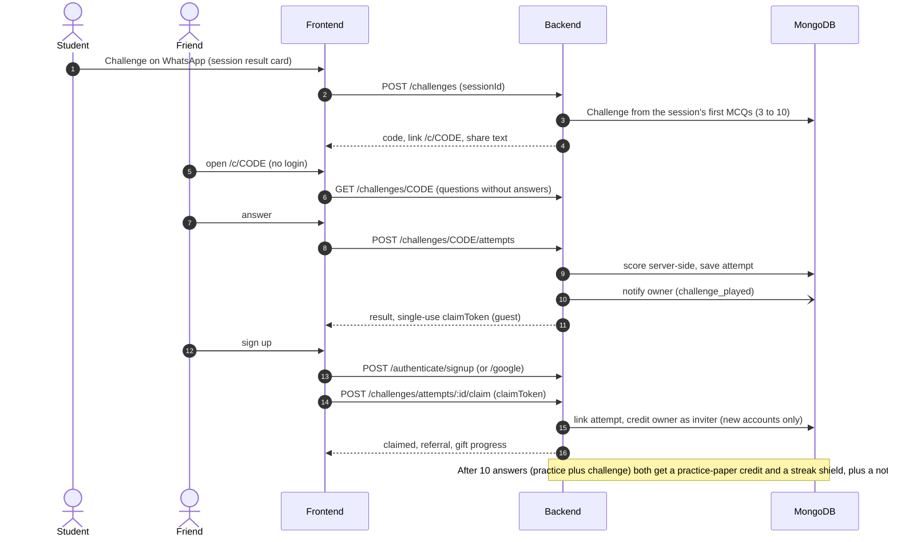

# AskAide AI — System High-Level Design

> **Verified against:** `frontend` @ `75ce259`, `Backend` @ `bf8e7df`, `ai-service` @ `e6043c7` (all `main`), 2026-09-26. Updated for the Backend and frontend changes through `Backend` @ `3b4489a` and `frontend` @ `ee0b6db` (2026-10-10): referrals, challenge a friend, teacher class links, in-app notifications, profile name and email change, single-use refresh tokens, per-answer saving.
> Component-level detail lives in the LLDs: [Frontend LLD](../frontend/lld.md) · [Backend LLD](../backend/lld.md) · [AI Service LLD](../ai-service/lld.md).

## 1. Purpose and scope

AskAide AI is an NCERT-aligned K-12 learning platform. Students practise chapter-wise, AI-generated questions with difficulty levels and topic mastery tracking. Teachers, principals and parents follow progress and generate teaching material. A SuperAdmin manages the curriculum and ingests chapter PDFs that ground all AI output.

This document describes the system as a whole: context, containers, deployment, data ownership, interfaces, the main end-to-end flows, cross-cutting concerns, scaling limits and the design decisions behind them.

| Not covered here | See |
|---|---|
| Module, class and function internals | The three LLDs |
| Endpoint-by-endpoint specs | [API Reference](./api-reference.md) |
| Request and response schemas across the Backend ↔ AI Service boundary | [Shared Contracts](../shared-contracts/api-definitions.md) |
| Per-call integration detail | [Cross-Service Integration Guide](./integration.md) (partly stale, see section 12) |

## 2. System context

### 2.1 Actors

Roles are the Backend's `accountType` values (`src/shared/middleware/auth.js`). `SuperAdmin` passes every role guard.

| Actor | Main capabilities |
|---|---|
| Student (and `NormalUser`) | Chapter-wise practice sessions, quizzes, streaks, badges, daily challenges, weekly leaderboard, AI learning insights, challenge-a-friend links, Refer & Earn, joining a teacher's class by link, notification bell |
| Teacher | Self-signup (email or Google), class join links, class dashboards, quizzes, question papers, AI assistant for quizzes, worksheets, notes and assignments, notification bell |
| Principal | School, section and teacher management for their own school, school-level dashboards |
| Parent | Linked children's progress |
| SuperAdmin | Curriculum and chapter PDF ingestion, user approval, feedback moderation, campaigns, platform metrics, live LLM selection (AI System tab) |

Visitors who are not signed in can use the public pages and Try Now, play a friend's challenge (`/c/:code`) and open a class link's join page (`/join/:code`); signing up afterwards links that play or class to the new account.

### 2.2 External systems

| System | Used by | Purpose | Impact if unavailable |
|---|---|---|---|
| LLM provider (one live at a time: `LLM_PROVIDER` default, switchable by SuperAdmin from /admin → AI System without a restart) | AI Service | Summaries, topic extraction, question generation, insights, teacher content | New questions, insights and AI assistant fail; practice on existing questions continues |
| Embedding providers (`EMBEDDING_PROVIDERS` fallback chain) | AI Service | Chunk, topic and query vectors | Falls through to the next provider; all failing blocks ingestion and retrieval |
| Qdrant (Qdrant Cloud per code comments) | AI Service | Vector store for chapter chunks | Ingestion, generation and AI assistant fail |
| MongoDB (Atlas per code comments) | Backend, AI Service | System of record | Platform down; Backend `/health` returns 503 |
| Redis (optional) | AI Service | Teacher-assistant clarification sessions | Falls back to an in-process dictionary |
| SendGrid (HTTPS API, not SMTP) | Backend | OTP, password reset, email-change codes, challenge and referral emails, campaign email | Signup verification, resets and email changes fail; in-app notifications still work |
| Google Identity | Frontend, Backend | Google Sign-In; Backend verifies the ID token | Google login unavailable; email login unaffected |
| Google Sheets | Backend | Best-effort mirror of feedback submissions | None for users; mirror skipped |
| Grafana Cloud Loki (optional) | Backend, AI Service | Centralised logs | Logs stay local only |
| Microsoft Clarity, Rybbit | Frontend | Product analytics | None for users |

## 3. Container view

**Rule:** the browser never calls the AI Service. Every AI capability is reached through the Backend, which authenticates the user, applies role and ownership checks and then calls the AI Service with the shared service key.

| Container | Technology | Responsibility | State it holds |
|---|---|---|---|
| Frontend | React 18.3, Vite 5.4, React Router 7, Redux Toolkit 2, Tailwind 3, axios, `vite-prerender-plugin`, `vite-plugin-pwa` | UI for all roles, client routing, SEO pages, answer buffering, polling for generated questions | Tokens and retry queues in `localStorage`, service-worker caches |
| Backend | Node.js 18+ (ESM), Express 4.21, Mongoose 8.13, Joi, jsonwebtoken, node-cron, Winston, SendGrid SDK, puppeteer-core | Auth, roles, all REST APIs, business rules, question bank and generation jobs, sessions, mastery, quizzes, referrals and challenges, teacher class links, in-app notifications, feedback, campaigns, PDF rendering, scheduled jobs, AI orchestration | MongoDB (42 models); per-process caches and rate-limit counters |
| AI Service | Python 3.11, FastAPI on uvicorn, Qdrant client, pymongo, Redis client, structlog, pypdfium2 | PDF ingestion (chunk, summarise, extract topics, embed), RAG retrieval, question generation, learning insights, teacher AI assistant | Qdrant vectors; a few MongoDB collections; in-memory upload task registry |

## 4. Deployment view

| Component | Platform (source) | Process model | Keep-alive / notes |
|---|---|---|---|
| Frontend | Cloudflare Pages (`scripts/generate-sitemap.mjs` comments) | Static files | `npm run build` generates `sitemap.xml` and `_redirects`, runs `vite build`, then prerenders about 500 public routes. `_redirects` forces trailing slashes on prerendered routes and falls back `/*` to `/index.html` |
| Backend | Render (code comments: trust proxy, SIGTERM on deploy, free-tier sleep) | One Node process (`node index.js`), no cluster | node-cron self-ping of `/ping` every 14 min; Chromium child processes per PDF/PNG render |
| AI Service | Render, 512 MB instance (code comments) | One uvicorn process, no `--workers` | Self-ping every 120 s (`SELF_API_URL`), Qdrant keep-alive every `QDRANT_KEEPALIVE_SECONDS` (default 1800 s) |
| MongoDB | Managed (Atlas per comments) | Shared by Backend and AI Service | Backend pool 10–50, `secondaryPreferred` reads |
| Qdrant | Managed (Qdrant Cloud per comments) | One collection | Keep-alive prevents free-tier idling |
| Docs site | GitHub Pages | Static Docusaurus build | `.github/workflows/deploy.yml` in this repo |

- None of the service repos contains a Dockerfile, Procfile or `render.yaml`; service configuration lives in the hosting dashboards.
- CI exists only in `ai-service` (GitHub Actions: ruff, mypy, pytest).
- `AI_SERVICE_API_KEY` must hold the same value in the Backend and the AI Service. The Backend reaches the AI Service through `AI_ENDPOINT` (base URL only; call sites append `/v1/...`). The Frontend reaches the Backend through `VITE_API_URL` (includes `/api/v1`).

## 5. Data architecture

### 5.1 Stores and ownership

| Store | Written by | Read by | Contents |
|---|---|---|---|
| MongoDB, Backend collections | Backend | Backend; AI Service reads a subset | Users, profiles, schools, sections, classes, subjects, chapters, topics, chapter-topic links, question bank, generation jobs, sessions, answers, topic progress, quizzes and attempts, referrals, challenges and challenge attempts, teacher class links, notifications, feedback and suggestions, campaigns, refresh tokens, OTPs, pending email changes, daily-activity rows, API logs |
| MongoDB, read by AI Service | — | AI Service | `chapters`, `classes`, `subjects`, `teacherstudents`, `studenttopicprogresses`, `topics`, `chaptertopics` |
| MongoDB, AI Service collections | AI Service | AI Service (Backend for conversations via API) | `agent_generations`, `conversations`, `messages`; topic embedding cache fields on `topics`; `chaptertopics` via the sync endpoint |
| Qdrant | AI Service | AI Service | One point per chapter chunk: chunk text, chapter summary, topic tags, class/subject/chapter ids as strings of the Mongo ObjectIds (keyword-indexed) |
| Redis (optional) | AI Service | AI Service | `agent_session:*` clarification state, 30 min TTL |
| Browser | Frontend | Frontend | Access and refresh tokens, answer and quiz retry queues, first-touch attribution (invite code, UTMs), a guest's pending challenge claim and pending class join (`localStorage`), post-logout redirect reason (`sessionStorage`), service-worker caches |
| Local disk | Backend, AI Service | — | Rotating log files (ephemeral on Render); AI temp upload files, deleted after ingestion |

- **Chapter PDFs are not stored.** The Backend buffers the upload in memory (50 MB limit) and forwards it; the AI Service writes it to a temp file for ingestion and then deletes it. After ingestion the Qdrant index is the only copy of chapter content.
- **Identifiers bridge the stores.** Mongo ObjectIds are the canonical ids; Qdrant payloads carry them as strings so vector searches can be filtered by class, subject and chapter.
- **TTL data:** OTPs expire after 5 min, email-change codes after 10 min, refresh tokens at `expiresAt`, notifications 60 days after their last event, API logs after 30 days.
- **Activity tracking:** the auth middleware upserts one `useractivitydays` row per signed-in user per IST day (`userId`, `day`, `accountType`, first and last seen) and sets `User.lastActiveAt`. Writes are throttled per user, not awaited, and never fail the request.
- **Attribution:** a new account stores its first-touch `acquisition` (source `referral`, `challenge`, `class` or `organic`, invite code, UTM fields, landing path) sent by the frontend at signup.

### 5.2 Consistency

There are no cross-store transactions. The system relies on ordering and idempotency instead:

| Concern | Approach |
|---|---|
| Chapter indexed state | The Backend persists the `Chapter` first, calls the AI Service, then sets `ragIndexed: true` on a 2xx response. Chapters without `ragIndexed` and topic links are not startable |
| Chapter deletion | The Backend asks the AI Service to delete vectors (failures only logged), then deletes Mongo rows regardless; a failed AI delete can leave orphan vectors |
| Concurrent question generation | One `QuestionGenerationJob` per chapter, question type and difficulty, claimed atomically; unique normalised-text index de-duplicates questions |
| Mastery | `StudentTopicProgress` is updated incrementally when a session ends, from that session's answers |
| Referral rewards | A referred friend becomes active (10 answers, practice plus challenge) through one conditional update on the referral entry, so both sides are rewarded exactly once. The check runs after saved answers and challenge plays or claims; opening the referral screen and the daily notification job settle any activation that was missed |
| Refresh-token rotation | The old refresh token is claimed with one atomic `findOneAndUpdate` on `revoked: false`, so concurrent refreshes with the same token cannot both succeed |
| Notifications | Unique index on user, type, group key and IST day: repeated events fold into one row with a `count`; one-time events are inserted only once |
| Schema coupling | The AI Service reads Backend-owned collections directly, so Backend model changes to those collections are cross-repo changes |

## 6. Interfaces

### 6.1 Frontend → Backend

| Aspect | Design |
|---|---|
| Transport | HTTPS REST/JSON under `/api/v1`; multipart for PDF upload; binary for PDF/PNG downloads; SSE for the teacher AI assistant (`/ai-assistant/stream`) |
| Client | One axios instance (`src/api/axios.js`); raw `fetch` only for SSE, PDF export and keep-alive session end |
| Auth | `Authorization: Bearer` access token; on `401` with `tokenExpired` a single shared refresh call (`POST /authenticate/refresh`) runs and queued requests are replayed. Refresh tokens are single-use, so the refresh runs under a cross-tab Web Lock and a tab reuses tokens another tab has just saved. Raw `fetch` calls (SSE, PDF export) go through `authorizedFetch` with the same refresh-and-retry |
| Polling | The notification bell polls `GET /notifications/unread-count` every 60 s while the tab is visible |
| Response envelope | `success`, `message`, `data` |
| Client timeouts | 30 s default; 600 s for AI generation calls |

### 6.2 Backend → AI Service

All business endpoints are under `/v1`; only `/ping`, `/health*` and `/metrics` sit at the root. Requests carry `x-api-key` and `x-correlation-id`. The Backend does not retry AI calls.

| Backend caller | AI endpoint | Purpose | Backend timeout | On failure |
|---|---|---|---|---|
| `content.service.js` | `POST /v1/upload-document` | Chapter PDF ingestion (returns `202`, processed in background) | 120 s | Chapter saved without `ragIndexed` |
| `content.service.js` | `POST /v1/delete-document` | Remove chapter vectors | 30 s | Logged; Mongo delete proceeds |
| `content.service.js` | `POST /v1/search-document` | Check whether a chapter is indexed | 30 s | Reported per chapter |
| `questions.service.js` | `POST /v1/generate-questions` | Question generation (two tiers per run) | 4 min | Job marked `failed`; auto-retry after 2 min cooldown |
| `topicProgress.controller.js` | `GET /v1/ai-insights/chapter`, `/subject`, `/teacher/class` | Learning insights | 30 s | Error returned to the UI |
| `ai-assistant` services | `POST /v1/ai-agent`, `/v1/ai-agent/stream`, `GET /v1/ai-agent/classes`, `/tasks`, `/generation/:id`, conversations | Teacher AI assistant | 10 min for generation | Error returned or streamed to the UI |

### 6.3 AI Service → providers

HTTPS to the configured LLM provider and embedding providers, Qdrant over HTTP (optionally gRPC), MongoDB, Redis and Loki. OpenRouter has an explicit 120 s timeout; Qdrant operations retry up to 3 times with exponential backoff; there is no LLM transport retry or provider fallback.

## 7. Key end-to-end flows

### 7.1 Chapter ingestion

See section 12 for the gap between the `202` response and the Backend's topic handling.

### 7.2 Student practice session with on-demand question generation

Each answer is saved as soon as it is given (one-item batch), so closing the tab loses nothing; failed saves go to a `localStorage` retry queue. From the session result card the student can turn the session into a challenge (section 7.6).

The bank for each chapter, type and difficulty grows until `QUESTION_HARD_CAP` (default 300) or until `QUESTION_LOW_YIELD_LIMIT` consecutive low-yield runs mark it content-complete; the batch endpoint then returns `mastered`.

### 7.3 Teacher AI assistant (streaming)

Retrieval is always filtered to the classes and subjects the teacher is linked to; an empty scope returns nothing rather than everything.

### 7.4 Learning insights

### 7.5 Authentication and session renewal

Signup (`POST /authenticate/signup`, or `/google` creating an account) also returns a token pair, so a new account is signed in immediately. Both accept an optional invite code and first-touch attribution; teachers can sign up themselves (`accountType: "Teacher"`).

### 7.6 Challenge a friend and the referral gift

Invite links (`/signup?ref=CODE`) follow the same reward rule without the challenge step.

### 7.7 Teacher class links

A teacher creates a link for a class + subject (+ section) with `POST /teacher-classes` (a teacher without a school gets a private independent school first) and shares `/join/CODE`. The join page reads `GET /teacher-classes/join/CODE` without login; a signed-in student joins with `POST /teacher-classes/join/CODE` (guests sign up first and are joined when they return). Joining creates an ordinary `TeacherStudent` row, so the student appears in every existing teacher dashboard view, and notifies the teacher (`class_joined`). A class report and a certificate unlock as joined students practise.

## 8. Cross-cutting concerns

### 8.1 Security

| Layer | Mechanism |
|---|---|
| User authentication | Backend-issued JWTs: access token (default 2h) and refresh token (default 7d). Refresh tokens are stored as SHA-256 hashes, single-use (each refresh claims the old token atomically and issues a new one), capped at 5 active per user and revoked on password change or reset. Google Sign-In verifies the Google ID token server-side. Email OTP for verification and password reset; a login-email change takes effect only after a 6-digit code sent to the new address is confirmed, and the old address is told |
| Public growth links | Challenge play and class join pages work without login but are rate-limited per IP; challenge questions are served without answers and scored on the server; a guest's play can only be claimed with its single-use claim token; only brand-new accounts can be credited to an inviter |
| Authorization | Enforced in the Backend by role guards and per-resource checks. Frontend route guards only shape the UX |
| Service-to-service | Shared API key on every Backend → AI Service call. The AI Service has no end-user identity and treats the Backend as its only trusted caller; teacher content scope is enforced in retrieval filters |
| Edge protection | `helmet` and CORS in the Backend; rate limits in both services (Backend global plus stricter per-route limits on auth and public endpoints; AI Service per client IP); upload validation by extension, magic bytes and size |
| Secrets | Environment variables on the hosting platform; the frontend bundle only contains public identifiers |

### 8.2 Observability

- **Correlation IDs:** the Backend creates one per request (AsyncLocalStorage), forwards it as `x-correlation-id`, and the AI Service binds it into its structured logs, so one request can be traced across both services.
- **Logs:** Winston (Backend) and structlog JSON (AI Service), optionally shipped to Grafana Cloud Loki. The Backend also persists sampled, masked API logs to MongoDB (30-day TTL).
- **Health:** Backend `/health` reports MongoDB connection state and returns 503 when degraded. AI Service `/health` endpoints exist but register no dependency checks, and `/metrics` records nothing yet.
- **Product analytics:** Microsoft Clarity (disabled in dev) and Rybbit (skipped on localhost).

### 8.3 Resilience

| Risk | Mitigation |
|---|---|
| Slow or failing generation | Background job state machine: stale `processing` jobs restart after 5 min, failed jobs retry after a 2 min cooldown, and the 4 min AI timeout is shorter than the stale threshold so a hung call fails before a duplicate starts |
| Empty question bank | Prefetch when the bank runs low; the frontend polls every 5 s (up to 60 times, paused on hidden tabs) |
| Network loss while practising | Each practice answer is saved as soon as it is given, with a `localStorage` retry queue for failed saves; quiz answers saved one at a time with a per-attempt retry queue replayed on reconnect and before submit; offline banner |
| Side effects failing | Notifications and owner emails are fire-and-forget and never fail the request that triggered them; daily-activity writes are not awaited; a missed referral activation is settled later (referral screen, daily job) |
| UI crashes | App-wide error boundary that remounts on retry |
| Provider outages | Embedding provider fallback chain; Qdrant retries; Redis falls back to memory |
| Free-tier sleep and cold starts | Self-pings in both services and a Qdrant keep-alive |

### 8.4 Performance

- **Frontend:** about 500 prerendered public routes, every route lazy-loaded, vendor chunks split (react, redux, ui), `jspdf` loaded on demand, service-worker caching (static assets precached; API network-first with a 10 s timeout and 24 h retention; images cache-first for 30 days).
- **Backend:** question prefetch hides generation latency; a 5-minute in-memory cache for the study hierarchy; MongoDB reads from secondaries.
- **AI Service:** heavy clients are lazy singletons, chunking is streamed, summarisation runs up to 4 windows in parallel per upload, and at most 5 ingestions run at once to fit in 512 MB.

### 8.5 SEO

Public marketing, blog and curriculum pages (class, subject, chapter) are prerendered with `react-helmet-async` metadata, trailing-slash canonical URLs and JSON-LD. A generated sitemap lists them; chapters with no questions are `noindex, follow` and left out. App paths are disallowed in `robots.txt`.

### 8.6 Scheduled jobs

All Backend jobs are `node-cron` schedules started when `index.js` imports them, and run inside the single Backend process (see section 9).

| Job | Schedule | What it does |
|---|---|---|
| Keep-alive (`src/shared/jobs/keepAlive.js`) | Every 14 min | Pings the Backend's own `/ping` so the free-tier instance does not sleep |
| Achievement sweep (`supporting/jobs/achievementScheduler.js`) | Daily 11:35 (server time) | Re-checks every user's badges as a safety net for the real-time badge check |
| Daily notifications (`notification/jobs/notificationScheduler.js`) | Daily 17:00 IST (`Asia/Kolkata`) | Sends one gift reminder to each referred friend who joined 1–7 days ago and is still short of 10 answers (settling the gift instead if they already reached it), and one-time class report / certificate notifications to teachers whose class links reached them |

Notifications from user actions (challenge plays, friends joining, gifts, badges, class joins) are written immediately, not by a job. Notifications appear in the in-app bell, which polls for the unread count.

## 9. Scalability and capacity

Each service runs as a **single instance with a single process**, and both backend services keep state in memory. The Frontend is static and scales with the CDN.

| Service | Per-process state | What breaks with more than one instance or worker |
|---|---|---|
| Backend | Rate-limit counters, study-hierarchy cache, API-log buffer, cron jobs (section 8.6), in-flight generation and campaign promises | Rate limits multiply, caches diverge, every cron job runs once per instance; restarts lose in-flight work (generation recovers via the job state machine) |
| AI Service | Upload task registry, rate-limit windows, Redis-fallback sessions, upload semaphore | Upload status is only known to the instance that accepted the upload; rate limits become per-instance |

**Current bottlenecks**

1. LLM latency: a generation run can take minutes, which is why generation is backgrounded and prefetched.
2. AI Service event loop: several async routes call synchronous code directly, so a slow LLM call on those routes delays other requests. Question generation, ingestion and the streaming agent are moved to threads.
3. AI Service memory: 512 MB caps ingestion concurrency.
4. Backend PDF/PNG rendering starts a Chromium process per render.

**Prerequisites for horizontal scaling:** a shared rate-limit store, a single scheduler for cron jobs, a durable job queue for generation and ingestion, persisted upload task status, and moving the remaining synchronous AI routes off the event loop.

## 10. Technology summary

| Concern | Choice |
|---|---|
| Frontend framework | React 18 SPA on Vite 5, prerendered public routes, PWA service worker |
| Frontend state | Redux Toolkit plus React Context and local state |
| Backend framework | Express 4 on Node.js (ESM), Joi validation |
| Primary database | MongoDB via Mongoose (Backend) and pymongo (AI Service) |
| Vector database | Qdrant, cosine distance, one collection |
| AI framework | FastAPI with custom RAG pipeline (no orchestration framework) |
| LLM | One live provider/model at a time: OpenRouter (env default), OpenAI, Gemini or Anthropic; switchable at runtime from /admin → AI System |
| Embeddings | Ordered fallback over Ollama, external HTTP endpoint, OpenAI, Google |
| Email | SendGrid HTTPS API |
| Background work | node-cron and in-process promises (Backend); asyncio tasks and threads (AI Service) |
| Logging | Winston and structlog, optional Grafana Cloud Loki |
| Hosting | Cloudflare Pages (Frontend), Render (Backend, AI Service), managed MongoDB and Qdrant |

## 11. Key design decisions

| Decision | Rationale | Consequence |
|---|---|---|
| Backend is the only gateway to the AI Service | One place for user auth and authorization; the service key never reaches the browser | The Backend proxies SSE and must carry long timeouts for generation |
| Backend and AI Service share one MongoDB | The AI Service can scope retrieval and build insights from curriculum and progress data without extra APIs | Schema coupling across repos; changes to shared collections need coordinated releases |
| RAG over ingested chapter PDFs | AI output stays grounded in the NCERT text the student is studying | Content quality depends on ingestion; the vector index is the only copy of chapter text |
| Generate questions on demand, persist them in a bank | Cost is paid once per question, not per student; the bank grows with demand | Background job orchestration and de-duplication are needed; a cold chapter shows a short "generating" wait |
| One live LLM provider (switchable at runtime), embedding fallback chain | Simple operations and predictable output format | No automatic LLM fallback: a provider outage stops generation until a SuperAdmin switches the live model (instant, no redeploy) |
| Prerendered SPA rather than an SSR framework | Static hosting with SEO for public pages, no server to run | Public question previews come from a snapshot refreshed at build time (`npm run content`) |
| In-process background work instead of a queue | No extra infrastructure on free-tier hosting | Single-instance constraint (section 9) |
| Stateless access JWT with stored, rotating refresh tokens | No session store on the hot path; refresh tokens can be revoked | Access tokens stay valid until expiry after logout |

## 12. System-level constraints and known issues

1. **Single-instance design** in both backend services (section 9).
2. **Free-tier hosting:** keep-alive pings mitigate idling; the AI Service has 512 MB of memory.
3. **Upload response mismatch.** The AI Service's `POST /v1/upload-document` has returned `202` with only `task_id` and `status: queued` since May 2026, and the Backend never polls `/v1/upload-status`. The Backend still sets `ragIndexed: true` on that response and looks for `topic_keys` that are no longer present, so the upload path creates no `Topic` or `ChapterTopics` rows and flags the chapter as indexed before ingestion has finished (or even if it later fails).
4. **Hollow AI health checks:** AI Service health endpoints report healthy without checking dependencies, so they cannot be used as readiness signals.
5. **No infrastructure as code:** hosting configuration is manual and not versioned.
6. **Mixed time zones:** the achievement sweep and keep-alive cron jobs use server local time; the daily notification job is pinned to IST; streaks, daily challenges, the weekly leaderboard (from Monday 00:00 IST), notification grouping and daily-activity rows use IST dates.
7. **Documentation drift:** the older per-service `architecture.md` pages and parts of the [Cross-Service Integration Guide](./integration.md) (response shapes, timeouts, route names) predate the current code. Where they disagree with this HLD or the LLDs, the LLDs are correct as of the commits above.

## 13. Related docs

- [Frontend LLD](../frontend/lld.md), [Backend LLD](../backend/lld.md), [AI Service LLD](../ai-service/lld.md)
- [Cross-Service Integration Guide](./integration.md)
- [API Reference](./api-reference.md)
- [Shared Contracts — API Definitions](../shared-contracts/api-definitions.md)
- [Backend Database Schema](../backend/reference/database-schema.md)
- [Developer Guide](./developer-guide.md)
